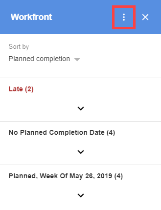

# Accesso ed uscita [!DNL Adobe Workfront for G Suite]

>[!NOTE]
>
>C&#39;è una [problema noto](https://experienceleague.adobe.com/docs/workfront-known-issues/issues/new-workfront-experience/wf-current/wf-integrations-error-when-opening-wf-for-gsuite.html?lang=en) con la versione corrente di [!DNL Workfront for G Suite] non funziona come previsto. Stiamo lavorando a una nuova versione e ci aspettiamo che venga rilasciata al [!DNL Google Marketplace] nel prossimo futuro.

## Requisiti di accesso

Per eseguire i passaggi descritti in questo articolo, è necessario disporre dei seguenti diritti di accesso:

<table style="table-layout:auto"> 
 <col> 
 <col> 
 <tbody> 
  <tr> 
   <td role="rowheader">[!DNL Adobe Workfront] piano*</td> 
   <td> 
Qualsiasi
 </td> 
  </tr> 
  <tr> 
   <td role="rowheader">[!DNL Adobe Workfront] licenza*</td> 
   <td> 
[!UICONTROL Work], [!UICONTROL Plan]
 </td> 
  </tr> 
   </tbody> 
</table>

&#42;Per sapere quale piano, tipo di licenza o accesso hai, contatta il tuo [!DNL Workfront] amministratore.

## Prerequisiti

Prima di poter accedere o uscire da [!DNL Workfront for G Suite], devi

* Installa [!DNL Workfront for G suite]\
   Per istruzioni, consulta [Installa [!DNL Adobe Workfront for G Suite]](../../workfront-integrations-and-apps/workfront-for-g-suite/install-workfront-for-gsuite.md).

## Accedi a [!DNL Adobe Workfront for G Suite]

1. Fai clic sul pulsante [!DNL Workfront] icona  in [!DNL G Suite] barra laterale dei componenti aggiuntivi all&#39;estrema destra di [!DNL Gmail], [!DNL Google Calendar]oppure [!DNL Google Drive].

   Se hai appena installato il [!DNL Workfront for G Suite] add-on e non è possibile visualizzare questa icona, prova ad aggiornare la pagina del browser.

1. Fai clic su **[!UICONTROL Accesso]** in [!DNL Workfront for G Suite] add-on.
1. Digita il tuo [!DNL Workfront] indirizzo di dominio, ad esempio *companyname.my.workfront.com*.
1. Segui le istruzioni per accedere a [!DNL Workfront].

   >[!NOTE]
   >
   >* [!DNL Workfront] si connette a [!DNL G Suite] utilizzando OAuth 2.0, uno standard sicuro utilizzato dalla maggior parte delle integrazioni basate su web per l’autenticazione e l’autorizzazione degli utenti.
   >* Quando viene richiesto di immettere il [dominio o host] del tuo [!DNL Workfront] account, digitare il formato: *la tua azienda&#39;sDomain.my.workfront.com*. Il dominio della tua azienda è in genere il nome della tua azienda.

## Esci [!DNL Workfront for G Suite]

1. Se la [!UICONTROL Workfront per G Suite] il pannello non è visualizzato, fai clic sul pulsante [!DNL Workfront] icona  in [!DNL G Suite] barra laterale dei componenti aggiuntivi all’estrema destra della pagina.
1. Fai clic sul pulsante **[!UICONTROL Altre azioni]** nella parte superiore della [!DNL Workfront for G Suite] pannello.

   

1. Fai clic su **[!UICONTROL Logout]** nel menu visualizzato.

   Questo non ti disconnette [!DNL G Suite].
