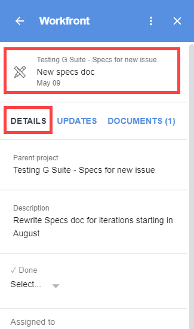

# Visualizza e gestisci [!DNL Adobe Workfront] dettagli oggetto da [!DNL G Suite]

È possibile visualizzare e gestire i dettagli di un elemento di lavoro senza uscire [!DNL G Suite]. Ad esempio, è possibile leggere la descrizione di un&#39;attività, visualizzarne l&#39;oggetto principale, modificarne lo stato e contrassegnarla come completa, il tutto all&#39;interno di [!DNL Adobe Workfront for G Suite].

## Requisiti di accesso

Per eseguire i passaggi descritti in questo articolo, è necessario disporre dei seguenti diritti di accesso:

<table style="table-layout:auto"> 
 <col> 
 <col> 
 <tbody> 
  <tr> 
   <td role="rowheader">[!DNL Adobe Workfront] piano*</td> 
   <td> 
Qualsiasi
 </td> 
  </tr> 
  <tr> 
   <td role="rowheader">[!DNL Adobe Workfront] licenza*</td> 
   <td> 
[!UICONTROL Work], [!UICONTROL Plan]
 </td> 
  </tr> 
</tbody> 
</table>

&#42;Per sapere quale piano, tipo di licenza o accesso hai, contatta il tuo [!DNL Workfront] amministratore.

## Prerequisiti

Prima di visualizzare e gestire i dettagli degli elementi di lavoro in [!DNL G Suite], devi

* Installa [!DNL Workfront for G suite]\
   Per istruzioni, consulta [Installa [!DNL Adobe Workfront for G Suite]](../../workfront-integrations-and-apps/workfront-for-g-suite/install-workfront-for-gsuite.md).

## Visualizza e gestisci i dettagli degli elementi di lavoro in [!DNL G Suite]

1. Se la [!UICONTROL Workfront per G Suite] il pannello non è visualizzato, fai clic sul pulsante [!DNL Workfront] icona  in [!DNL G Suite] barra laterale dei componenti aggiuntivi all’estrema destra della pagina.
1. Vai a [!DNL Workfront] attività o problema in [!DNL G Suite], come descritto in [Accesso [!DNL Adobe Workfront] [!UICONTROL Pagina principale] contenuto di [!DNL G Suite]](../../workfront-integrations-and-apps/workfront-for-g-suite/access-wf-home-content-from-g-suite.md).

   Quando selezioni un’attività o un problema, la **[!UICONTROL Dettagli]** è aperta la scheda . L&#39;area sopra la **[!UICONTROL Dettagli]** visualizza il nome dell&#39;oggetto principale, il nome dell&#39;attività o del problema e il [!UICONTROL Data di scadenza] (se si tratta di un&#39;attività) o [!UICONTROL Data priorità] (se si tratta di un problema).

   

   Puoi eseguire varie attività in questa scheda senza uscire [!DNL G Suite], compresi i seguenti elementi:

   * Visualizza l&#39;oggetto **[!UICONTROL Descrizione]** e altri dettagli, quali gli utenti assegnati all&#39;oggetto, **[!UICONTROL Priorità]**, il richiedente, **[!UICONTROL Data di completamento prevista]**, nonché tutti i campi e i moduli personalizzati associati all’oggetto.

      Nei moduli personalizzati vengono visualizzati solo i campi in cui sono state aggiunte informazioni.

   * Fai clic sul pulsante **[!UICONTROL Progetto principale]** area per visualizzare i dettagli dell&#39;oggetto principale.

      >[!TIP]
      >
      >Questa funzione può essere utile quando si dispone di attività e problemi con lo stesso nome e occorre differenziarli.

   * Accetta il lavoro assegnato facendo clic su **[!UICONTROL Lavorare]**.
   * Modifica varie opzioni, ad esempio **[!UICONTROL Fine]** l&#39;opzione **[!UICONTROL Stato]** e **[!UICONTROL Percentuale completata]**.

      Sotto **[!UICONTROL Percentuale completata]**, digitare numeri e (facoltativamente) il segno percentuale % per indicare l&#39;avanzamento su un articolo.
   * Visualizza informazioni su una richiesta di approvazione, inclusi il proprietario, le dimensioni e gli eventuali allegati.
   * **[!UICONTROL Approva]** o **[!UICONTROL Rifiuta]** richieste di approvazione e documenti.

   * **[!UICONTROL Concessione]** o **[!UICONTROL Ignora]** richieste di accesso.

1. (Facoltativo) Fai clic su **[!UICONTROL Visualizza in[!DNL Workfront]]** per passare all&#39;elemento di lavoro corrente in [!DNL Workfront].

* Per informazioni sull&#39;utilizzo del [!UICONTROL Aggiornamenti] scheda in [!DNL Workfront for G Suite], vedi [Aggiornare un [!DNL Adobe Workfront] oggetto da [!DNL G Suite]](../../workfront-integrations-and-apps/workfront-for-g-suite/update-a-workfront-object-in-gsuite.md).
* Per informazioni sull&#39;utilizzo del [!UICONTROL Documenti] scheda in [!DNL Workfront for G Suite], vedi [Visualizzare e gestire documenti da [!DNL G Suite]](../../workfront-integrations-and-apps/workfront-for-g-suite/view-and-manage-documents-in-gsuite.md).
