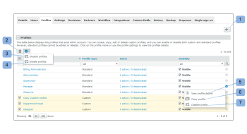
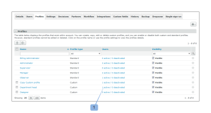

# Configura profili personalizzati in [!DNL Workfront Proof]

>[!IMPORTANT]
>
>Questo articolo fa riferimento alla funzionalità nel prodotto autonomo [!DNL Workfront] Proof. Per informazioni sulla verifica all&#39;interno di [!DNL Adobe Workfront], vedere [Verifica](../../../review-and-approve-work/proofing/proofing.md).

In qualità di amministratore della fatturazione [!DNL Workfront Proof] o di amministratore [!DNL Workfront Proof], puoi configurare profili personalizzati per altri utenti.

I profili personalizzati ti consentono di assegnare autorizzazioni granulari agli utenti nel tuo account e di definire il livello di accesso e i diritti di cui dispongono sugli elementi nel tuo account. Per ulteriori informazioni sui profili personalizzati, vedere [Creare e gestire profili personalizzati tramite [!DNL Workfront Proof]](../../../workfront-proof/wp-mnguserscontacts/users/create-and-manage-custom-profiles.md).

È possibile modificare il layout della pagina per visualizzare solo le informazioni pertinenti:

* È possibile regolare il numero di elementi visualizzati (1)
* Puoi filtrare l’elenco dei profili per individuare quelli con cui desideri lavorare (2)
* Puoi controllare facilmente il numero di profili presenti nell’account (3)\
   

## Scheda Profili

La scheda [!UICONTROL Profili] ti consente di aggiungere e gestire in modo semplice i profili personalizzati. Da qui è possibile eseguire le azioni seguenti:

* Aggiungi un nuovo profilo (1)
* Eseguire azioni in blocco sui profili:
* Eliminare più profili (2)
* Disattiva più profili (3)
* Abilita più profili (4)
* Dettagli profilo di accesso (5)
* Copiare un profilo (6)
* Disattiva un profilo (7)

Per ulteriori informazioni su come personalizzare la scheda Profili, vedere [Creare e gestire profili personalizzati utilizzando [!DNL Workfront Proof]](../../../workfront-proof/wp-mnguserscontacts/users/create-and-manage-custom-profiles.md).

## Dettagli profilo

La pagina Dettagli profilo ti consente di modificare le autorizzazioni abilitate per il profilo personalizzato, copiarlo, eliminarlo e visualizzare l’elenco di utenti a cui è assegnato il profilo.

Per ulteriori informazioni sulle azioni che puoi eseguire in questa pagina, vedi &quot;[Creare e gestire profili personalizzati utilizzando [!DNL Workfront Proof]](../../../workfront-proof/wp-mnguserscontacts/users/create-and-manage-custom-profiles.md).

* [Accesso alla pagina Dettagli profilo](#accessing-the-profile-details-page)
* [Visualizzazione dell’elenco degli utenti a cui è assegnato un profilo](#viewing-the-list-of-users-with-a-profile-assigned)

### Accesso alla pagina Dettagli profilo {#accessing-the-profile-details-page}

Per accedere ai dettagli del profilo:

1. Fai clic sul nome del profilo.
1. 

### Visualizzazione dell’elenco degli utenti a cui è assegnato un profilo {#viewing-the-list-of-users-with-a-profile-assigned}

Per visualizzare l’elenco degli utenti a cui è stato assegnato un particolare profilo:

1. Fai clic sul collegamento che mostra il numero di utenti attivi e disattivati con questo profilo (1).
1. In alternativa, l’elenco viene visualizzato nella pagina dei dettagli del profilo.
1. 

1. L’elenco mostra gli utenti attivi e disattivati nel tuo account a cui è stato assegnato il profilo in questione. Se l&#39;elenco è troppo lungo, è possibile modificare il layout della pagina per visualizzare solo le informazioni desiderate.
1. 
