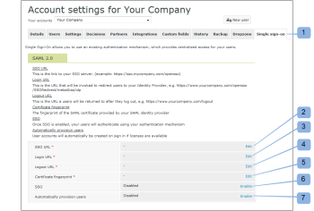
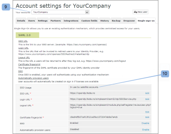

# Configurare Single Sign-On per [!DNL Workfront Proof] utenti

>[!IMPORTANT]
>
>Questo articolo fa riferimento alla funzionalità del prodotto standalone [!DNL Workfront Proof]. Per informazioni sulle prove all&#39;interno [!DNL Adobe Workfront], vedi [Copertura](../../../review-and-approve-work/proofing/proofing.md).

Se disponi del piano Select o Premium, puoi fornire la funzionalità Single Sign-On (SSO) che ti consente di utilizzare il nome utente e la password dell&#39;organizzazione esistente per accedere al tuo [!DNL Workfront Proof] conto.

Ciò significa che ti autenticherai sul tuo sistema di accesso, non contro il [!DNL Workfront Proof] pagina di accesso.

>[!NOTE]
>
>È necessario impostare un sottodominio o un dominio personalizzato sul [!DNL Workfront Proof] per abilitare SAML. I sottodomini personalizzati possono essere configurati liberamente. Vedi [Branding](https://support.workfront.com/hc/en-us/sections/115000921208-Branding) Per ulteriori informazioni, consulta ulteriori informazioni sui domini completamente personalizzati sul nostro [Marchio [!DNL Workfront Proof] sito - avanzato](../../../workfront-proof/wp-acct-admin/branding/brand-wp-site-advanced.md).

## Abilitazione di SSO in [!DNL Workfront Proof]

La funzionalità Single Sign-On può essere abilitata nel [!UICONTROL Single sign-on] scheda [!UICONTROL Impostazioni account], e si applica a tutti gli utenti sul tuo [!DNL Workfront Proof] conto. Vedi [Impostazioni account](https://support.workfront.com/hc/en-us/sections/115000912147-Account-settings) per ulteriori informazioni.

## ID entità

In qualità di fornitore di servizi abbiamo pubblicato il nostro Entity ID qui:

[https://yoursubdomain.my.workfront.com/proof/saml/module.php/saml/sp/metadata.php/phq](https://yoursubdomain.my.workfront.com/proof/saml/module.php/saml/sp/metadata.php/phq) (dove &quot;sottodominio&quot; è il sottodominio del tuo account)

[!DNL Workfront Proof] richiede l’indirizzo e-mail dell’utente come identificatore univoco, che può essere trasmesso come uno dei seguenti attributi:

* abbandono:mace:dir:attribute-def:emailAddress
* http://schemas.xmlsoap.org/ws/2005/05/identity/claims/emailaddress
* http://schemas.xmlsoap.org/claims/EmailAddress
* abbandono:oid:0.9.2342.19200300.100.1.3
* http://axschema.org/contact/email
* openid.sreg.email
* mail
* email
* emailAddress

Per configurare SSO:

1. Apri **[!UICONTROL Single Sign-On]** scheda (1).
1. Inserisci il **URL SSO** (2)
Questo è il collegamento al server SSO (ad esempio, **https://sso.mycompany.com/opensso**).

1. Inserisci il **URL di accesso** (3)
Si tratta dell’URL che verrà richiamato per reindirizzare gli utenti al provider di identità.

1. Questo non è un URL effettivo immesso nel browser, ma un endpoint che elaborerà le informazioni che gli inviamo per presentare la schermata di accesso.

Inserisci il **URL di disconnessione** (4)
Questo è l&#39;URL a cui verrai restituito dopo la disconnessione, ad esempio

**https://www.yourcompany.com/services/logout.asp**

1. Inserisci il **impronta digitale del certificato** (5)
1. L’impronta digitale SHA1 del certificato SAML fornito dal provider di identità SAML.
1. Accertati di includere le informazioni chiave impostandole sul provider di identità.
1. Interruttore **SSO** a **[!UICONTROL Abilitato]** (6)
Una volta abilitato l&#39;SSO, tu e gli altri utenti del tuo account effettuerete l&#39;accesso utilizzando il vostro meccanismo di autenticazione. Ciò significa che quando gli utenti accedono al tuo [!DNL Workfront Proof] schermata di accesso all’account (ad esempio, **yourcompany.proofhq.com/login**), viene visualizzata una finestra di trasferimento alla pagina di accesso di autenticazione personalizzata.

1. (Facoltativo) Abilita **Provisioning automatico degli utenti** (7)
Una volta attivata questa opzione, gli account utente verranno creati automaticamente per le persone che non hanno il proprio [!DNL Workfront Proof] , ma accederà al tuo [!DNL Workfront Proof] account che utilizza le credenziali Single Sign-On. Questa azione viene eseguita solo quando il limite utente non è ancora stato raggiunto sul tuo account.

1. Per impostazione predefinita, ai nuovi utenti con provisioning vengono assegnate le autorizzazioni del profilo Manager . Per ulteriori informazioni, consulta [Profili delle autorizzazioni di prova in [!DNL Workfront Proof]](../../../workfront-proof/wp-acct-admin/account-settings/proof-perm-profiles-in-wp.md).

## Abilitazione dell&#39;SSO per gli account satellite

Quando hai account satellitari collegati al tuo account hub, puoi amministrarli dal livello dell&#39;account hub.

Single Sign-On è una funzione Select e Premium, quindi Single Sign-On può essere abilitato solo su satelliti che sono su piani Select e Premium.

1. Fai clic su **[!UICONTROL Impostazioni]** > **[!UICONTROL Impostazioni account]** (1)

1. Fai clic sull’account satellite nel menu a discesa (2).
1. Apri **[!UICONTROL Single Sign-On]** scheda (3).
1. Inizia a modificare la configurazione SSO (4).
1. 
Sono disponibili due metodi (5) di configurazione:

1. **Ereditato:** SSO con la configurazione presa dal tuo account hub.
Se un utente accede a [!DNL Workfront Proof] attraverso **pagina di accesso predefinita** ([https://www.proofhq.com/login](https://www.proofhq.com/login)) **due livelli di autorizzazione**: Per prima cosa viene richiesto a un utente di effettuare l&#39;accesso utilizzando [!DNL Workfront Proof] dati di accesso (e-mail e password); quindi l&#39;utente viene trasferito attraverso una finestra SSO alla pagina di accesso SSO.
Pertanto, con il servizio SSO abilitato, ti consigliamo di accedere da solo [!DNL Workfront Proof] sottodominio/dominio.

   >[!NOTE]
   >
   >Al momento, quando Single Sign-On è abilitato sul tuo [!DNL Workfront Proof] account, non potrai accedere all’app iPhone con tali credenziali.

   1. **Manuale** (predefinito): SSO con una configurazione diversa (ad esempio, che punta a un altro provider di identità).

      >[!NOTE]
      >
      >Se l&#39;account satellite eredita la configurazione SSO dall&#39;account hub, la schermata di accesso sarà quella dell&#39;account hub. Quando l’utente dell’account satellitare inserisce i propri dati di accesso SSO in questa pagina, verrà reindirizzato nuovamente all’account satellitare.

      

   1. Fai clic su **[!UICONTROL Salva]** (6)

## Impostazioni SSO ereditate da un account Hub

Quando scegli di ereditare le impostazioni dall’account hub, noterai che tutti i campi sono ora compilati con i dati dell’account hub (7) e che Single Sign-On è abilitato/Disabilitato automaticamente (8) come nell’account principale. Non esistono più collegamenti di modifica nei campi, in quanto l&#39;intera configurazione SSO per l&#39;account Satellite è ora impostata e gestita dal tuo account hub.

Nel tuo account hub (9) il [!UICONTROL Utilizzo SSO] Questo campo mostra che questa configurazione è in uso da account satellitari (10).\

## SSO configurato manualmente

Se è stata selezionata la configurazione SSO manuale per un account satellite (1), è necessario immettere manualmente i dati per il Single Sign-On.

1. Fai clic su **[!UICONTROL Impostazioni]** > **[!UICONTROL Impostazioni account]** (1)

1. Apri **[!UICONTROL Single sign-on]** scheda .
1. Fai clic su **[!UICONTROL Modifica],** compila il campo e fai clic su **[!UICONTROL Salva]** (2)

1. Sulla **[!UICONTROL SSO]** riga, fai clic su **[!UICONTROL Abilitato]** (3)

## Accesso SSO

1. Fai clic su **[!UICONTROL Impostazioni]** > **[!UICONTROL Impostazioni account]** (1)

1. Apri **[!UICONTROL Single sign-on]** scheda .
1. Assicurati che il tuo [!DNL Workfront Proof] dominio/sottodominio (1) configurato e che gli utenti accedano al tuo [!DNL Workfront Proof] tramite questo dominio/sottodominio personalizzato.
   
Con il Single Sign-On abilitato, l’URL di accesso al sottodominio (ad esempio yourcompany.proofhq.com/login) visualizza una schermata di trasferimento (2) che ti porta direttamente alla pagina di accesso SSO.
   

1. Se un utente accede a [!DNL Workfront Proof] attraverso **pagina di accesso predefinita** ([https://www.proofhq.com/login](https://www.proofhq.com/login)) **due livelli di autorizzazione**. Per prima cosa viene richiesto a un utente di effettuare l&#39;accesso utilizzando [!DNL Workfront Proof] dati di accesso (e-mail e password). Quindi, l&#39;utente viene trasferito attraverso una finestra SSO (2) alla pagina di accesso SSO.\
   Pertanto, con il servizio SSO abilitato, ti consigliamo di accedere da solo [!DNL Workfront Proof] sottodominio/dominio.

1. Al momento, quando Single Sign-On è abilitato sul tuo account Workfront Proof, non potrai accedere all’app iPhone con tali credenziali.

## Aggiunta di un nuovo utente

Quando la funzionalità Single Sign-On è abilitata sul tuo [!DNL Workfront Proof] account, i nuovi utenti non riceveranno alcuna e-mail di conferma in quanto i loro account verranno attivati automaticamente e pronti per l’uso.

Dal tuo [!DNL Workfront Proof] pagina di accesso, dopo aver fatto clic sul pulsante [!UICONTROL Login] gli utenti vengono portati alla pagina di accesso SSO e viene richiesto di immettere le credenziali di accesso Single Sign-On.

>[!IMPORTANT]
>
>Gli utenti vengono identificati tramite un indirizzo e-mail durante il processo di autenticazione, il che significa che l&#39;account e-mail utilizzato per il tuo accesso SSO deve essere l&#39;indirizzo e-mail dell&#39;utente registrato nel tuo account.

## Servizi federativi Active Directory (AD FS)

Active Directory Federation Services (AD FS) è un [!DNL Microsoft] componente software che può essere installato sui sistemi operativi Windows Server per fornire agli utenti l&#39;accesso Single Sign-On a sistemi e applicazioni situati oltre i confini dell&#39;organizzazione. Per ulteriori informazioni, vedere &quot;Active Directory Federation Services&quot; nel sito Web Microsoft Developer Network.

La [!DNL Workfront Proof] Il sistema supporta SAML 2.0 ed è compatibile solo con AD FS versione 2.0 o successiva.

Vedi [Accesso singolo [!DNL Workfront Proof]: Configurazione di AD FS](../../../workfront-proof/wp-acct-admin/account-settings/sso-in-wp-adfs-configuration.md) per istruzioni dettagliate.
