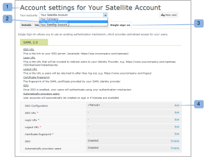

# Configura Single Sign-On per [!DNL Workfront Proof] utenti

>[!IMPORTANT]
>
>Questo articolo fa riferimento alle funzionalità nel prodotto autonomo [!DNL Workfront Proof]. Per informazioni sulla verifica all&#39;interno di [!DNL Adobe Workfront], vedere [Verifica](../../../review-and-approve-work/proofing/proofing.md).

Se si dispone del piano Select o Premium, è possibile fornire la funzionalità Single Sign-On (SSO) che consente di utilizzare il nome utente e la password dell&#39;organizzazione esistente per accedere all&#39;account [!DNL Workfront Proof].

Ciò significa che effettuerai l&#39;autenticazione in base al tuo sistema di accesso e non in base alla pagina di accesso di [!DNL Workfront Proof].

>[!NOTE]
>
>Per abilitare SAML, è necessario che nell&#39;account [!DNL Workfront Proof] sia configurato un sottodominio o un dominio personalizzato. I sottodomini personalizzati sono liberi di impostare. Per ulteriori informazioni, consulta [Branding](https://support.workfront.com/hc/en-us/sections/115000921208-Branding).Per ulteriori informazioni sui domini completamente personalizzati, consulta il nostro [sito  [!DNL Workfront Proof]  dedicato al marchio - avanzato](../../../workfront-proof/wp-acct-admin/branding/brand-wp-site-advanced.md).

## Abilitazione dell&#39;SSO entro [!DNL Workfront Proof]

La funzionalità Single Sign-On può essere abilitata nella scheda [!UICONTROL Single Sign-On] delle [!UICONTROL impostazioni account] e verrà applicata a tutti gli utenti dell&#39;account [!DNL Workfront Proof]. Per ulteriori informazioni, vedere [Impostazioni account](https://support.workfront.com/hc/en-us/sections/115000912147-Account-settings).

## ID entità

In qualità di fornitore di servizi, abbiamo pubblicato il nostro ID entità qui:

[https://yoursubdomain.proofhq.com/saml/module.php/saml/sp/metadata.php/phq](https://yoursubdomain.proofhq.com/saml/module.php/saml/sp/metadata.php/phq) (dove &quot;dominio secondario&quot; è il dominio secondario dell&#39;account)

[!DNL Workfront Proof] richiede l&#39;indirizzo e-mail dell&#39;utente come identificatore univoco, che può essere passato come uno dei seguenti attributi:

* urn:mace:dir:attribute-def:emailAddress
* http://schemas.xmlsoap.org/ws/2005/05/identity/claims/emailaddress
* http://schemas.xmlsoap.org/claims/EmailAddress
* urn:oid:0.9.2342.19200300.100.1.3
* http://axschema.org/contact/email
* openid.sreg.email
* mail
* email
* emailAddress

Per configurare l&#39;SSO:

1. Apri la scheda **[!UICONTROL Single Sign-On]** (1).
1. Immettere l&#39;**URL SSO** (2).
Questo è il collegamento al server SSO (ad esempio, **https://sso.mycompany.com/opensso**).

1. Immettere l&#39;**URL di accesso** (3).
Questo è l’URL che verrà richiamato per reindirizzare gli utenti al provider di identità.

   Non si tratta di un URL effettivo immesso nel browser, ma di un endpoint che elaborerà le informazioni inviate per presentare la schermata di accesso.

1. Immettere l&#39;**URL disconnessione** (4).
Questo è l&#39;URL a cui verrai restituito dopo la disconnessione, ad esempio

   **https://www.yourcompany.com/services/logout.asp**

1. Immetti l&#39;**impronta digitale del certificato** (5).
1. L&#39;impronta digitale SHA1 del certificato SAML fornito dal provider di identità SAML.
1. Assicurati di includere le informazioni chiave impostandole sul provider di identità.
1. Passa da **SSO** a **[!UICONTROL abilitato]** (6).
Una volta abilitato l’accesso SSO, tu e altri utenti del tuo account accederete utilizzando il tuo meccanismo di autenticazione. Ciò significa che quando gli utenti accedono alla schermata di accesso dell&#39;account [!DNL Workfront Proof] (ad esempio, **yourcompany.proofhq.com/login**), verrà visualizzata la finestra di trasferimento nella pagina di accesso di autenticazione.

1. (Facoltativo) Abilita **Esegui automaticamente il provisioning degli utenti** (7).
Una volta abilitata questa opzione, gli account utente verranno creati automaticamente per le persone che non dispongono di profili [!DNL Workfront Proof] propri, ma accederanno all&#39;account [!DNL Workfront Proof] utilizzando le credenziali Single Sign-On. Questa azione viene eseguita solo quando il limite utente non è ancora stato raggiunto sul tuo account.

1. Ai nuovi utenti con provisioning vengono assegnate per impostazione predefinita le autorizzazioni del profilo Manager. Se hai bisogno di ulteriori informazioni, consulta [Profili di autorizzazione bozza in [!DNL Workfront Proof]](../../../workfront-proof/wp-acct-admin/account-settings/proof-perm-profiles-in-wp.md).

## Abilitazione di SSO per gli account satellite

Quando disponi di account satellite connessi al tuo account hub, puoi amministrarli dal livello dell’account hub.

Single Sign-On è una funzionalità Select e Premium, pertanto è possibile abilitare il Single Sign-On solo sui satelliti inclusi nei piani Select e Premium.

1. Fare clic su **[!UICONTROL Impostazioni]** > **[!UICONTROL Impostazioni account]** (1).

1. Fai clic sull’account satellite nel menu a discesa (2).
1. Apri la scheda **[!UICONTROL Single Sign-On]** (3).
1. Inizia a modificare la configurazione SSO (4).
1. 
Qui sono disponibili due metodi (5) di configurazione:

1. **Ereditato:** SSO con la configurazione prelevata dall&#39;account hub.
Se un utente accede a [!DNL Workfront Proof] tramite la **pagina di accesso predefinita** ([https://business.adobe.com/it/products/workfront/proofing-approvals.html](https://business.adobe.com/it/products/workfront/proofing-approvals.html)) saranno disponibili **due livelli di autorizzazione**: prima viene richiesto a un utente di accedere utilizzando i dati di accesso [!DNL Workfront Proof] (e-mail e password), quindi l&#39;utente viene trasferito tramite una finestra SSO alla pagina di accesso SSO.
Pertanto, con il servizio SSO abilitato, è consigliabile accedere tramite il proprio sottodominio/dominio [!DNL Workfront Proof].

   >[!NOTE]
   >
   >Al momento, quando Single Sign-On è abilitato sul tuo account [!DNL Workfront Proof], non potrai accedere all&#39;app iPhone con tali credenziali.

   1. **Manuale** (impostazione predefinita): SSO con una configurazione diversa, ad esempio che punta a un altro provider di identità.

      >[!NOTE]
      >
      >Se l&#39;account satellite eredita la configurazione SSO dall&#39;account hub, la schermata di accesso sarà quella dell&#39;account hub. Quando l’utente dell’account satellite immette i propri dettagli di accesso SSO in questa pagina, verrà reindirizzato all’account satellite.

      

   1. Fai clic su **[!UICONTROL Salva]** (6).

## Impostazioni SSO ereditate da un account hub

Quando scegli di ereditare le impostazioni dall&#39;account hub, tutti i campi vengono ora compilati con i dati dell&#39;account hub (7) e il Single Sign-On viene automaticamente abilitato/disabilitato(8) come nell&#39;account principale. Inoltre non ci sono più collegamenti di modifica nei campi, in quanto l&#39;intera configurazione SSO per l&#39;account Satellite è ora impostata e gestita dall&#39;account hub.

Nel tuo account hub (9) il campo [!UICONTROL Utilizzo SSO] indica che questa configurazione è utilizzata dagli account satellite (10).\

## SSO configurato manualmente

Se è stata scelta la configurazione SSO manuale per un account satellite (1), è necessario immettere manualmente i dati per il Single Sign-On.

1. Fare clic su **[!UICONTROL Impostazioni]** > **[!UICONTROL Impostazioni account]** (1).

1. Apri la scheda **[!UICONTROL Single Sign-on]**.
1. Fai clic su **[!UICONTROL Modifica],** popola il campo, quindi fai clic su **[!UICONTROL Salva]** (2).

1. Nella riga **[!UICONTROL SSO]**, fare clic su **[!UICONTROL Abilitato]** (3).

## Accesso SSO

1. Fare clic su **[!UICONTROL Impostazioni]** > **[!UICONTROL Impostazioni account]** (1).

1. Apri la scheda **[!UICONTROL Single Sign-on]**.
1. Verificare che il dominio/sottodominio [!DNL Workfront Proof] (1) sia configurato e che gli utenti accedano all&#39;account [!DNL Workfront Proof] tramite questo dominio/sottodominio personalizzato.
   
Con il Single Sign-On abilitato, l&#39;URL di accesso del sottodominio (ad esempio, yourcompany.proofhq.com/login) visualizza una schermata di trasferimento (2) che porta direttamente alla pagina di accesso SSO.
   

1. Se un utente accede a [!DNL Workfront Proof] tramite il **accesso predefinito alla pagina** ([https://business.adobe.com/it/products/workfront/proofing-approvals.html](https://business.adobe.com/it/products/workfront/proofing-approvals.html)) saranno disponibili **due livelli di autorizzazione**. Innanzitutto, a un utente viene richiesto di effettuare l&#39;accesso utilizzando i dati di accesso [!DNL Workfront Proof] (e-mail e password). L&#39;utente viene quindi trasferito tramite una finestra SSO (2) alla pagina di accesso SSO.\
   Pertanto, con il servizio SSO abilitato, è consigliabile accedere tramite il proprio sottodominio/dominio [!DNL Workfront Proof].

1. Al momento, quando l’accesso Single Sign-On è abilitato sul tuo account Workfront Proof, non potrai accedere all’app iPhone con tali credenziali.

## Informazioni sull&#39;aggiunta di un nuovo utente

Quando la funzionalità Single Sign-On è abilitata per l&#39;account [!DNL Workfront Proof], i nuovi utenti non riceveranno alcuna e-mail di conferma in quanto i loro account verranno attivati automaticamente e pronti per l&#39;uso.

Dalla pagina di accesso di [!DNL Workfront Proof], dopo aver fatto clic sul pulsante [!UICONTROL Accesso], gli utenti vengono reindirizzati alla pagina di accesso SSO e viene richiesto di immettere le credenziali di accesso Single Sign-On.

>[!IMPORTANT]
>
>Gli utenti vengono identificati tramite un indirizzo e-mail durante il processo di autenticazione, il che significa che l’account e-mail utilizzato per l’accesso SSO deve essere l’indirizzo e-mail dell’utente registrato nel tuo account.

## Active Directory Federation Services (ADFS)

Active Directory Federation Services (ADFS) è un componente software [!DNL Microsoft] che può essere installato nei sistemi operativi Windows Server per consentire agli utenti di accedere in modalità Single Sign-On a sistemi e applicazioni che si trovano oltre i limiti dell&#39;organizzazione. Per ulteriori informazioni, vedere &quot;Active Directory Federation Services&quot; nel sito Web Microsoft Developer Network.

Il sistema [!DNL Workfront Proof] supporta SAML 2.0 ed è compatibile solo con ADFS versione 2.0 o successiva.

Per istruzioni dettagliate, vedere [Single Sign-On in [!DNL Workfront Proof]: configurazione AD FS](../../../workfront-proof/wp-acct-admin/account-settings/sso-in-wp-adfs-configuration.md).
