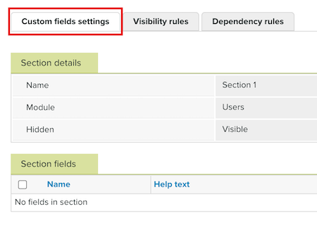

# Crea e gestisci campi personalizzati in [!DNL Workfront Proof]

<!-- Audited: 4/2025 -->

>[!IMPORTANT]
>
>Questo articolo fa riferimento alle funzionalità nel prodotto autonomo [!DNL Workfront Proof]. Per informazioni sulla verifica all&#39;interno di [!DNL Adobe Workfront], vedere [Verifica](../../../review-and-approve-work/proofing/proofing.md).

Per utilizzare questa funzione è necessario un piano Select o Premium [!DNL Workfront]. Per ulteriori informazioni sui vari piani disponibili, vedere [Piani Workfront](https://business.adobe.com/products/workfront/pricing.html).

I campi personalizzati ti consentono di acquisire dati aggiuntivi durante la creazione di una nuova bozza, utente o ospite. Ad esempio, gli utenti che creano una nuova bozza potrebbero voler includere una sezione aggiuntiva che consenta loro di acquisire un Numero OdL, un Codice reparto o un Riferimento fornitore.

>[!NOTE]
>
>* L’acquisizione di questo tipo di informazioni nella pagina Nuova bozza tramite campi personalizzati consente inoltre di ridurre la lunghezza del nome della bozza, in quanto tali dettagli non dovranno essere inclusi nel nome.
>
>* Una volta utilizzato un campo personalizzato su una bozza, un utente o un contatto, non puoi eliminarlo o modificare il tipo di campo. Tuttavia, potrai nasconderlo tramite la pagina Impostazioni campo personalizzato in modo che non venga utilizzato per i nuovi elementi.
>
>* Se si nasconde una sezione di campi personalizzati, verranno nascosti anche tutti i campi della sezione, anche se i singoli campi sono impostati come visibili.

## Creare campi personalizzati

{{step1-to-proofing}}

1. Nell&#39;angolo superiore destro della pagina fare clic su **Impostazioni account**.

1. Nella pagina **Impostazioni account** selezionare la scheda **Campi personalizzati**.

1. Fai clic su **[!UICONTROL Aggiungi sezione campo personalizzato]** sul lato destro del modulo (**Bozza**, **Utenti** o **Contatti**) a cui desideri aggiungere il campo personalizzato. Viene visualizzata la scheda **Dettagli sezione**.

1. Digita un **Nome** per la sezione del campo personalizzato, quindi fai clic su **[!UICONTROL Salva]**.

1. Fare clic sulla scheda **[!UICONTROL Impostazioni campi personalizzati]** per aggiornare la pagina. La nuova sezione del campo personalizzato viene visualizzata sotto il relativo modulo assegnato.

   

1. Fai clic sul nome della nuova sezione del campo personalizzato per aprire la scheda **Sezione campi personalizzati**.

1. Nella parte superiore destra della pagina fare clic sul pulsante **[!UICONTROL Nuovo campo personalizzato]**. Viene visualizzata la pagina **Nuovo campo personalizzato**.

1. Specifica **Dettagli campo**:

   * **Nome**: immettere il nome del campo personalizzato.
   * **Guida**: immettere il testo della Guida che verrà visualizzato in una descrizione comando.
   * **Obbligatorio**: seleziona questa casella per richiedere all&#39;utente di completare il campo.
   * **Ricercabile** (Condizionale): seleziona questa casella per rendere ricercabile il campo personalizzato.
   * **Nascosto**: selezionare questa casella per nascondere il campo personalizzato nelle pagine **Nuova bozza**, **Nuovo ospite** e **Nuovo utente**.

1. Specificare il tipo di campo **&#x200B;**&#x200B;e i dettagli:

   * **Tipo**: selezionare il tipo di campo personalizzato.
   * **Elementi elenco**: (condizionale) aggiungi gli elementi elenco che verranno visualizzati nel campo personalizzato.
   * **Valore predefinito**: selezionare il valore predefinito per questo campo personalizzato. Questa opzione varia a seconda del tipo di campo personalizzato selezionato.

1. Fai clic su **[!UICONTROL Salva]**.

1. Apporta ulteriori modifiche alle impostazioni del campo:

   * Nascondi o scopri la sezione del campo personalizzato facendo clic sul menu **Altro**  a destra del nome della sezione del campo personalizzato, quindi facendo clic su **[!UICONTROL Nascondi sezione]** o **[!UICONTROL Scopri sezione]**.
   * Nascondere o rendere visibile il campo personalizzato facendo clic sul menu **Altro**  a destra del nome della sezione del campo personalizzato, quindi facendo clic su **[!UICONTROL Nascondi campo personalizzato]** o **[!UICONTROL Scopri campo personalizzato]**.
   * Modifica l’ordine dei campi utilizzando le frecce su/giù visualizzate a destra del nome (se sono stati aggiunti più campi in una sezione).

1. Fare clic sulla scheda **[!UICONTROL Regole di visibilità]**.

   Le regole di visibilità consentono di determinare quali campi aggiuntivi vengono visualizzati in base al completamento del campo personalizzato iniziale. Ad esempio, se il campo dipendente è A e il campo Controllo è X, il campo A sarà visibile solo se il campo X è completato.

   È possibile utilizzare i valori di controllo per determinare i valori nel campo di controllo che, se selezionati, risulteranno visibili nel campo dipendente. Ad esempio, immaginate che il campo dipendente sia A e il campo di controllo sia X e che i valori di controllo in X siano solo le opzioni 1 e 2. Questo significa che il campo A sarà visibile solo se è selezionata l’opzione 1 o 2 del campo X. Inoltre, se sono selezionate le opzioni 3 o 4 del campo X, il campo A non viene visualizzato.

   >[!NOTE]
   >
   >Solo i tipi di campo personalizzati Elenco e Radio possono essere utilizzati per il campo di controllo in una regola di visibilità, mentre il campo dipendente può essere qualsiasi tipo di campo.

   Per aggiungere una regola di visibilità:

   1. Fare clic su **[!UICONTROL Nuova regola di visibilità]** per il modulo a cui si desidera aggiungere la regola.

   1. Seleziona le impostazioni desiderate per la regola, quindi fai clic su **[!UICONTROL Salva]**.

1. Apri la scheda **[!UICONTROL Regole di dipendenza]**.

   Le regole di dipendenza consentono di determinare le opzioni disponibili nel campo dipendente quando vengono selezionate determinate opzioni nel campo di controllo. Ad esempio, se il campo dipendente è &quot;B&quot; e il campo di controllo è &quot;Y&quot;, puoi impostarlo come segue:

   * Se si sceglie l&#39;opzione 1 nel campo Y, vengono visualizzate solo le opzioni 1 e 2 nel campo B.

   * Se si sceglie l&#39;opzione 2 nel campo Y, vengono visualizzate solo le opzioni 3 e 4 nel campo B.

   >[!NOTE]
   >
   >Per i campi dipendenti e di controllo di una regola di dipendenza è possibile utilizzare solo i tipi di campo personalizzati Elenco e Radio.

   Per aggiungere una regola di dipendenza:

   1. Fare clic su **[!UICONTROL Nuova regola di dipendenza]** per il modulo a cui si desidera aggiungere la regola.

   1. Selezionare le impostazioni desiderate per la dipendenza, quindi fare clic su **[!UICONTROL Salva]**.

## Gestire i campi personalizzati

Puoi visualizzare e modificare i dettagli della sezione del campo personalizzato o dei singoli campi personalizzati.

{{step1-to-proofing}}

1. Nell&#39;angolo superiore destro della pagina fare clic su **Impostazioni account**.

1. Nella pagina **Impostazioni account** selezionare la scheda **Campi personalizzati**.

1. Fai clic sul nome della sezione del campo personalizzato o di un singolo campo personalizzato.

1. (Condizionale) Se gestisci una sezione di campi personalizzati, apporta una delle seguenti modifiche alla pagina **[!UICONTROL Sezione di campi personalizzati]**:

   * Modifica il nome della sezione.
   * Spostala in un modulo diverso.
   * Nascondi/mostra la sezione.

1. (Condizionale) Se gestisci un campo personalizzato, apporta una delle seguenti modifiche alla pagina **[!UICONTROL Campo personalizzato]**:

   * Sposta il campo in un&#39;altra sezione.
   * Modifica il nome del campo.
   * Modificare il testo della Guida.
   * Abilita/disabilita l&#39;impostazione **[!UICONTROL Obbligatorio]** nel campo.
   * (Condizionale) Abilita/disabilita l&#39;impostazione **[!UICONTROL Ricercabile]** nel campo.
   * Nascondi/scopri il campo.
   * Modifica il tipo di campo.
   * Imposta/modifica un valore predefinito per il campo.
   * Imposta le regole di visibilità e dipendenza.
