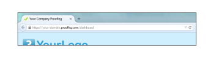

# Personalizza il sito [!DNL Workfront Proof] - avanzato

>[!IMPORTANT]
>
>Questo articolo fa riferimento alle funzionalità nel prodotto autonomo [!DNL Workfront Proof]. Per informazioni sulla verifica all&#39;interno di [!DNL Adobe Workfront], vedere [Verifica](../../../review-and-approve-work/proofing/proofing.md).

Il branding avanzato è disponibile nei piani Select e Premium ed è incluso nel costo del piano.

Per informazioni sul branding di base, che include la pagina di accesso, le notifiche e-mail e le bozze, consulta [Assegna il marchio al  [!DNL Workfront Proof] sito](../../../workfront-proof/wp-acct-admin/branding/brand-wp-site.md).

Le opzioni di branding avanzate includono la personalizzazione delle seguenti aree:

* Colore intestazione e testo
* Intestazione dell’applicazione web
* Colore barra dei menu e testo
* Finestra di benvenuto del dashboard e finestra di avvio rapido
* Testo piè di pagina
* Favicon
* Titolo pagina
* Collegamenti della Guida

Le sezioni seguenti descrivono in modo più dettagliato il branding avanzato:

## Panoramica del branding avanzato

Troverai la sezione [!UICONTROL Configurazione del marchio] nella scheda della pagina [Impostazioni account](https://support.workfront.com/hc/en-us/sections/115000912147-Account-Settings). Per applicare le modifiche al tuo account, assicurati che l&#39;opzione di branding sia impostata su [!UICONTROL Abilitato] (1).

Consulta la sezione seguente per informazioni più dettagliate su come configurare le opzioni di branding avanzate (2-14).

## Configurazione avanzata del marchio

È possibile aggiungere le seguenti aree di [!DNL Workfront Proof]:

* [Applicazione web](#web-application)
* [Intestazione](#header)
* [Collegamenti intestazione](#header-links)
* [Barra laterale](#sidebar)
* [Finestra di benvenuto](#welcome-box)
* [Intestazioni di sezione](#section-headers)

### Applicazione web {#web-application}

Puoi scegliere tra tre opzioni di branding per l’intestazione dell’applicazione web (2):

* Immagine di branding nell’intestazione
* Nome account nell&#39;intestazione
* Se disattivi il branding, il logo [!DNL Workfront Proof] rimarrà nell&#39;intestazione dell&#39;app Web

Immagine di branding: ridimensiona fino a una dimensione massima di 550x90px. È possibile utilizzare GIF, PNG o JPG e gli sfondi trasparenti sono supportati.

Nome dell’account: tratto dai dettagli dell’account e visualizzato con un font bianco. Il nome dell&#39;account può contenere un massimo di 60 caratteri (inclusi spazi e segni di punteggiatura).

### Intestazione {#header}

In questo campo (3) è possibile impostare lo sfondo dell’intestazione e scegliere un colore a tinta unita o un’immagine di sfondo.

Colore: come in tutti gli altri campi di branding della configurazione della combinazione di colori, puoi immettere un valore di colore Esadecimale desiderato o utilizzare un comodo selettore colore (facendo clic sul campo di testo si apre la finestra a comparsa). Il colore di sfondo predefinito dell’intestazione è #232d2e.

Immagine di sfondo: può essere combinata con l&#39;immagine di branding.

* È possibile utilizzare GIF, PNG o JPG: per i file con trasparenza viene visualizzato un colore di sfondo bianco.
* L&#39;altezza dell&#39;intestazione è di 96 px e l&#39;immagine caricata non verrà ridimensionata per l&#39;opzione [!UICONTROL Nessuna ripetizione].
* L&#39;immagine di sfondo è posizionata in alto a sinistra.

### Collegamenti intestazione {#header-links}

In questo campo (4) puoi modificare il colore e il colore del nome utente dei collegamenti nel menu Intestazione, visibile nell’angolo in alto a destra del tuo account.

### Barra laterale {#sidebar}

Scegliere i colori per la barra dei menu (5) e il carattere del menu (6) per personalizzare la barra laterale

>[!NOTE]
>
>Il colore al passaggio del mouse viene regolato automaticamente aggiungendo un valore esadecimale costante al colore selezionato nella barra dei menu.

Impossibile personalizzare il colore del pulsante Nuova bozza.

### Finestra di benvenuto {#welcome-box}

In questo campo (7) è possibile impostare il colore della casella di benvenuto visualizzato nella pagina Dashboard.

### Intestazioni di sezione {#section-headers}

Questi campi ti consentono di personalizzare lo sfondo (8) e il colore del font (9) delle intestazioni di sezione nelle [[!UICONTROL Impostazioni account]](https://support.workfront.com/hc/en-us/sections/115000912147-Account-Settings) pagine.

**Piè di pagina**

In questo campo (10) della configurazione di Branding è possibile comporre un piè di pagina che verrà visualizzato nella parte inferiore di tutte le pagine dell’account. Puoi utilizzare l’editor WYSIWYG integrato oppure incollare semplicemente la progettazione.

>[!NOTE]
>
>Non è possibile modificare HTML nell&#39;editor di testo del piè di pagina, ma è possibile incollare una progettazione copiata, inclusi tutti i collegamenti e le immagini.

**Favicon e titolo pagina**

È possibile personalizzare la modalità di presentazione delle pagine [!DNL Workfront Proof] nei browser impostando l&#39;immagine preferita (file .ICO) (11) e il titolo della pagina (12), che verranno visualizzati nelle schede o nelle intestazioni delle finestre del browser per tutte le pagine dell&#39;account.

>[!NOTE]
>
>Il tuo favicon verrà visualizzato anche nelle intestazioni delle finestre del visualizzatore [!DNL Workfront Proof] per tutte le bozze create sul tuo account.

**Collegamenti della Guida**

Puoi personalizzare i tuoi collegamenti di aiuto per indirizzare gli utenti e i revisori al tuo contenuto. Per attivare questo, impostare l&#39;opzione [!UICONTROL Collegamenti della Guida] (13) su Abilitato e aggiungere i collegamenti nei campi successivi (14). Puoi configurare fino a quattro collegamenti, che saranno disponibili:

* nel menu [!UICONTROL Intestazione] del collegamento [!UICONTROL Guida]
  

* nel pannello [!UICONTROL Guida] della barra laterale [!DNL Workfront Proof] [!UICONTROL Visualizzatore]
  

Per un costo aggiuntivo, i clienti che utilizzano i piani aziendali hanno anche la possibilità di personalizzare completamente i seguenti elementi:

* Personalizza completamente le pagine di destinazione (ad esempio pagine di accesso e disconnessione, pagina Password dimenticata)
* Personalizzazione completa del dominio

Per ulteriori informazioni sulle opzioni di branding aggiuntive, contattaci all’indirizzo sales.team@workfront.com.

<!--
<h2 data-mc-conditions="QuicksilverOrClassic.Draft mode">Custom Domains</h2>
-->

<!--

Our Select and Premium plans include the option to purchase a fully-branded domain. This means that you can customize your URL as well as all links included in notification emails.&nbsp;

-->

<!--

For more information, please see&nbsp;<a href="../../../workfront-proof/wp-acct-admin/branding/configure-branded-domain-in-wp.md" class="MCXref xref">Configure a branded domain in Workfront Proof</a>.

-->

<!--
<h2 data-mc-conditions="QuicksilverOrClassic.Draft mode">Custom Page Branding</h2>
-->

<!--

Custom branding of the Workfront Proof pages is a paid service and by default&nbsp;includes full customization of the following:

-->

<!--
  <li data-mc-conditions="QuicksilverOrClassic.Draft mode"><a href="https://app.proofhq.com/login">Log in/landing page</a> </li>
  -->

<!--
  <li data-mc-conditions="QuicksilverOrClassic.Draft mode"><a href="https://app.proofhq.com/logout">Logout page</a> </li>
  -->

<!--
  <li data-mc-conditions="QuicksilverOrClassic.Draft mode"><a href="https://app.proofhq.com/login/password">Forgot password page</a> </li>
  -->

<!--
<h3 data-mc-conditions="QuicksilverOrClassic.Draft mode">Design Elements</h3>
-->

<!--

Please create your design&nbsp;in&nbsp;a .PSD file with all the elements placed in the separate layers - this will allow us to prepare the scalable pages for you.

-->

<!--

There are no particular restrictions on the .PSD files, and the look and layout of the pages is completely up to you. However please make sure that the key elements are included in your design:

-->

<!--

<strong>Login Page</strong>    

-->

<!--

<strong>Logout page</strong>    

-->

<!--

<strong>Forgot password</strong>    

-->

<!--

<strong>Inactivity alert</strong>    

-->

<!--

<strong>Invalid email address</strong>    

-->

<!--

<strong>Inactivity and incorrect email address</strong>    

-->

<!--
<note type="note">
&nbsp;The separate designs for the alerts are not required. If you'd like us to leave the default style of the messages, as shown on the screencasts above, please let us know. The team will match the colors with your design.
</note>
-->

<!--

If you'd like to have placeholder text in the text fields, please include this in your designs.

-->

<!--
<note type="note">
The wording of the alerts cannot be changed as these are the system messages.
</note>
-->

<!--

<strong>2. Fonts</strong> 

-->

<!--

Please make sure that the text is not rasterized but kept as the text layers, unless you want the particular elements to be displayed as images on your landing pages.

-->

<!--

If you use custom fonts in your design, please make sure to include the following font files: EOT + .TTF + OTF + SVG + WOFF for support in all browsers.

-->

<!--
<note type="note">
&nbsp; You need to hold an appropriate license, which allows implementing your selected fonts on the web pages.
</note>
-->

<!--

If you use the standard and widely available fonts, the font files are not required. Please see the following lists for reference:

-->

<!--
  <li data-mc-conditions="QuicksilverOrClassic.Draft mode"><a href="http://www.w3schools.com/cssref/css_websafe_fonts.asp">Websafe fonts listed in the standard Font families</a> </li>
  -->

<!--
  <li data-mc-conditions="QuicksilverOrClassic.Draft mode"><a href="https://www.google.com/fonts">Open Source Google fonts</a> </li>
  -->

<!--

<strong>3. Screen resolution</strong> 

-->

<!--

We support 1024x768 screen resolution (1366x768 for wide screens) and upwards. However, for the landing pages designs we do recommend using higher resolution for the better results on the various screens. The best practice would be to determine what screen resolution is the most common on your users' machines and prepare a slightly bigger design.

-->

<!--

<strong>4. Browsers compatibility</strong> 

-->

<!--

The newer browsers generally don't require any custom code to display the pages properly. However, if your users have the older browser versions installed on their machines some code adjustments may be needed.

-->

<!--

By default we do prepare the pages compatible with the following browsers:

-->

<!--
  <li data-mc-conditions="QuicksilverOrClassic.Draft mode">Internet Explorer 9+</li>
  -->

<!--
  <li data-mc-conditions="QuicksilverOrClassic.Draft mode">Safari 6.x+</li>
  -->

<!--
  <li data-mc-conditions="QuicksilverOrClassic.Draft mode">Chrome 22+ *</li>
  -->

<!--
  <li data-mc-conditions="QuicksilverOrClassic.Draft mode">Firefox 15+ *</li>
  -->

<!--

* Preferred browsers 

-->

<!--
<note type="note"> Workfront Proof will not design your custom pages, the PSD files must be supplied by you, but if you have any questions, please contact our Support team.
</note>
-->
