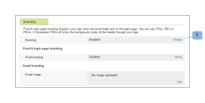

# Personalizza il sito [!DNL Workfront Proof]

>[!IMPORTANT]
>
>Questo articolo fa riferimento alla funzionalità nel prodotto autonomo [!DNL Workfront] Proof. Per informazioni sulla verifica all&#39;interno di [!DNL Adobe Workfront], vedere [Verifica](../../../review-and-approve-work/proofing/proofing.md).

In qualità di amministratore di [!DNL Workfront Proof], puoi aggiungere un marchio al tuo account [!DNL Workfront Proof] per offrire a te e ai tuoi utenti un&#39;esperienza più personalizzata.

Il marchio dell&#39;account di base è disponibile per tutti i piani senza costi aggiuntivi.

Per informazioni sul branding avanzato, che include il branding dell&#39;intestazione, della barra dei menu, del dashboard e altro ancora, consulta [Personalizzare il  [!DNL Workfront Proof] sito - avanzato](../../../workfront-proof/wp-acct-admin/branding/brand-wp-site-advanced.md). Il branding avanzato è disponibile solo nei piani Select e Premium

Vedere le sezioni seguenti per informazioni su come applicare il marchio a vari aspetti del sito di bozze [!DNL Workfront]:

## Abilitazione del marchio nella pagina di accesso [!DNL Workfront Proof]

Per abilitare il branding sul tuo account:

1. Accedere a [!DNL Workfront Proof] come amministratore [!DNL Workfront Proof].
1. Fare clic su **[!UICONTROL Impostazioni account]** nell&#39;angolo superiore destro dell&#39;interfaccia [!DNL Workfront Proof].

   Per ulteriori informazioni sulle varie impostazioni account configurabili, vedere [Impostazioni account.](https://support.workfront.com/hc/en-us/sections/115000912147-Account-Settings)

1. Fare clic sulla scheda **[!UICONTROL Impostazioni]**.
1. Nella sezione **[!UICONTROL Branding]**, fai clic su **[!UICONTROL Abilita]**. 1)

   

   L’immagine di branding viene ora visualizzata nella pagina di accesso.

   >[!NOTE]
   >
   >L&#39;immagine di branding non viene visualizzata nella pagina di accesso se si accede tramite l&#39;URL di accesso principale di [!DNL Workfront] Proof. Ad esempio, `https://www.proofhq.com/login`. Viene visualizzato solo se accedi alla pagina di accesso tramite il sottodominio personalizzato o il dominio a marchio completo. Per accedere alla pagina di accesso personalizzata, digita l’URL dell’account nel browser. Ad esempio, `http://<yoursubdomain>.proofhq.com.` <!--For more information about fully branded domains, see "Fully Branded Domains" in the article [Configure a branded domain in [!DNL Workfront Proof]](../../../workfront-proof/wp-acct-admin/branding/configure-branded-domain-in-wp.md).-->

   

## Abilitazione del branding sulle bozze

Per aggiungere la tua immagine di branding alla pagina [!UICONTROL caricamento bozza] di ogni bozza creata nel tuo account:

1. Accedere a [!DNL Workfront Proof] come amministratore [!DNL Workfront Proof].
1. Fare clic su **[!UICONTROL Impostazioni account]** nell&#39;angolo superiore destro dell&#39;interfaccia [!DNL Workfront Proof].

   Per ulteriori informazioni sulle varie impostazioni account configurabili, vedere [Impostazioni account.](https://support.workfront.com/hc/en-us/sections/115000912147-Account-Settings)

1. Fare clic sulla scheda **[!UICONTROL Impostazioni]**.
1. Nella sezione **[!UICONTROL Branding]**, fai clic su **[!UICONTROL Configurazione]** accanto a **[!UICONTROL Branding bozza]**. 1)

   

1. Dal menu a discesa, seleziona **[!UICONTROL Immagine di branding]**.
Se si seleziona **[!UICONTROL Disattiva]**, il logo [!DNL Workfront Proof] verrà visualizzato nella pagina di caricamento della bozza

1. Fai clic su **[!UICONTROL Salva]**. 3)

   

1. Fai clic su **[!UICONTROL Modifica]** per selezionare l&#39;immagine di branding (4).

   È possibile utilizzare GIF, PNG o JPG. È supportata la trasparenza. Le dimensioni consigliate per l&#39;immagine sono 150x300px. L&#39;immagine nelle pagine di accesso e disconnessione verrà ridimensionata in base a queste dimensioni.

   

1. Seleziona l’immagine da caricare. 5)
1. Fai clic su **[!UICONTROL Salva]**.

   L’immagine di branding viene ora visualizzata nella pagina di caricamento della bozza di ogni bozza creata nel tuo account.

   

## Notifiche e-mail di branding

Puoi configurare l’immagine di branding in modo che venga inclusa nelle notifiche e-mail inviate ai revisori. L&#39;immagine viene ridimensionata alla dimensione massima di 90x550px.

Per impostare il branding e-mail:

1. Accedere a [!DNL Workfront Proof] come amministratore [!DNL Workfront Proof].
1. Fare clic su **[!UICONTROL Impostazioni account]** nell&#39;angolo superiore destro dell&#39;interfaccia [!DNL Workfront Proof].

   Per ulteriori informazioni sulle varie impostazioni account configurabili, vedere [Impostazioni account.](https://support.workfront.com/hc/en-us/sections/115000912147-Account-Settings)

1. Fare clic sulla scheda **[!UICONTROL Impostazioni]**.
1. Nella sezione **[!UICONTROL Branding]**, fai clic su **[!UICONTROL Modifica]** accanto all&#39;immagine dell&#39;applicazione e-mail (1).
   

1. Seleziona l’immagine da utilizzare per il branding delle e-mail. 2)

   Se hai già configurato un marchio e-mail e vuoi disabilitarlo, fai clic su **[!UICONTROL Cancella]**. 4)

   

1. Fai clic su **[!UICONTROL Salva]**.

   L’immagine ora viene visualizzata in tutte le e-mail di notifica delle bozze. 3)

   

<!--
<h2 data-mc-conditions="QuicksilverOrClassic.Draft mode">Custom Sub-Domains</h2>
-->

<!--

You can add your brand name to your Workfront Proof account URL. For example, your URL might look like this:

-->

<!--

<strong>http://yoursubdomain.proofhq.com</strong> 

-->

<!--

This customization is also included in all your proof links, as well as in the 'From' email address for your proof notifications.

-->

<!--

For more information on how to set up a branded sub-domain, see <a href="../../../workfront-proof/wp-acct-admin/branding/configure-branded-domain-in-wp.md" class="MCXref xref">Configure a branded domain in Workfront Proof</a>

-->

## Eliminazione di pulsanti e collegamenti tramite l’API

Se si crea una bozza tramite l&#39;API [!DNL Workfront Proof], è possibile eliminare pulsanti e collegamenti e creare collegamenti personalizzati.

Per ulteriori informazioni, vedere [[!DNL Workfront Proof] API](https://api.proofhq.com/).
