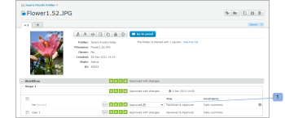

# Informazioni sulle firme elettroniche in [!DNL Workfront Proof]

>[!IMPORTANT]
>
>Questo articolo fa riferimento alla funzionalità del prodotto standalone [!DNL Workfront Proof]. Per informazioni sulle prove all&#39;interno [!DNL Adobe Workfront], vedi [Copertura](../../../review-and-approve-work/proofing/proofing.md).

Le firme elettroniche consentono di migliorare la sicurezza delle bozze e di rispettare gli standard di settore come ISO.

Questa impostazione può essere resa obbligatoria o non obbligatoria a livello di conto. Se è obbligatorio per impostazione predefinita, viene attivato su tutte le bozze create nel tuo account e non può essere disattivato a livello di bozza. Se questa impostazione non è obbligatoria per impostazione predefinita, puoi attivarla/disattivarla a livello di bozza.

Per ulteriori informazioni, consulta .

Quando l’impostazione di firma elettronica è abilitata su una bozza, una casella di firma elettronica richiede a qualsiasi revisore che decida di fornire la propria e-mail e password.

## Firme elettroniche [!UICONTROL Dettagli bozza] Pagina

Se un revisore prende la sua decisione selezionando la propria decisione sul [!UICONTROL Dettagli della bozza] pagina (1) e [!UICONTROL Firma elettronica] compare la casella pop-up che chiede loro di inserire i loro dettagli (2) e di confermare la loro decisione (3).

Il pop-up visualizzerà l&#39;eventuale set di messaggi predefiniti e al revisore verrà richiesto di inserire la propria e-mail e password.

La [!UICONTROL Firma elettronica] pop-up apparirà nel visualizzatore di bozze e anche sul [!UICONTROL Dettagli della bozza] Se il revisore decide di prendere la propria decisione da quel livello.

Se la [!UICONTROL Single Sign-On] l’opzione è abilitata nella bozza, i dettagli dell’e-mail e della password non verranno visualizzati nella [!UICONTROL Firma elettronica] quando prenda una decisione.

Al contrario, dopo aver fatto clic sul pulsante [!UICONTROL Conferma] (4) pulsante su questo pop-up il revisore verrà reindirizzato al [!UICONTROL Single Sign-On] pagina.

Dopo aver immesso le credenziali SSO, il revisore viene automaticamente reindirizzato al [!UICONTROL Dettagli della bozza] (o torna alla pagina [!UICONTROL Visualizzatore di prove] se la decisione è presa da lì).

>[!NOTE]
>
> Se la decisione è firmata elettronicamente, la **[!UICONTROL icona firma]** (5) appare accanto alla decisione nella [!UICONTROL Flusso di lavoro] sezione [!UICONTROL Dettagli della bozza] pagina. Se la decisione non viene modificata dal revisore ma da un&#39;altra persona che dispone dei diritti di modifica sulla prova, a tale persona non verrà chiesto di firmare elettronicamente la decisione e non vi sarà alcuna icona di firma accanto alla decisione (6).

Per informazioni sul single sign-on, vedi [Single Sign-On in Workfront Proof](../../../workfront-proof/wp-acct-admin/managing-security/single-sign-on-overview.md).

Per informazioni sulla pagina dei dettagli della bozza, consulta [Gestisci dettagli bozza in [!DNL Workfront] Prova](../../../workfront-proof/wp-work-proofsfiles/manage-your-work/manage-proof-details.md).
