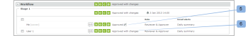

# Informazioni sulle firme elettroniche in [!DNL Workfront Proof]

>[!IMPORTANT]
>
>Questo articolo fa riferimento alle funzionalità nel prodotto autonomo [!DNL Workfront Proof]. Per informazioni sulla verifica all&#39;interno di [!DNL Adobe Workfront], vedere [Verifica](../../../review-and-approve-work/proofing/proofing.md).

Le firme elettroniche consentono di migliorare la sicurezza delle bozze e di rispettare gli standard di settore come ISO.

Questa impostazione può essere resa obbligatoria o non obbligatoria a livello di account. Se è obbligatorio per impostazione predefinita, viene abilitato su tutte le bozze create nel tuo account e non può essere disabilitato a livello di bozza. Se questa impostazione non è obbligatoria per impostazione predefinita, potrai abilitarla o disabilitarla a livello di bozza.

Per ulteriori informazioni, consulta .

Quando l&#39;impostazione della firma elettronica è abilitata su una bozza, un riquadro di firma elettronica richiede a qualsiasi revisore che decide sulla bozza di fornire la propria e-mail e password.

## Firme elettroniche nella pagina [!UICONTROL Dettagli bozza]

Se un revisore decide selezionando la propria decisione nella pagina [!UICONTROL Dettagli bozza] (1), verrà visualizzata una finestra a comparsa [!UICONTROL Firma elettronica] in cui viene richiesto di immettere i propri dettagli (2) e di confermare la propria decisione (3).

Nel pop-up verrà visualizzato il set di messaggi predefinito (se presente) e al revisore verrà richiesto di inserire l’e-mail e la password.

Se il revisore decide di prendere una decisione a partire da tale livello, la finestra a comparsa [!UICONTROL Firma elettronica] verrà visualizzata nel visualizzatore di bozze e nella pagina [!UICONTROL Dettagli bozza].

Se l&#39;opzione [!UICONTROL Single Sign-On] è abilitata nella bozza, i dettagli dell&#39;e-mail e della password non verranno visualizzati nel pop-up [!UICONTROL Firma elettronica] quando si prende una decisione.

Al contrario, dopo aver fatto clic sul pulsante [!UICONTROL Conferma] (4) in questa finestra a comparsa, il revisore verrà reindirizzato alla pagina [!UICONTROL Single Sign-On].

Dopo aver immesso le credenziali SSO, il revisore verrà automaticamente reindirizzato alla pagina [!UICONTROL Dettagli bozza] (o nuovamente al [!UICONTROL Visualizzatore bozze] se la decisione viene presa da lì).

>[!NOTE]
>
> Se la decisione è firmata elettronicamente, l&#39;icona **[!UICONTROL firma]** (5) viene visualizzata accanto alla decisione nella sezione [!UICONTROL Flusso di lavoro] nella pagina [!UICONTROL Dettagli bozza]. Se la decisione non viene modificata dal revisore, ma da un’altra persona che dispone dei diritti di modifica sulla bozza, a tale persona non verrà richiesto di firmare elettronicamente la decisione e non ci sarà alcuna icona di firma accanto alla decisione (6).

Per informazioni sul Single Sign-On, vedere [Single Sign-On in Workfront Proof](../../../workfront-proof/wp-acct-admin/managing-security/single-sign-on-overview.md).

Per informazioni sulla pagina Dettagli bozza, vedere [Gestione dei dettagli bozza in [!DNL Workfront] Proof](../../../workfront-proof/wp-work-proofsfiles/manage-your-work/manage-proof-details.md).
