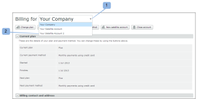

# Gestire un account satellite in [!DNL Workfront Proof]

>[!IMPORTANT]
>
>Questo articolo fa riferimento alle funzionalità nel prodotto autonomo [!DNL Workfront Proof]. Per informazioni sulla verifica all&#39;interno di [!DNL Adobe Workfront], vedere [Verifica](../../../review-and-approve-work/proofing/proofing.md).

In qualità di amministratore [!DNL Workfront Proof], puoi gestire un account satellite configurato sull&#39;account della tua organizzazione.

## Aggiornamento informazioni fatturazione

Per visualizzare e gestire i dettagli di fatturazione del tuo account satellite:

1. Vai alla pagina [!UICONTROL Fatturazione].
1. Apri il menu a discesa nella parte superiore della pagina (1), quindi scegli l’account satellite rilevante. (2)

   Per ulteriori informazioni, vedere &quot;[The [!DNL Workfront Proof] [!UICONTROL Billing] Page](../../../workfront-proof/wp-billingsettings/manage-your-billing/wp-billing-page.md).

   

## Aggiornamento delle informazioni sull&#39;account

Per visualizzare e gestire le impostazioni dell&#39;account Satellite:

1. Vai a [!UICONTROL Impostazioni account] nella parte superiore della pagina.
1. Fai clic sul menu a discesa **[!UICONTROL I tuoi account]**, quindi scegli l&#39;account Satellite pertinente. (1)
1. Fare clic sulla scheda corrispondente per gestire l&#39;impostazione dell&#39;account per l&#39;account Satellite.

