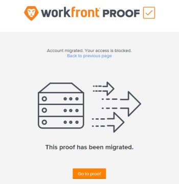

# Domande frequenti: [!UICONTROL Workfront Proof] - Migrazione da Stati Uniti a area EMEA

>[!IMPORTANT]
>
>Questo articolo fa riferimento alle funzionalità nel prodotto autonomo [!DNL Workfront Proof]. Per informazioni sulla verifica all&#39;interno di [!DNL Adobe Workfront], vedere [Verifica](../../../review-and-approve-work/proofing/proofing.md).

## Come posso sapere se questo cambiamento influisce sulla mia organizzazione?

[!DNL Workfront] sta contattando direttamente tutte le organizzazioni interessate dalla migrazione da [!DNL Workfront Proof] Stati Uniti all&#39;area EMEA.

## C&#39;è qualcosa che devo fare per prepararmi alla migrazione?

Sì. Prima della migrazione, accertati di aggiungere quanto segue al inserisco nell&#39;elenco Consentiti di dell’organizzazione:

**[!DNL webcapture.proofhq.eu]**

## Quanto tempo ci vorrà per migrare il mio account?

Per un breve periodo di tempo, fino a due ore, il tuo account non sarà accessibile durante la migrazione alla nuova posizione nel data center dell’area EMEA.

Al termine della migrazione dell’account, inizieremo a spostare tutti i file dal data center statunitense al data center dell’area EMEA. Durante lo spostamento, i file saranno comunque accessibili nel data center statunitense. Questo processo avverrà in background e non avrà alcun impatto su di te e sui tuoi utenti.

Una volta completata la migrazione, gli utenti potranno accedere ai file e alle bozze solo dal data center dell’area EMEA.

## Cosa succederà all&#39;URL che utilizzo per accedere a [!DNL Workfront Proof]?

Questo URL rimarrà invariato. Sarà possibile accedere al sistema [!DNL Workfront] esattamente come è stato fatto in passato.

## Posso ancora usare i miei vecchi link di bozza e segnalibri?

I segnalibri specifici della bozza non funzioneranno più dopo la migrazione. Chiunque ne utilizzi uno riceverà un messaggio che fornisce l&#39;accesso alla bozza tramite il pulsante [!UICONTROL Vai alla bozza]:

## Il mio nome utente e la mia password rimarranno gli stessi di prima?

Sì, il nome utente e la password rimarranno identici a quelli attuali.

## Posso ancora interagire con gli account di prova con cui collaboro negli Stati Uniti?

No, qualsiasi accesso ai precedenti account di verifica USA non sarà più disponibile. Il tuo account nell&#39;area EMEA è completamente separato dall&#39;ambiente statunitense. In questo modo i tuoi dati rimarranno sicuri e rispetteranno le normative sulla privacy dei dati dell’UE.

Se hai un altro account USA con cui hai rapporti e hai l’obbligo di mantenere questa partnership, i proprietari di tale account devono migrare con il tuo account. Discuti di questo con loro prima della migrazione per assicurarti che sia effettuata la migrazione degli account corretti.

## Cosa succede se utilizzo SSO sul mio account?

Se si utilizza SSO sull&#39;account di verifica, sarà necessario riconfigurare l&#39;account per utilizzare il nuovo dominio [!DNL proofhq.eu].
