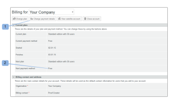
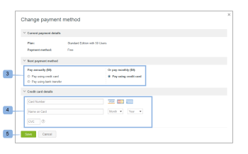

# Scelta del metodo di pagamento in [!DNL Workfront Proof]

>[!IMPORTANT]
>
>Questo articolo fa riferimento alle funzionalità nel prodotto autonomo [!DNL Workfront Proof]. Per informazioni sulla verifica all&#39;interno di [!DNL Adobe Workfront], vedere [Verifica](../../../review-and-approve-work/proofing/proofing.md).

## Informazioni sulle opzioni di pagamento

Sono disponibili le seguenti opzioni di pagamento:

| **Abbonamenti mensili** | **Abbonamenti annuali** |
|---|---|
| carta di credito | carta di credito |
| bonifico bancario |  |

{style="table-layout:auto"}

Non accettiamo assegni

## Modifica del metodo di pagamento e dei dettagli della carta di credito {#changing-your-payment-method-and-credit-card-details}

>[!NOTE]
>
>Prima di modificare il metodo di pagamento, considera quanto segue:
>
>* La modifica della modalità di pagamento non è applicata all&#39;abbonamento corrente. Se desideri modificare questa impostazione per una fattura già emessa, contatta il nostro team finanziario all&#39;indirizzo [finance@proofhq.com](mailto:finance@proofhq.com).
>* Non è possibile modificare il metodo di pagamento o aggiungere una carta di credito se è stato impostato un piano di valutazione sul proprio account. Potrai impostare questi dettagli durante l’aggiornamento dell’account.
>

Per modificare il metodo di pagamento successivo e aggiornare i dati della carta di credito:

1. Fai clic su **[!UICONTROL Modifica dettagli pagamento]** (1) nella parte superiore della pagina\
   Oppure\
   Fai clic su **[!UICONTROL Metodo di pagamento successivo]**. (2)\
   

1. Nella finestra a comparsa **[!UICONTROL Modifica dettagli pagamento]**, seleziona il metodo di pagamento successivo. (3)
1. (Condizionale) Per i pagamenti con carta di credito, inserisci i dettagli della carta.\
   Se si desidera modificare solo i dettagli della carta di credito, compilare solo i campi dei dettagli della carta di credito (4) con i nuovi dati della carta e salvare (5) le modifiche. Puoi cambiare i dati della tua carta di credito in qualsiasi momento. La nuova carta viene utilizzata per tutti i pagamenti in abbonamento con effetto immediato.\
   Accettiamo [!DNL Visa], [!DNL American Express] e [!DNL MasterCard].

1. Fai clic su **[!UICONTROL Salva]**. (4)\
   

## Modifica dei dettagli del metodo di pagamento per gli account satellite

Se si dispone di account Satellite, è necessario aggiornare i dati della carta di credito e il metodo di pagamento separatamente per ciascun account. Per ulteriori informazioni sugli account satellite, vedere [Account satellite.](https://support.workfront.com/hc/en-us/sections/115000921108-Satellite-accounts)

1. Vai alla pagina [!UICONTROL Fatturazione] nell&#39;account Hub.\
   Per ulteriori informazioni sulla pagina Fatturazione, vedere [La [!DNL Workfront] pagina di fatturazione bozza](../../../workfront-proof/wp-billingsettings/manage-your-billing/wp-billing-page.md).

1. Apri il menu a discesa [!UICONTROL elenco account]. (1)
1. Scegliere l&#39;account satellite (2) associato alla carta di credito che si desidera aggiornare.
1. Continua con [Modifica del metodo di pagamento e dei dettagli della carta di credito](#changing-your-payment-method-and-credit-card-details).\
   

