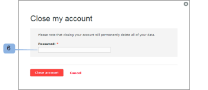

# Chiudi il tuo account [!DNL Workfront Proof]

>[!IMPORTANT]
>
>Questo articolo fa riferimento alle funzionalità nel prodotto autonomo [!DNL Workfront Proof]. Per informazioni sulla verifica all&#39;interno di [!DNL Adobe Workfront], vedere [Verifica](../../../review-and-approve-work/proofing/proofing.md).

Dopo aver completato i passaggi descritti in questa sezione, il tuo account verrà chiuso immediatamente. Tutti i dati nel tuo account verranno eliminati e non potranno essere ripristinati.

Cerchiamo continuamente di migliorare il nostro prodotto. Se desideri chiudere il tuo account, ti saremo grati se potresti prendere qualche minuto e farci sapere come possiamo migliorare.

Puoi contattarci all&#39;indirizzo [!DNL support@proofhq.com] con i tuoi commenti; tutti i commenti sono i benvenuti.

1. Apri la pagina [!UICONTROL Fatturazione] nel tuo account aprendo il menu [!UICONTROL Impostazioni] e scegliendo **[!UICONTROL Fatturazione]** (1).

   Per ulteriori informazioni sulla pagina Fatturazione, vedere [La [!DNL Workfront] pagina di fatturazione bozza](../../../workfront-proof/wp-billingsettings/manage-your-billing/wp-billing-page.md).

   

1. Fare clic sul pulsante **[!UICONTROL Chiudi account]** (3).

   

1. Selezionare il motivo della chiusura dell&#39;account. (4)
1. Conferma la tua decisione facendo clic su **[!UICONTROL Salva]**. (5)

   

1. Immetti la password per chiudere l&#39;account. (6)

   
