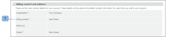

# Pagina Fatturazione [!DNL Workfront Proof]

>[!IMPORTANT]
>
>Questo articolo fa riferimento alle funzionalità nel prodotto autonomo [!DNL Workfront Proof]. Per informazioni sulla verifica all&#39;interno di [!DNL Adobe Workfront], vedere [Verifica](../../../review-and-approve-work/proofing/proofing.md).

## Pagina Fatturazione

Per accedere alla pagina [!UICONTROL Fatturazione], apri il menu **[!UICONTROL Impostazioni]** in alto a destra dello schermo e scegli **[!UICONTROL Fatturazione]** nel menu a discesa.

La pagina [!UICONTROL Fatturazione] contiene quanto segue:

* Nome account (1)
* Elenco account (ad esempio, se si dispone di account satellite)(2)
* Cambia piano (3)
* Modifica dettagli pagamento (4)
* Nuovo account satellite (5)
* Chiudi conto (6)
* Informazioni sul piano corrente (7)
* Contatto di fatturazione e indirizzo (8)
* Statistiche di utilizzo (9)
* Cronologia fatturazione (10)
* Attività di fatturazione (11)

  

## [!UICONTROL Piano corrente]

In questa sezione (7) sono illustrati i dettagli del piano corrente, inclusi i seguenti elementi:

* Nome del piano
* Metodo di pagamento corrente
* Date di inizio e fine del piano corrente
* Tipo di piano successivo
* Metodo di pagamento piano successivo

  Per ulteriori informazioni, vedere [Scelta del metodo di pagamento in [!DNL Workfront Proof]](../../../workfront-proof/wp-billingsettings/manage-your-billing/choose-payment-method-in-wp.md).

## [!UICONTROL Contatto di fatturazione e indirizzo]

In questa sezione (8) sono riportati il contatto di fatturazione principale e i dettagli dell&#39;indirizzo del tuo account.

Il contatto Fatturazione può essere selezionato solo dagli utenti impostati come Amministratori fatturazione sul tuo account. Sugli account satellite, in questo campo è possibile impostare solo gli amministratori di fatturazione dell&#39;account principale.

>[!NOTE]
>
> Puoi avere più amministratori fatturazione sul tuo account, ma solo uno di loro, selezionato nel campo [!UICONTROL Contatto fatturazione], riceverà tutte le notifiche di fatturazione e gli avvisi di utilizzo dell&#39;account.

Sono incluse le seguenti e-mail di notifica:

* Utilizzo bozza
* Fatture
* Downgrade
* Avviso di pagamento in ritardo/sospensione del conto
* Guasto carta di credito

  

Il campo [!UICONTROL Fatturazione CC] consente inoltre di aggiungere un indirizzo e-mail da copiare in tutte le e-mail relative alla fatturazione. Fai clic sul campo per attivare la modifica incline e inserisci un indirizzo e-mail di tua scelta (può essere anche l’indirizzo e-mail di un utente esistente).

## [!UICONTROL Indirizzo di fatturazione]

Questa sezione utilizza la modifica in linea, quindi fai clic sui campi per inserire/modificare il testo.

>[!NOTE]
>
> Includiamo questo indirizzo nelle fatture di abbonamento in modo che questi dati siano sempre aggiornati.

## [!UICONTROL Statistiche utilizzo]

Questa sezione mostra le statistiche di utilizzo del tuo account entro il periodo di fatturazione corrente, inclusi i seguenti elementi:

* Archiviazione utilizzata
* Bozze utilizzate
* Limite utenti utilizzato

### [!UICONTROL Avvisi di utilizzo]

I [[!UICONTROL Profili autorizzazioni bozza] in [!DNL Workfront] Proof](../../../workfront-proof/wp-acct-admin/account-settings/proof-perm-profiles-in-wp.md) impostati come Contatto fatturazione (1) sul tuo account riceveranno una notifica via e-mail quando il tuo account raggiunge:

* 75% e quindi 98% della capacità di storage
* 75% e quindi 100% del limite della bozza

Una volta raggiunti i limiti di bozza o di archiviazione, verranno visualizzati anche gli avvisi nella parte superiore della pagina [!UICONTROL Fatturazione]:

* Per il limite di bozze raggiunto

  

* Per il limite di archiviazione raggiunto

>[!NOTE]
>
>Il conteggio delle bozze viene utilizzato quando le bozze vengono create nel tuo account e non può essere ripristinato rimuovendo le bozze.

Lo spazio di archiviazione può essere liberato eliminando le bozze e i file e svuotando il [!UICONTROL cestino] in seguito.

Se hai bisogno di più bozze, risorse di archiviazione o utenti, puoi aggiornare il tuo account in qualsiasi momento; l’operazione ha effetto immediato.

## [!UICONTROL Cronologia fatturazione]

Questa sezione mostra l’attività per qualsiasi periodo di fatturazione recente. È inoltre possibile scaricare le fatture da questa sezione.

Per ulteriori informazioni, vedere &quot; [Download della fattura [!DNL Workfront Proof] ](../../../workfront-proof/wp-billingsettings/manage-your-billing/download-wp-invoice.md) in corso.&quot;

## [!UICONTROL Attività fatturazione]

Questa sezione mostra le modifiche recenti apportate alla configurazione della fatturazione, ad esempio gli abbonamenti, gli aggiornamenti, i downgrade e i rinnovi del piano [!DNL Workfront Proof].

Se si modifica il piano impostandolo su uno con un limite utente inferiore (1), gli utenti che superano il nuovo limite verranno automaticamente disattivati all&#39;avvio del nuovo piano. Questa attività verrà acquisita anche nei registri del tuo account (2).

