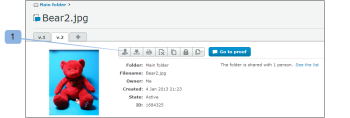

# Nuova e-mail a prova di

>[!IMPORTANT]
>
>Questo articolo fa riferimento alla funzionalità del prodotto standalone [!DNL Workfront Proof]. Per informazioni sulle prove all&#39;interno [!DNL Adobe Workfront], vedi [Copertura](../../../review-and-approve-work/proofing/proofing.md).

<!--

Make this article work better for PiW.

-->

Quando crei una nuova bozza o una nuova versione di una bozza, aggiungi nuove persone a una bozza o aggiungi un flusso di lavoro a una bozza, puoi decidere se inviare un’e-mail ai revisori, come spiegato in questi articoli:

* [Creare una bozza avanzata con un flusso di lavoro automatizzato](../../../review-and-approve-work/proofing/creating-proofs-within-workfront/create-automated-proof-workflow.md)
* [Genera bozze in [!DNL Workfront Proof]](../../../workfront-proof/wp-work-proofsfiles/create-proofs-and-files/generate-proofs.md)

L’e-mail che ricevi è denominata [!UICONTROL Nuova bozza] e-mail. Solo il creatore di prove e gli utenti autorizzati ad aggiungere revisori a una bozza possono controllare questo messaggio e-mail. I destinatari non possono disabilitarlo.

L’e-mail Nuova bozza contiene:

* Messaggio personale (se si sceglie di includerne uno)
* Se invii sempre lo stesso messaggio personalizzato ai tuoi revisori, potrebbe essere utile salvarlo nel tuo [!UICONTROL Impostazioni personali] in [!UICONTROL Valori predefiniti di correzione] scheda . Per ulteriori informazioni, consulta .
* Collegamento personale alla bozza
* **[!UICONTROL Visualizza dettagli]** collegamento che ti porta al [!DNL Workfront] oggetto (ad esempio un progetto, un&#39;attività o un problema)
* Miniatura dell&#39;immagine di prova
* I seguenti dettagli della prova:

   * Nome bozza
   * Numero di versione

      Per ulteriori informazioni, consulta .

   * Elenco dei revisori e loro avanzamento sulla prova
   * Un collegamento per condividere la bozza con un altro utente

      Questo consente di condividere l’URL della bozza e/o il collegamento di download per il file originale. Questo non ti consente di aggiungere in modo esplicito revisori alla bozza, stai condividendo solo l’URL della bozza pubblica e il destinatario riceverà l’accesso in sola lettura alla bozza.

      Vedi [Condividi una bozza in [!DNL Workfront Proof]](../../../workfront-proof/wp-work-proofsfiles/share-proofs-and-files/share-proof.md) per ulteriori informazioni.

      Se non desideri che questo collegamento venga visualizzato nell&#39;e-mail del destinatario, puoi disattivare l&#39; [!UICONTROL Condivisione pubblica] impostazioni della bozza

      (Scarica il file originale e l’URL pubblico). Vedi [Gestisci dettagli bozza in [!DNL Workfront Proof]](../../../workfront-proof/wp-work-proofsfiles/manage-your-work/manage-proof-details.md) per ulteriori informazioni.

## Registro attività

Invio di un [!UICONTROL Nuova bozza] l&#39;e-mail inviata a un revisore viene registrata [!UICONTROL Attività] sezione [!UICONTROL Dettagli della bozza] pagina. Vedi  [Gestisci[!UICONTROL  Dettagli bozza] in [!DNL Workfront Proof]](../../../workfront-proof/wp-work-proofsfiles/manage-your-work/manage-proof-details.md) per ulteriori informazioni. Puoi controllare se la [!UICONTROL Nuova bozza] l’e-mail è stata abilitata al momento della creazione di una bozza.

>[!NOTE]
>
>* Se il Creatore o il Proprietario della bozza ha [!UICONTROL Prove Realizzate] e-mail disattivate per impostazione predefinita (nelle impostazioni personali), non riceveranno alcun messaggio [!UICONTROL Prove fatte] o [!UICONTROL Nuova prova] e-mail anche se [!UICONTROL Informa le persone tramite e-mail] Questa casella è selezionata nella pagina Nuova bozza . Per ulteriori informazioni, consulta .
>* Se le notifiche e-mail sono disattivate come impostazione predefinita nella [!UICONTROL Impostazioni account] il Creatore / Proprietario della bozza non riceverà alcun [!UICONTROL Prove fatte] o [!UICONTROL Nuova prova] e-mail anche se è abilitata nelle impostazioni personali e [!UICONTROL Notifica] la casella per e-mail è selezionata nella pagina Nuova bozza . Per ulteriori informazioni, consulta [La [!UICONTROL Prove Realizzate] email](../../../workfront-proof/wp-emailsntfctns/proof-notifications-and-reminders/proof-made-email.md) e vedi .
>

## Abilita la [!UICONTROL Nuova bozza] e-mail e includi un messaggio personalizzato

È possibile specificare se si desidera inviare un avviso e-mail ai revisori su una bozza quando la si crea o quando si aggiunge un utente.

* [Quando crei una bozza](#when-you-create-a-proof)
* [Quando si aggiunge un revisore a una bozza](#when-you-add-a-reviewer-to-a-proof)

### Quando crei una bozza {#when-you-create-a-proof}

Quando crei una nuova bozza nel [!UICONTROL Nuova prova] sotto **[!UICONTROL Condividi]** Puoi scegliere se inviare avvisi e-mail:

* Qui puoi decidere se vuoi [!UICONTROL Informa le persone tramite e-mail] (1) Se deselezioni questa opzione, nessuno dei revisori riceve un’e-mail per informarli che la bozza è pronta per la revisione.
* Puoi anche includere un messaggio personalizzato nella notifica e-mail (2).
* Se decidi di aggiungere un messaggio personalizzato, puoi inserire un oggetto personalizzato (3) e un messaggio nel corpo dell’e-mail (4).
* Per eliminare il messaggio personalizzato fai clic sul collegamento (5).

   >[!NOTE]
   >
   >Se invii sempre lo stesso messaggio personalizzato ai tuoi revisori, potrebbe essere utile salvarlo nelle impostazioni Personali in [!UICONTROL Valori predefiniti di correzione] scheda . Per ulteriori informazioni, consulta .

### Quando si aggiunge un revisore a una bozza {#when-you-add-a-reviewer-to-a-proof}

Puoi selezionare se un nuovo revisore aggiunto a una bozza esistente riceverà una notifica della bozza (simile a quanto sopra).

* Per aggiungere nuovi revisori, fai clic sul pulsante **[!UICONTROL Condividi questa versione]** pulsante **[!UICONTROL Dettagli della bozza]** pagina (1).

* Viene visualizzata una casella in cui è possibile aggiungere nuovi revisori. Puoi quindi decidere se desideri ricevere una notifica tramite e-mail (2) e scegliere di aggiungere un messaggio personalizzato all’e-mail (3).

* Se scegli di aggiungere un messaggio personalizzato, la casella si espande e potrai inserire un oggetto personalizzato (4) e un testo personalizzato nel corpo dell’e-mail (5). Puoi anche eliminare il messaggio personalizzato facendo clic sul collegamento (6).

