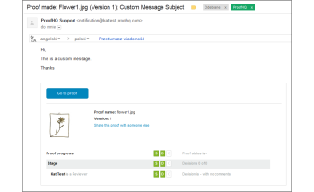

# E-mail [!UICONTROL Bozza effettuata]

>[!IMPORTANT]
>
>Questo articolo fa riferimento alle funzionalità nel prodotto autonomo [!DNL Workfront Proof]. Per informazioni sulla verifica all&#39;interno di [!DNL Adobe Workfront], vedere [Verifica](../../../review-and-approve-work/proofing/proofing.md).

Un&#39;e-mail di [!UICONTROL Bozza creata] viene inviata al creatore della bozza solo quando ha creato una bozza. Se una persona ha creato una bozza e ne ha resa Proprietaria un&#39;altra, solo il nuovo Proprietario riceve l&#39;e-mail [!UICONTROL Bozza creata]. Il Creatore e/o il Proprietario non ne riceveranno uno; riceveranno solo l&#39;e-mail [!UICONTROL Proof Made]. Per ulteriori informazioni sull&#39;e-mail [!UICONTROL Nuova bozza], vedere l&#39;e-mail [[!UICONTROL Nuova bozza]](../../../workfront-proof/wp-emailsntfctns/proof-notifications-and-reminders/new-proof-email.md).

Gli utenti possono disabilitare le e-mail [!UICONTROL Proof Made] nelle impostazioni del profilo, come spiegato di seguito.

>[!NOTE]
>
> Se l&#39;autore o il proprietario della bozza ha disabilitato [!UICONTROL Proof Made] email per impostazione predefinita nelle impostazioni personali, non riceverà alcuna e-mail [!UICONTROL Proof Made] o [!UICONTROL New Proof], anche se la casella [!UICONTROL Notify people by email] è selezionata nella pagina [!UICONTROL New proof].

Un&#39;e-mail di [!UICONTROL Verifica effettuata] include il messaggio personale (se ne includi uno) e i seguenti dettagli della bozza:

* Nome bozza
* Collegamento personale alla bozza
* Numero di versione
* Miniatura della bozza
* Avanzamento bozza
* Collegamento per condividere la bozza con un altro utente
* Questo consente di condividere l’URL della bozza e/o il collegamento per il download del file originale.

>[!NOTE]
>
> La condivisione di collegamenti alle bozze non consente di aggiungere in modo esplicito i revisori alla bozza, ma solo di condividere l’URL pubblico della bozza e il destinatario riceverà l’accesso in sola lettura alla bozza.

Per ulteriori informazioni, vedere [Condividi bozza in [!DNL Workfront Proof]](../../../workfront-proof/wp-work-proofsfiles/share-proofs-and-files/share-proof.md).

Se non vuoi che questo collegamento venga visualizzato nell&#39;e-mail del destinatario, disabilita le impostazioni [!UICONTROL Condivisione pubblica] nella bozza ([!UICONTROL Scarica il file originale] e [!UICONTROL URL pubblico]).

## Disabilitazione dell&#39;e-mail [!UICONTROL Proof Made] in corso

1. Fai clic su **[!UICONTROL Impostazioni]** > **[!UICONTROL Impostazioni personali]**, apri la scheda **[!UICONTROL Impostazioni predefinite bozza]**, quindi fai clic su **[!UICONTROL Disattiva]** accanto a **[!UICONTROL Conferma e-mail quando le bozze sono pronte]**.

1. 

1. Per istruzioni più dettagliate, vedere [Configurare le impostazioni delle notifiche e-mail in Workfront Proof](../../../workfront-proof/wp-emailsntfctns/email-alerts/config-email-notification-settings-wp.md).
1. Se le notifiche e-mail sono disabilitate come predefinite nelle [!UICONTROL Impostazioni account], il creatore o il proprietario della bozza non riceverà alcuna e-mail [!UICONTROL Bozza creata] o [!UICONTROL Nuova bozza], anche se questa opzione è abilitata nelle impostazioni personali e la casella [!UICONTROL Notifica agli utenti tramite e-mail] è selezionata nella pagina [!UICONTROL Nuova bozza].
