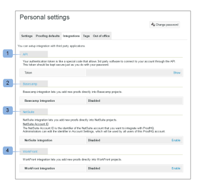

# Integrazioni - Configurazione utente

>[!IMPORTANT]
>
>Questo articolo fa riferimento alle funzionalità nel prodotto autonomo [!DNL Workfront Proof]. Per informazioni sulla verifica all&#39;interno di [!DNL Adobe Workfront], vedere [Verifica](../../../review-and-approve-work/proofing/proofing.md).

Questa sezione mostra le opzioni disponibili per la configurazione di collegamenti di integrazione predefiniti con applicazioni di terze parti.

Qui puoi anche trovare il token di autenticazione che consente a software di terze parti di connettersi al tuo account tramite l’API.

I punti di integrazione correnti sono disponibili per:

* API pubblica (1) - Consulta la nostra [pagina di aiuto API](https://api.proofhq.com/) dedicata
* [!DNL Basecamp] (2) - Consulta le nostre pagine di aiuto dedicate [[!DNL Basecamp]](https://support.workfront.com/hc/en-us/sections/115000911927-Basecamp) e [[!DNL Basecamp Classic]](https://support.workfront.com/hc/en-us/categories/115000588707-Basecamp-Classic)

* [!DNL NetSuite] (3)
* [!DNL WorkFront] (4)

