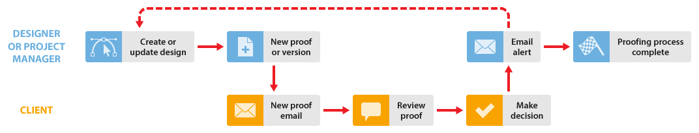

# Processo di verifica di base in [!DNL Workfront Proof]

>[!IMPORTANT]
>
>Questo articolo fa riferimento alle funzionalità nel prodotto autonomo [!DNL Workfront Proof]. Per informazioni sulla verifica all&#39;interno di [!DNL Adobe Workfront], vedere [Verifica](../../../review-and-approve-work/proofing/proofing.md).

In questo esempio viene illustrato il flusso di lavoro di base tra un designer o un project manager e uno o più revisori, ad esempio un client.

* **Crea nuova bozza** - La finestra di progettazione o il project manager crea una nuova bozza in [!DNL Workfront Proof] e la condivide con il client. (Vedi [Generare bozze in [!DNL Workfront Proof]](../../../workfront-proof/wp-work-proofsfiles/create-proofs-and-files/generate-proofs.md).)

* **Nuova e-mail bozza** - Il client riceve un&#39;e-mail contenente un collegamento alla bozza.

* **Rivedi una bozza** - Il client rivede la bozza, aggiunge commenti e prende una decisione. (Vedi [Verifica delle bozze entro [!DNL Adobe Workfront]](../../../review-and-approve-work/proofing/reviewing-proofs-within-workfront/review-proofs-in-wf.md) e [Decidi su una bozza nel visualizzatore di bozze](../../../review-and-approve-work/proofing/reviewing-proofs-within-workfront/make-a-decision-on-a-proof/make-decisions-on-proof.md).)

* **Avviso e-mail** - il progettista o il project manager riceve un messaggio e-mail con un riepilogo della revisione del client, a seconda degli avvisi e-mail impostati. (Vedi [Configurare le impostazioni delle notifiche e-mail in [!DNL Workfront Proof]](../../../workfront-proof/wp-emailsntfctns/email-alerts/config-email-notification-settings-wp.md).)

* **Nuova versione** (se necessario) - Il designer o il project manager modifica il file e lo carica in [!DNL Workfront Proof] come nuova versione. (Vedere ).

Puoi ripetere questa procedura finché la bozza non viene approvata.
