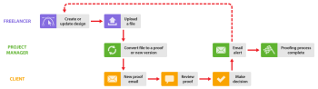
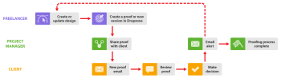

# Utilizzo dei freelance in [!DNL Workfront Proof]

>[!IMPORTANT]
>
>Questo articolo fa riferimento alla funzionalità del prodotto standalone [!DNL Workfront Proof]. Per informazioni sulle prove all&#39;interno [!DNL Adobe Workfront], vedi [Copertura](../../../review-and-approve-work/proofing/proofing.md).

Se la tua organizzazione lavora con i freelance, puoi includerli nella tua [!DNL Workfront Proof] anche il processo.

Esistono alcuni modi per farlo a seconda che desideri che il freelancer faccia parte della tua organizzazione in [!DNL Workfront Proof] o no:

## Aggiungi freelance al tuo [!DNL Workfront Proof] Account

Puoi semplicemente aggiungere i tuoi freelance come utenti al tuo account in [!DNL Workfront Proof], proprio come faresti con i tuoi colleghi, possono far parte di tutti i flussi di lavoro descritti in questa sezione.

Puoi utilizzare i vari profili utente e la regola sulla privacy delle cartelle per gestire la visibilità e l’accesso del Freelancer nel tuo account.

Vedi gli articoli  [Profili utente e autorizzazioni](https://support.workfront.com/hc/https://support.workfront.com/hc/en-us/articles/115004087428-User-profiles-and-permissions) e [Comprendere le autorizzazioni delle cartelle in [!DNL Workfront Proof]](../../../workfront-proof/wp-work-proofsfiles/organize-your-work/folder-permissions.md) prima di aggiungere un freelancer come utente al tuo account .

Per informazioni sull’aggiunta di un freelancer al team, consulta [Crea utenti utilizzando [!DNL Workfront Proof]](../../../workfront-proof/wp-mnguserscontacts/users/create-users.md).

>[!NOTE]
>
>Tutti i freelance aggiunti al tuo account come utenti avranno visibilità nel tuo account e potranno anche vedere i dettagli del cliente (a seconda del loro profilo utente). Questo potrebbe non essere quello che si vuole, quindi forse l&#39;impostazione di un account satellitare per i vostri freelance sarebbe un&#39;opzione più adatta; vedere [Imposta un account satellitare per i tuoi freelance](https://support.workfront.com/knowledge/articles/115004259868/en-us?brand_id=662728&amp;return_to=%2Fhc%2Fen-us%2Farticles%2F115004259868#Option-B---set-up-a-satellite-account-for-your-freelancers) sotto.

## Imposta un account satellitare per i tuoi freelance

Se non vuoi che i clienti e i freelance si vedano in [!DNL Workfront Proof], puoi impostare account satellitari per i tuoi freelance.

Questo significa che avranno un proprio dashboard per visualizzare tutti gli elementi su cui stanno lavorando in un&#39;unica posizione. Inoltre, saranno in grado di inviare file a voi tramite [!DNL Workfront Proof], che puoi convertire in bozze ([!UICONTROL Enterprise] e [!UICONTROL Senza limiti] solo piani). Per ulteriori informazioni, consulta [Gestisci i file in [!DNL Workfront Proof]](../../../workfront-proof/wp-work-proofsfiles/manage-your-work/manage-files.md).

Significa anche che se il freelancer deve creare nuove versioni della bozza durante il processo di revisione, puoi aggiungerle esplicitamente alla bozza come [!UICONTROL Autore], che consentirà loro di partecipare al processo di revisione e di creare nuove versioni come e quando necessario. Per ulteriori informazioni, consulta e [Gestisci ruoli di bozza in [!DNL Workfront Proof]](../../../workfront-proof/wp-work-proofsfiles/share-proofs-and-files/manage-proof-roles.md).

1. Il freelancer accede al loro account satellitare.
1. Il freelancer carica il file e lo condivide con te. Vedi [Caricare file e contenuti web in [!DNL Workfront Proof]](../../../workfront-proof/wp-work-proofsfiles/create-proofs-and-files/upload-files-web-content.md) e [Condividi file in [!DNL Workfront Proof]](../../../workfront-proof/wp-work-proofsfiles/share-proofs-and-files/share-files.md).

1. Ricevi un&#39;e-mail che ti dice che un file è stato condiviso con te.
1. Accedi al tuo account e trova il file che è stato condiviso con te.
1. Utilizzi le [!UICONTROL convertire in bozza] per convertire il file in una bozza. Per ulteriori informazioni, consulta [Gestisci i file in [!DNL Workfront Proof]](../../../workfront-proof/wp-work-proofsfiles/manage-your-work/manage-files.md).
1. Puoi quindi gestire il flusso di lavoro della bozza con i clienti nel modo normale. Se desideri aggiungere il tuo Freelancer esplicitamente alla bozza, puoi farlo utilizzando la funzione di condivisione. Per ulteriori informazioni, consulta [Condividi una bozza in [!DNL Workfront Proof]](../../../workfront-proof/wp-work-proofsfiles/share-proofs-and-files/share-proof.md).
1. Se non desideri aggiungere esplicitamente il tuo Freelancer alla bozza, ma desideri notificarlo quando è stato approvato; puoi inviare una notifica al tuo freelancer al termine del processo di bozza condividendo con loro un collegamento alla bozza.

   Ciò significa che non fanno parte del team di revisione e che i clienti non vedono il loro nome elencato nella bozza.

Per informazioni sulla configurazione di un account satellitare per i tuoi freelance, vedi  [Configurare un account satellite in [!DNL Workfront Proof]](../../../workfront-proof/wp-acct-admin/satellite-accounts/configure-sat-acct-in-wp.md).

## Utilizza la [!UICONTROL Zona Dropzone]

Questa opzione è utile se non desideri che i clienti e i freelance si vedano tra loro in [!DNL Workfront Proof]. Puoi dare ai tuoi freelance l&#39;accesso al tuo [!UICONTROL Zona Dropzone] (disponibile il [!UICONTROL Enterprise] e [!UICONTROL Senza limiti] solo piani). Per ulteriori informazioni, consulta [La [!UICONTROL Zona Dropzone]](../../../workfront-proof/wp-work-proofsfiles/create-proofs-and-files/dropzone.md).

1. Il freelancer va al vostro pubblico [!UICONTROL Zona Dropzone] pagina.
1. Utilizzano [!UICONTROL Zona Dropzone] per creare una nuova bozza nel tuo account.
1. Ricevi un&#39;e-mail che ti dice che è presente una nuova prova [!UICONTROL Zona Dropzone].
1. Accedi al tuo account e trova la bozza nel tuo [!UICONTROL Zona Dropzone].
1. Sblocca la bozza, aggiungi revisori, imposta le impostazioni della bozza e gestisci il flusso di lavoro della bozza con i clienti nel modo normale. Il tuo freelancer sarà mostrato come Creatore della bozza (e non potrà essere rimosso).

* Puoi gestire l’accesso del tuo freelancer alla bozza con il tuo [!UICONTROL Zona Dropzone] impostazioni. Per ulteriori informazioni, consulta [Configura la zona di rilascio in [!DNL Workfront Proof]](../../../workfront-proof/wp-acct-admin/account-settings/configure-dropzone-in-wp.md).
* Puoi anche gestire il ruolo assegnato alla bozza, ad esempio [!UICONTROL Sola lettura], nonché le comunicazioni via e-mail con loro riguardo alla prova. Per ulteriori informazioni, consulta [Gestisci ruoli di bozza in [!DNL Workfront Proof]](../../../workfront-proof/wp-work-proofsfiles/share-proofs-and-files/manage-proof-roles.md).
* Se non desideri che il tuo freelancer partecipi al processo di revisione ma desideri che venga loro notificata la decisione finale, puoi impostare il ruolo di prova predefinito all&#39;interno del tuo [!UICONTROL Zona Dropzone] impostazioni e un avviso e-mail per tutti [!UICONTROL Zona Dropzone] notificanti [Gestisci ruoli di bozza in [!DNL Workfront Proof]](../../../workfront-proof/wp-work-proofsfiles/share-proofs-and-files/manage-proof-roles.md) e [Configura le impostazioni di notifica e-mail in [!DNL Workfront Proof]](../../../workfront-proof/wp-emailsntfctns/email-alerts/config-email-notification-settings-wp.md) rispettivamente. Per ulteriori informazioni, consulta [Avvisi e-mail,](https://support.workfront.com/hc/en-us/sections/115000911867-Email-alerts) [Gestisci ruoli di bozza in [!DNL Workfront Proof]](../../../workfront-proof/wp-work-proofsfiles/share-proofs-and-files/manage-proof-roles.md) e [Configura le impostazioni di notifica e-mail in [!DNL Workfront Proof]](../../../workfront-proof/wp-emailsntfctns/email-alerts/config-email-notification-settings-wp.md).
* Se desideri che il tuo freelancer partecipi attivamente al processo di revisione, puoi regolare il suo ruolo di bozza e l’impostazione di avviso tramite e-mail, a seconda delle necessità, modificando in linea questi dettagli nella pagina Dettagli bozza . Per ulteriori informazioni su tale pagina, consulta [Gestisci dettagli bozza in [!DNL Workfront Proof]](../../../workfront-proof/wp-work-proofsfiles/manage-your-work/manage-proof-details.md)
