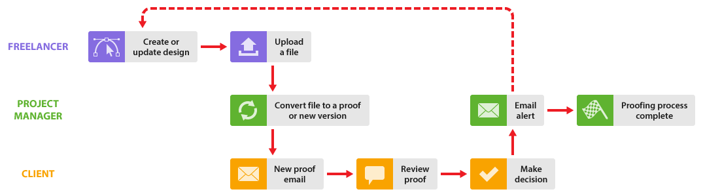

# Utilizzo di freelance in [!DNL Workfront Proof]

>[!IMPORTANT]
>
>Questo articolo fa riferimento alle funzionalità nel prodotto autonomo [!DNL Workfront Proof]. Per informazioni sulla verifica all&#39;interno di [!DNL Adobe Workfront], vedere [Verifica](../../../review-and-approve-work/proofing/proofing.md).

Se la tua organizzazione lavora con freelance, puoi includerli anche nel processo [!DNL Workfront Proof].

Esistono alcuni modi per eseguire questa operazione a seconda che si desideri che il freelance faccia parte dell&#39;organizzazione in [!DNL Workfront Proof] o meno:

## Aggiungi freelance al tuo account [!DNL Workfront Proof]

Puoi semplicemente aggiungere i tuoi freelance come utenti al tuo account in [!DNL Workfront Proof], proprio come faresti con i tuoi colleghi, in modo che possano far parte di tutti i flussi di lavoro descritti in questa sezione.

Puoi utilizzare i vari profili utente e le regole sulla privacy delle cartelle per gestire la visibilità e l’accesso dei freelance nel tuo account.

Consulta gli articoli [Profili utente e autorizzazioni](https://support.workfront.com/hc/https://support.workfront.com/hc/en-us/articles/115004087428-User-profiles-and-permissions) e [Comprendere le autorizzazioni della cartella in [!DNL Workfront Proof]](../../../workfront-proof/wp-work-proofsfiles/organize-your-work/folder-permissions.md) prima di aggiungere un freelance come utente al tuo account.

Per informazioni sull&#39;aggiunta di un freelance al tuo team, consulta [Creare utenti utilizzando [!DNL Workfront Proof]](../../../workfront-proof/wp-mnguserscontacts/users/create-users.md).

>[!NOTE]
>
>Tutti i freelance aggiunti al tuo account come utenti avranno visibilità sul tuo account e potranno anche visualizzare i dettagli del cliente (a seconda del loro profilo utente). Questo potrebbe non essere ciò che desideri, quindi forse la configurazione di un account Satellite per i tuoi freelance sarebbe un&#39;opzione più adatta; vedi [Configurare un account Satellite per i tuoi freelance](https://support.workfront.com/knowledge/articles/115004259868/en-us?brand_id=662728&amp;return_to=%2Fhc%2Fen-us%2Farticles%2F115004259868#Option-B---set-up-a-satellite-account-for-your-freelancers) di seguito.

## Configurare un account satellite per i freelance

Se non si desidera che i clienti e i freelance si vedano in [!DNL Workfront Proof], è possibile impostare account satellite per i freelance.

Ciò significa che disporranno di un proprio dashboard per visualizzare tutti gli elementi su cui stanno lavorando in un’unica posizione. Inoltre, potranno inviarti i file tramite [!DNL Workfront Proof], che potrai convertire in bozze ([!UICONTROL Enterprise] e [!UICONTROL Unlimited] piani solo). Per ulteriori informazioni, vedere [Gestire i file in [!DNL Workfront Proof]](../../../workfront-proof/wp-work-proofsfiles/manage-your-work/manage-files.md).

Ciò significa anche che se il freelance deve creare nuove versioni della bozza durante il processo di revisione, puoi aggiungerle esplicitamente alla bozza come [!UICONTROL Autore], consentendo loro di partecipare al processo di revisione e creare nuove versioni come e quando necessario. Per ulteriori informazioni, vedere e [Gestire i ruoli bozza in [!DNL Workfront Proof]](../../../workfront-proof/wp-work-proofsfiles/share-proofs-and-files/manage-proof-roles.md).

1. Il freelance accede al suo account satellitare.
1. Il freelance carica il file e lo condivide con te. Consulta [Caricare file e contenuti Web in [!DNL Workfront Proof]](../../../workfront-proof/wp-work-proofsfiles/create-proofs-and-files/upload-files-web-content.md) e [Condividere file in [!DNL Workfront Proof]](../../../workfront-proof/wp-work-proofsfiles/share-proofs-and-files/share-files.md).

1. Ricevi un’e-mail che ti informa che un file è stato condiviso con te.
1. Accedi al tuo account e individua il file che è stato condiviso con te.
1. Il pulsante [!UICONTROL converti in bozza] consente di convertire il file in una bozza. Per ulteriori informazioni, vedere [Gestire i file in [!DNL Workfront Proof]](../../../workfront-proof/wp-work-proofsfiles/manage-your-work/manage-files.md).
1. Puoi quindi gestire il flusso di lavoro della bozza con i clienti nel modo normale. Se desideri aggiungere esplicitamente il tuo Freelancer alla bozza, puoi farlo utilizzando la funzione di condivisione. Per ulteriori informazioni, vedere [Condividi bozza in [!DNL Workfront Proof]](../../../workfront-proof/wp-work-proofsfiles/share-proofs-and-files/share-proof.md).
1. Se non desideri aggiungere esplicitamente il tuo freelance alla bozza, ma desideri comunque informarlo quando questa sarà stata approvata, puoi informare il tuo freelance alla fine del processo di bozza condividendo con loro un collegamento alla bozza.

   Ciò significa che non fanno parte del team di revisione e che i tuoi clienti non visualizzano il proprio nome nell’elenco della bozza.

Per informazioni sulla configurazione di un account satellite per i freelance, consulta [Configurare un account satellite in [!DNL Workfront Proof]](../../../workfront-proof/wp-acct-admin/satellite-accounts/configure-sat-acct-in-wp.md).

## Utilizza [!UICONTROL Dropzone]

Questa opzione è utile se non si desidera che client e freelance si vedano in [!DNL Workfront Proof]. Puoi consentire ai tuoi freelance di accedere alla [!UICONTROL Dropzone] (disponibile solo nei piani [!UICONTROL Enterprise] e [!UICONTROL Unlimited]). Per ulteriori informazioni, vedere [La [!UICONTROL Dropzone]](../../../workfront-proof/wp-work-proofsfiles/create-proofs-and-files/dropzone.md).

1. Il freelance accede alla tua pagina pubblica [!UICONTROL Dropzone].
1. Usano [!UICONTROL Dropzone] per creare una nuova bozza nel tuo account.
1. Ricevi un&#39;e-mail che ti informa che una nuova bozza si trova nella tua [!UICONTROL Dropzone].
1. Accedi al tuo account e trova la bozza nel tuo [!UICONTROL Dropzone].
1. Puoi sbloccare la bozza, aggiungere revisori, impostare le impostazioni della bozza e gestire il flusso di lavoro della bozza con i clienti nel modo normale. Il freelance verrà mostrato come creatore della bozza (e non potrà essere rimosso).

* Puoi gestire l&#39;accesso alla bozza da parte del tuo freelance con le impostazioni di [!UICONTROL Dropzone]. Per ulteriori informazioni, vedere [Configurare la zona di rilascio in [!DNL Workfront Proof]](../../../workfront-proof/wp-acct-admin/account-settings/configure-dropzone-in-wp.md).
* Puoi anche gestire il ruolo che gli viene assegnato sulla bozza, ad esempio [!UICONTROL Sola lettura], nonché le comunicazioni e-mail relative alla bozza. Per ulteriori informazioni, vedere [Gestione dei ruoli bozza in [!DNL Workfront Proof]](../../../workfront-proof/wp-work-proofsfiles/share-proofs-and-files/manage-proof-roles.md).
* Se non vuoi che il tuo freelance partecipi al processo di revisione ma desideri che venga loro notificata la decisione finale, puoi impostare il ruolo della bozza predefinito nelle impostazioni di [!UICONTROL Dropzone] e un avviso e-mail per tutti i [!UICONTROL submitter di Dropzone] su [Gestisci ruoli bozza in [!DNL Workfront Proof]](../../../workfront-proof/wp-work-proofsfiles/share-proofs-and-files/manage-proof-roles.md) e [Configura le impostazioni delle notifiche e-mail in [!DNL Workfront Proof]](../../../workfront-proof/wp-emailsntfctns/email-alerts/config-email-notification-settings-wp.md) rispettivamente. Per ulteriori informazioni, vedere [Avvisi e-mail,](https://support.workfront.com/hc/en-us/sections/115000911867-Email-alerts) [Gestione ruoli bozza in [!DNL Workfront Proof]](../../../workfront-proof/wp-work-proofsfiles/share-proofs-and-files/manage-proof-roles.md) e [Configurazione delle impostazioni delle notifiche e-mail in [!DNL Workfront Proof]](../../../workfront-proof/wp-emailsntfctns/email-alerts/config-email-notification-settings-wp.md).
* Se desideri che il tuo freelance partecipi attivamente al processo di revisione, puoi modificare il ruolo della bozza e l’impostazione dell’avviso e-mail in base alle esigenze, modificando questi dettagli in linea nella pagina Dettagli bozza. Per ulteriori informazioni su questa pagina, consulta [Gestire i dettagli della bozza in [!DNL Workfront Proof]](../../../workfront-proof/wp-work-proofsfiles/manage-your-work/manage-proof-details.md)
