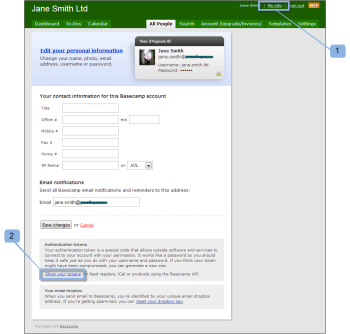

# Integra [!DNL Workfront Proof] con [!DNL Basecamp Classic]

>[!IMPORTANT]
>
>Questo articolo fa riferimento alle funzionalità nel prodotto autonomo [!DNL Workfront Proof]. Per informazioni sulla verifica all&#39;interno di [!DNL Adobe Workfront], vedere [Verifica](../../../review-and-approve-work/proofing/proofing.md).

Se utilizzi [!DNL Basecamp] per la gestione dei progetti, puoi offrire al team di progetto strumenti di revisione e approvazione più completi tramite [!DNL Workfront Proof].

## Informazioni sull&#39;integrazione di [!DNL Basecamp] con [!DNL Workfront]

L&#39;integrazione con [!DNL Basecamp] consente agli utenti di visualizzare, esaminare e approvare le bozze in [!DNL Basecamp]. Gli utenti possono inviare bozze al tuo account [!DNL Workfront Proof] e collegarli al progetto [!DNL Basecamp]. I revisori possono prendere [una decisione su una bozza nel visualizzatore di bozze](../../../review-and-approve-work/proofing/reviewing-proofs-within-workfront/make-a-decision-on-a-proof/make-decisions-on-proof.md) tramite [!DNL Basecamp], utilizzando la mini bozza incorporata nel messaggio Basecamp.

Quando è integrato con [!DNL Workfront Proof], [!DNL Basecamp] consente agli utenti di eseguire le seguenti operazioni con le bozze:

* Gli utenti possono rivedere e approvare le bozze entro [!DNL Basecamp Classic].
* Gli utenti dispongono di strumenti di revisione prontamente disponibili.
* I team di revisione del progetto ricevono un messaggio in [!DNL Basecamp] con una mini bozza per la revisione e l&#39;approvazione.
* Gli utenti possono passare a una bozza a pagina intera per la revisione e l’approvazione.
* Gli utenti possono aggiungere commenti e markup alle bozze mini e full-size.

  >[!NOTE]
  >
  >Una volta risposto, un commento non può essere modificato o eliminato.

* I revisori possono rispondere alle marcature e effettuate da altri revisori.
* Gli utenti vengono avvisati quando è disponibile una nuova versione della bozza.
* Gli utenti che non sono [!DNL Workfront Proof] utenti possono lavorare su una bozza in [!DNL Basecamp].

L&#39;integrazione di [!DNL Workfront Proof] con [!DNL Basecamp] deve essere impostata su due livelli:

* Configura [!DNL Basecamp] in [Impostazioni account:](https://support.workfront.com/hc/en-us/sections/115000912147-Account-settings) In questo modo viene abilitata l&#39;integrazione Basecamp per l&#39;intera organizzazione.
* Per ulteriori informazioni, vedere [Abilitazione dell&#39;integrazione [!DNL Basecamp] con [!DNL Workfront Proof]](#enabling-the-basecamp-integration-with-workfront-proof).
* Configura [!DNL Basecamp] in [Impostazioni personali](https://support.workfront.com/hc/en-us/sections/115000921168-Personal-settings): consente ai creatori e ai proprietari di bozze di connettersi al proprio account [!DNL Basecamp] personale e di autorizzare l&#39;accesso a [!DNL Workfront Proof]. Per ulteriori informazioni, vedere [Configurazione delle impostazioni personali](#configuring-personal-settings).

È possibile integrare [!DNL Workfront] con [!DNL Basecamp] o [!DNL Basecamp Classic]. Ogni versione di [!DNL Basecamp] utilizza un&#39;API diversa e richiede pertanto procedure di configurazione diverse.

Per informazioni sulla configurazione di [!DNL Basecamp Classic], vedere [Abilitare l&#39;integrazione di [!DNL Basecamp] con [!DNL Workfront Proof]](#enabling-the-basecamp-integration-with-workfront-proof) in questo articolo.

Per informazioni sulla configurazione di [!DNL Basecamp], vedere [Integrare [!DNL Workfront Proof] con [!DNL Basecamp]](../../../workfront-proof/wp-integrations/basecamp/integrate-workfront-proof-with-basecamp.md).

## Abilitazione dell&#39;integrazione di [!DNL Basecamp] con [!DNL Workfront Proof]

In qualità di [profili di autorizzazioni bozza in [!DNL Workfront Proof]](../../../workfront-proof/wp-acct-admin/account-settings/proof-perm-profiles-in-wp.md) o [profili di autorizzazioni bozza in [!DNL Workfront Proof]](../../../workfront-proof/wp-acct-admin/account-settings/proof-perm-profiles-in-wp.md), puoi impostare l&#39;integrazione Basecamp per l&#39;intero account nelle [impostazioni account](https://support.workfront.com/hc/en-us/sections/115000912147-Account-settings).

1. Vai a [Impostazioni account.](https://support.workfront.com/hc/en-us/sections/115000912147-Account-settings)
1. Apri la scheda **[!UICONTROL Integrazioni]** (1).
1. Per abilitare l&#39;integrazione Basecamp, fare clic su **[!UICONTROL Abilita]** (2).
1. Verificare che [!DNL Basecamp Classic] sia la versione con cui si sta effettuando l&#39;integrazione (3).
1. (Condizionale) Se non viene visualizzato alcun URL [!DNL Basecamp] (4), fai clic su **[!UICONTROL Modifica]** e immetti l&#39;URL per l&#39;account [!DNL Basecamp] (senza http://).
1. Fai clic su **[!UICONTROL Salva]** (5).\
   

1. (Facoltativo) Controlla l&#39;URL di [!DNL Basecamp] nel browser dopo aver effettuato l&#39;accesso all&#39;account di [!DNL Basecamp Classic] (6).

   

   Dopo aver integrato [!DNL Workfront Proof] con [!DNL Basecamp], gli utenti possono configurare le proprie impostazioni personali. Per informazioni sulla configurazione delle impostazioni personali, vedere [Configurazione delle impostazioni personali](#configuring-personal-settings).

   Se non riesci ad abilitare l&#39;integrazione di [!DNL Basecamp], l&#39;ID dell&#39;account [!DNL Workfront Proof] potrebbe non essere uguale all&#39;ID dell&#39;account utilizzato in [!DNL Basecamp].

## Configurazione delle impostazioni personali

Dopo aver configurato le [impostazioni account](https://support.workfront.com/hc/en-us/sections/115000912147-Account-settings) per l&#39;organizzazione, ogni autore che crea/invia bozze deve impostare le [impostazioni personali.](https://support.workfront.com/hc/en-us/sections/115000921168-Personal-settings)

>[!NOTE]
>
>Completare questi passaggi è più semplice se la sessione [!DNL Basecamp] è aperta in una finestra del browser e la sessione [!DNL Workfront Proof] è aperta in un&#39;altra finestra.

* [Recupero del token API  [!DNL Basecamp] &#x200B;](#retrieving-your-basecamp-api-token)
* [Aggiunta del token API  [!DNL Basecamp]  alle impostazioni personali](#adding-your-basecamp-api-token-to-your-personal-settings)

### Recupero del token API [!DNL Basecamp]

Per completare l&#39;integrazione a livello individuale in [!DNL Workfront Proof], gli utenti hanno bisogno del token di autenticazione individuale per l&#39;API [!DNL Basecamp].

Per recuperare il token API [!DNL Basecamp]:

1. Accedi al tuo account [!DNL Basecamp].
1. Fai clic su **[!UICONTROL Informazioni personali]** (1) nell&#39;angolo superiore destro dello schermo.\
   Viene visualizzata la pagina [!UICONTROL Informazioni personali].\
   

1. Nella sezione [!UICONTROL Token di autenticazione], fai clic su **[!UICONTROL Mostra i token]** (2) per visualizzare i token di autenticazione personali.
1. Seleziona **[!UICONTROL Token per i lettori di feed]** o l&#39;API **[!UICONTROL Basecamp]** (3), quindi copia il token negli Appunti.

1. Incolla il token API [!DNL Basecamp] in [!UICONTROL Token per i lettori di feed] o nella casella [!UICONTROL API Basecamp].\
   

### Aggiunta del token API [!DNL Basecamp] alle impostazioni personali

Per incollare il token API [!DNL Basecamp] nelle [!DNL Workfront Proof] [impostazioni personali](https://support.workfront.com/hc/en-us/sections/115000921168-Personal-settings):

1. Vai a [[!UICONTROL Integrazioni] - Configurazione utente](../../../workfront-proof/wp-getstarted/personal-settings/integrations-user-setup.md) nelle [Impostazioni personali](https://support.workfront.com/hc/en-us/sections/115000921168-Personal-settings) (1).\
   Un amministratore deve prima abilitare l&#39;integrazione di [!DNL Basecamp Classic] per abilitare le impostazioni personali. Per informazioni sulla configurazione dell&#39;integrazione, vedere [Abilitazione dell&#39;integrazione  [!DNL Basecamp] con [!DNL Workfront Proof]](#enabling-the-basecamp-integration-with-workfront-proof) in questo articolo.

1. Nella casella token API [!DNL Basecamp] (2), incolla nel campo (3) il token appena copiato dalla pagina [!DNL Basecamp] [!UICONTROL Informazioni personali].\
   Per informazioni sulla copia del token API [!DNL Basecamp], vedere [Recupero del token API [!DNL Basecamp] &#x200B;](#retrieving-your-basecamp-api-token) in questo articolo.

1. Fai clic su **[!UICONTROL Salva]** (4).

Le [!DNL Workfront Proof] [impostazioni personali](https://support.workfront.com/hc/en-us/sections/115000921168-Personal-settings) sono ora integrate con il tuo account [!DNL Basecamp Classic].
