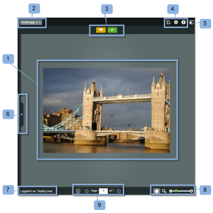

# Verifica una bozza in [!DNL Basecamp] Classic

>[!IMPORTANT]
>
>Questo articolo fa riferimento alle funzionalità nel prodotto autonomo [!DNL Workfront Proof]. Per informazioni sulla verifica all&#39;interno di [!DNL Adobe Workfront], vedere [Verifica](../../../review-and-approve-work/proofing/proofing.md).

[!DNL Basecamp] è uno strumento di gestione dei progetti in linea sviluppato da [!DNL 37signals]. Se utilizzi [!DNL Basecamp] per la gestione dei progetti, puoi offrire al team di progetto strumenti di revisione e approvazione più completi tramite [!DNL Workfront Proof].

## Informazioni sulle verifiche delle bozze in [!DNL Basecamp Classic]

Quando è integrato con [!DNL Workfront Proof], [!DNL Basecamp] consente agli utenti di eseguire le seguenti operazioni con le bozze:

* Gli utenti possono rivedere e approvare le bozze entro [!DNL Basecamp Classic].
* Gli utenti dispongono di strumenti di revisione prontamente disponibili.
* I team di revisione del progetto ricevono un messaggio in [!DNL Basecamp] con una mini bozza per la revisione e l&#39;approvazione.
* Gli utenti possono passare a una bozza a pagina intera per la revisione e l’approvazione.
* Gli utenti possono aggiungere commenti e markup alle bozze mini e full-size.
* Una volta risposto, un commento non può essere modificato o eliminato. Per informazioni sui commenti, vedere [Commento su una bozza](../../../review-and-approve-work/proofing/reviewing-proofs-within-workfront/comment-on-a-proof/comment-on-proof.md).
* I revisori possono rispondere alle marcature e effettuate da altri revisori. Per informazioni sui commenti, vedere [Commento su una bozza](../../../review-and-approve-work/proofing/reviewing-proofs-within-workfront/comment-on-a-proof/comment-on-proof.md).
* Gli utenti vengono avvisati quando è disponibile una nuova versione della bozza.
* Gli utenti che non sono [!DNL Workfront Proof] utenti possono lavorare su una bozza in [!DNL Basecamp].

## Visualizzazione di una bozza tramite l’e-mail di notifica

Se colleghi una bozza a [!DNL Basecamp], [!DNL Workfront Proof] invia a tutti i revisori un&#39;e-mail di notifica della bozza (1) contenente le seguenti informazioni:

* **Dettagli bozza** (2): visualizza informazioni sulla bozza. Le informazioni visualizzate dipendono dal modo in cui l’amministratore di Workfront ha configurato Basecamp.
* **[!UICONTROL Vai alla bozza] collegamento** (3): apre la bozza in Workfront.
* **[!DNL Basecamp]URL** (4): apre la bozza in Basecamp. Se alla bozza vengono aggiunti revisori non Basecamp, la notifica e-mail non include il collegamento Basecamp.
* **[!UICONTROL Stato bozza]** (5): elenca le fasi di approvazione e visualizza gli indicatori di avanzamento bozza.
* **[!UICONTROL Fase]** (6): elenca i revisori e il loro avanzamento individuale.

Per aprire la bozza dalla notifica e-mail:

1. Per aprire la bozza in [!DNL Workfront Proof], fare clic su **[!UICONTROL Vai alla bozza]**.\
   Oppure\
   Per aprire la bozza in [!DNL Basecamp], fare clic sull&#39;URL elencato nel campo **[!UICONTROL [!DNL Basecamp]URL]**.\
   Per informazioni sulla revisione di una bozza in [!DNL Basecamp Classic], vedere [Revisione di una bozza in [!DNL Basecamp]](#reviewing-a-proof-in-basecamp) in questo articolo.

## Visualizzazione della bozza tramite il messaggio [!DNL Basecamp Classic]

È possibile accedere a una bozza da un messaggio [!DNL Basecamp Classic].

1. In [!DNL Basecamp], vai alla pagina del tuo progetto (1).\
   

1. Fare clic sul messaggio relativo alla bozza che si desidera aprire. 2)\
   Viene visualizzato il messaggio relativo alla bozza, con una mini bozza. Il nome della bozza viene visualizzato nella parte superiore della finestra del messaggio (3).\
   È possibile visualizzare la bozza delle miniature in [!DNL Basecamp Classic] o in [!DNL Workfront Proof].\
   

1. Per visualizzare la bozza in modalità a schermo intero in [!DNL Workfront proof], fare clic sull&#39;URL riportato sopra la bozza (4).
1. (Condizionale) Se non hai effettuato l&#39;accesso all&#39;account [!DNL Workfront Proof] in una delle finestre del browser, effettua l&#39;accesso per rivedere la bozza:

   1. Fai clic su **[!UICONTROL Accedi]** (5) sopra la bozza.
   1. Digita il tuo indirizzo email (6).\

      Utilizza lo stesso indirizzo e-mail utilizzato al momento dell’aggiunta della bozza.
   1. Fai clic su **[!UICONTROL Avanti]**.
   1. Digitare la password [!DNL Workfront Proof] (7).\

      Oppure\
      Se non si dispone di un account [!DNL Workfront Proof], digitare un nome pubblico da visualizzare.\
      Puoi selezionare &quot;[!UICONTROL ricorda]&quot; in modo da immettere i tuoi dettagli solo una volta.

1. Per rivedere la bozza, continuare con [Revisione di una bozza in [!DNL Basecamp]](#reviewing-a-proof-in-basecamp).

>[!NOTE]
>
> La casella di commento riportata sotto la mini bozza nella pagina del messaggio si applica solo al messaggio stesso. Per inviare i commenti di revisione, devi utilizzare il pulsante dell&#39;icona dei commenti nella parte superiore della mini bozza o il pulsante più grande [!UICONTROL Commenti] nella parte superiore della bozza a pagina intera. Per ulteriori informazioni, vedere Revisione di [Revisione di una bozza in [!DNL Basecamp]](#reviewing-a-proof-in-basecamp).

## Revisione di una bozza in [!DNL Basecamp]

La mini bozza in [!DNL Basecamp] ti fornisce gli strumenti necessari per aggiungere e per prendere [una decisione su una bozza nel visualizzatore di bozze](../../../review-and-approve-work/proofing/reviewing-proofs-within-workfront/make-a-decision-on-a-proof/make-decisions-on-proof.md) della bozza. Tutti gli utenti assegnati al progetto visualizzano i tuoi commenti e commenti e possono rispondere con i propri commenti in tempo reale.

Quando si apre la bozza, la bozza viene visualizzata nella finestra [!UICONTROL correzione] (1) e il nome della bozza e il numero della versione vengono visualizzati nell&#39;angolo superiore sinistro (2).

Per rivedere la bozza:

1. Per aggiungere un commento, fai clic su [!UICONTROL Commento] (3) nella parte superiore della bozza e digita il commento.\
   Non è necessario inviare una risposta al messaggio [!DNL Basecamp], poiché i commenti e [Decidere su una bozza nel visualizzatore di bozze](../../../review-and-approve-work/proofing/reviewing-proofs-within-workfront/make-a-decision-on-a-proof/make-decisions-on-proof.md) sono stati salvati nella bozza (in modo analogo alla revisione di una bozza in [!DNL Workfront Proof]).

1. Per aggiungere una decisione, fai clic su Decisione (3) nella parte superiore della bozza, quindi seleziona la decisione di approvazione.\
   Per ulteriori informazioni sul processo decisionale per una bozza, vedere [Decidere su una bozza nel visualizzatore di bozze](../../../review-and-approve-work/proofing/reviewing-proofs-within-workfront/make-a-decision-on-a-proof/make-decisions-on-proof.md#making-a-decision-on-a-proof).

Altre funzioni disponibili nella finestra della bozza sono:

* **[!UICONTROL Menu azioni]** (4): consente di selezionare le impostazioni per la bozza.
* **[!UICONTROL Pulsante Schermo intero]** (5): consente di passare dalla modalità a schermo intero a quella a bozza mini.
* **[!UICONTROL Barra laterale]** (6): consente di espandere o ridurre la visualizzazione della bozza.
* **[!UICONTROL Nome utente]** (7): visualizza il nome utente se si è connessi a Workfront.
* **[!UICONTROL Strumenti zoom]** (8): ti consente di ingrandire un&#39;area della bozza.
* **[!UICONTROL Strumenti di navigazione]** (9): consente di scorrere fino ad altre pagine all&#39;interno della bozza.

<!--For more information on reviewing proofs, see [Legacy proofing viewer Overview](../../../workfront-proof/wp-work-proofsfiles/review-proofs-lpv/legacy-proofing-viewer.md).-->
