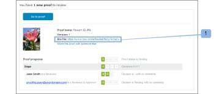

# Visualizza il file originale di una bozza nella casella

>[!IMPORTANT]
>
>Questo articolo fa riferimento alle funzionalità del prodotto autonomo [!DNL Workfront Proof]. Per informazioni sulle prove all&#39;interno [!DNL Adobe Workfront], vedi [Bozza](../../../review-and-approve-work/proofing/proofing.md).

Se utilizzi il [!DNL Workfront Proof] - [!DNL Box] Integrazione di, in Box, puoi visualizzare il file originale utilizzato per creare una bozza. È possibile eseguire questa operazione in due modi:

## Visualizzazione del file in [!DNL Box] tramite notifica e-mail bozza

Quando viene creata una nuova bozza o una nuova versione da un [!DNL Box] , il creatore e i revisori ricevono una notifica e-mail contenente un collegamento al file nel [!DNL Box] conto (1).\

## Visualizzazione del file in [!DNL Box] tramite [!UICONTROL Dettagli bozza] Pagina

Il [!UICONTROL Altre opzioni di condivisione] sezione del [!UICONTROL Dettagli bozza] pagina della bozza creata da un [!DNL Box] il file include un collegamento al file nel [!DNL Box] conto (1).

