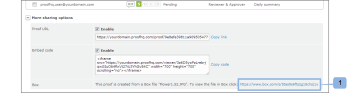

# Visualizzare in Box il file originale di Proof

>[!IMPORTANT]
>
>Questo articolo fa riferimento alle funzionalità nel prodotto autonomo [!DNL Workfront Proof]. Per informazioni sulla verifica all&#39;interno di [!DNL Adobe Workfront], vedere [Verifica](../../../review-and-approve-work/proofing/proofing.md).

Se utilizzi l&#39;integrazione [!DNL Workfront Proof] - [!DNL Box], in Box puoi visualizzare il file originale utilizzato per creare una bozza. È possibile eseguire questa operazione in due modi:

## Visualizzazione del file in [!DNL Box] tramite notifica e-mail bozza

Quando si crea una nuova bozza o una nuova versione da un file [!DNL Box], l&#39;autore e i revisori ricevono una notifica e-mail contenente un collegamento al file nell&#39;account [!DNL Box] (1).\

## Visualizzazione del file in [!DNL Box] tramite la pagina [!UICONTROL Dettagli bozza]

La sezione [!UICONTROL Altre opzioni di condivisione] della pagina [!UICONTROL Dettagli bozza] della bozza creata da un file [!DNL Box] include un collegamento al file nell&#39;account [!DNL Box] (1).

