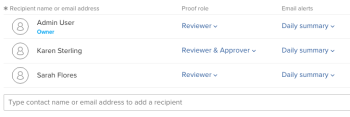

# Aggiungi gruppi a una bozza

>[!IMPORTANT]
>
>Questo articolo fa riferimento alla funzionalità del prodotto standalone [!DNL Workfront Proof]. Per informazioni sulle prove all&#39;interno [!DNL Adobe Workfront], vedi [Copertura](../../../review-and-approve-work/proofing/proofing.md).

Aggiungi un gruppo a una bozza per inviare automaticamente il contenuto a tutti i membri del gruppo.

Per informazioni su come creare un gruppo, consulta [Creare gruppi di correzione utilizzando [!DNL Workfront Proof]](../../../workfront-proof/wp-mnguserscontacts/groups/create-proofing-groups.md).

1. Inizia a creare una bozza utilizzando uno dei seguenti metodi:

   * Crea una bozza standard.

      Per ulteriori informazioni, consulta [Genera bozze in [!DNL Workfront Proof]](../../../workfront-proof/wp-work-proofsfiles/create-proofs-and-files/generate-proofs.md).

   * Crea una nuova versione di prova.

      Per ulteriori informazioni, consulta .
   * Faccia una copia di una prova. Per ulteriori informazioni, consulta <a href="../../../workfront-proof/wp-work-proofsfiles/create-proofs-and-files/copy-proofs.md" class="MCXref xref">Copia delle bozze in [!DNL Workfront Proof]</a>.

1. In **[!UICONTROL Flusso di lavoro]** inizia a digitare il nome del gruppo nella sezione **[!UICONTROL Digitare un nome di contatto o un indirizzo e-mail per aggiungere un destinatario]** campo . 
1. Selezionare il nome del gruppo.
Ora vengono visualizzati i membri del gruppo. 
1. (Facoltativo) Modificare l&#39;impostazione di un singolo membro **Ruolo di prova** o **Avvisi e-mail** con i menu a discesa.
Per ulteriori informazioni, consulta <a href="../../../workfront-proof/wp-work-proofsfiles/share-proofs-and-files/manage-proof-roles.md" class="MCXref xref">Gestisci ruoli di bozza in [!DNL Workfront Proof]</a> e <a href="../../../workfront-proof/wp-emailsntfctns/email-alerts/config-email-notification-settings-wp.md" class="MCXref xref">Configura le impostazioni di notifica e-mail in [!DNL Workfront Proof]</a>.
1. (Facoltativo) Per eliminare un membro del gruppo dalla bozza, passa il puntatore del mouse sulle informazioni dell&#39;utente e fai clic sul pulsante **[!UICONTROL X]**.
Oppure Elimina tutti i membri dalla bozza facendo clic su **[!UICONTROL Elimina tutto]**.
1. Continua a creare la bozza come descritto in <a href="../../../workfront-proof/wp-work-proofsfiles/create-proofs-and-files/generate-proofs.md" class="MCXref xref">Genera bozze in [!DNL Workfront Proof]</a>  o <a href="../../../workfront-proof/wp-work-proofsfiles/create-proofs-and-files/copy-proofs.md" class="MCXref xref">Copia delle bozze in [!DNL Workfront Proof]</a>. 
