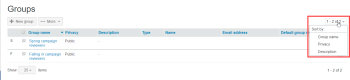

# Gestisci gruppi tramite [!DNL Workfront Proof]

>[!IMPORTANT]
>
>Questo articolo fa riferimento alle funzionalità nel prodotto autonomo [!DNL Workfront Proof]. Per informazioni sulla verifica all&#39;interno di [!DNL Adobe Workfront], vedere [Verifica](../../../review-and-approve-work/proofing/proofing.md).

In qualità di amministratore [!DNL Workfront Proof], puoi gestire i tuoi gruppi pubblici e privati nella pagina Gruppi.

## Apertura della pagina Gruppi

1. Fai clic su **[!UICONTROL Gruppi]** nella barra laterale di navigazione a sinistra.
Nella pagina [!UICONTROL Gruppi] è possibile:

   * Visualizza tutti i tuoi gruppi pubblici e privati.
   * Crea un nuovo Gruppo. Per ulteriori informazioni, vedere [Creare gruppi di verifica utilizzando [!DNL Workfront Proof]](../../../workfront-proof/wp-mnguserscontacts/groups/create-proofing-groups.md).
   * Esporta gruppi in file CSV.
   * Filtrare e ordinare i gruppi.
   * Dopo aver selezionato uno o più gruppi, sono disponibili le seguenti opzioni aggiuntive:

      * Aggiungi persone ai gruppi selezionati.

        

      * Rendi i gruppi selezionati privati o pubblici, come descritto in [Rendi i gruppi privati tramite [!DNL Workfront Proof]](../../../workfront-proof/wp-mnguserscontacts/groups/make-groups-private.md)
      * I gruppi privati sono visibili solo ai loro creatori.
      * Elimina i gruppi selezionati.

        
   * Puoi eseguire azioni sui gruppi anche su ciascun gruppo separatamente dal menu **[!UICONTROL Altro]** (tre punti):

     

      * Visualizza dettagli gruppo.

        È inoltre possibile visualizzare i dettagli del gruppo facendo clic sul nome del gruppo.
      * Aggiungi persone.
      * Rendi un gruppo pubblico/privato.
      * Eliminare un gruppo.

## Ordinamento dei gruppi

È possibile ordinare i gruppi in base al nome, allo stato di privacy e alla descrizione.

1. Fare clic sull&#39;intestazione di colonna in base alla quale si desidera eseguire l&#39;ordinamento.
Oppure
Selezionare un&#39;opzione di ordinamento dal menu Ordina.
   
Il triangolo su un&#39;intestazione di colonna indica l&#39;ordinamento. Puntato verso l’alto, indica un ordine crescente; puntato verso il basso indica un ordine decrescente.

## Filtraggio dei gruppi

1. Fai clic sull&#39;icona **[!UICONTROL Filtro]** all&#39;estrema destra delle intestazioni di colonna per visualizzare le opzioni di filtro sotto le intestazioni di colonna.
   

1. Seleziona [!UICONTROL opzioni filtro] dai menu a discesa e digita nelle caselle filtro visualizzate sotto ogni intestazione di colonna, quindi fai di nuovo clic sull&#39;icona **[!UICONTROL Filtro]** per applicare le opzioni.
Oppure\
   Selezionare la prima lettera nel nome del gruppo.
   

## Visualizzazione e modifica dei dettagli dei gruppi

1. Fai clic sul pulsante **[!UICONTROL Altro]** all&#39;estrema destra del nome del gruppo, quindi fai clic su **[!UICONTROL Visualizza dettagli gruppo]** nel menu a discesa.
Nella pagina visualizzata è possibile visualizzare tutte le persone attualmente nel gruppo, insieme ai ruoli predefiniti e agli avvisi e-mail per il gruppo.

1. Effettuate una delle seguenti operazioni per modificare i dettagli del gruppo:

   * Modificate il nome e la descrizione del gruppo facendo clic su di esso e digitando. Le modifiche vengono salvate facendo clic in un punto qualsiasi all&#39;esterno del campo.
   * Fai clic su **[!UICONTROL Privacy]** per modificare l&#39;impostazione relativa alla privacy del gruppo nel menu a discesa.
   * Fai clic su **[!UICONTROL Aggiungi al gruppo]** per aggiungere nuove persone al gruppo.

     

   * Fare clic su **[!UICONTROL Elimina gruppo]** nell&#39;angolo superiore destro per eliminare il gruppo.\

     

   * Fare clic sulla casella di controllo all&#39;inizio della riga di un membro del gruppo e utilizzare una delle opzioni visualizzate sopra l&#39;elenco.
   * Fai clic sull&#39;icona **[!UICONTROL Altro]** alla fine della riga di un membro del gruppo e utilizza una delle opzioni del menu a discesa.

     

## Aggiunta di contatti ai gruppi

1. Fai clic su **[!UICONTROL Contatti]** nel pannello di navigazione a sinistra per passare alla pagina **[!UICONTROL Contatti]**.

1. Selezionare le caselle di controllo accanto al nome o ai nomi dei contatti che si desidera aggiungere a un gruppo.
1. Fare clic sul pulsante **[!UICONTROL Aggiungi al gruppo]**.
   
Viene visualizzata la finestra di dialogo **[!UICONTROL Aggiungi al gruppo]**.

1. Nella sezione **[!UICONTROL Persone]**:

   1. Utilizza i menu a discesa per modificare il **Ruolo** o **Avvisi e-mail** di un membro. Per ulteriori informazioni, vedere [Gestione dei ruoli bozza in [!DNL Workfront Proof]](../../../workfront-proof/wp-work-proofsfiles/share-proofs-and-files/manage-proof-roles.md) e [Configurazione delle impostazioni delle notifiche e-mail in [!DNL Workfront Proof]](../../../workfront-proof/wp-emailsntfctns/email-alerts/config-email-notification-settings-wp.md).

   1. Utilizza il campo **[!UICONTROL Immettere un nome di contatto]** o **[!UICONTROL indirizzo e-mail]** per aggiungere ulteriori contatti al gruppo.

1. Nella sezione **[!UICONTROL Gruppi]** selezionare il gruppo a cui si desidera aggiungere il contatto o i contatti.
1. Fai clic su **[!UICONTROL Aggiungi al gruppo]**.
