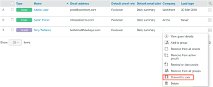

# Crea utenti con [!DNL Workfront Proof]

>[!IMPORTANT]
>
>Questo articolo fa riferimento alle funzionalità nel prodotto autonomo [!DNL Workfront Proof]. Per informazioni sulla verifica all&#39;interno di [!DNL Adobe Workfront], vedere [Verifica](../../../review-and-approve-work/proofing/proofing.md).

In qualità di amministratore [!DNL Workfront Proof], puoi creare nuovi utenti.

Per informazioni sui diritti di amministratore, consulta [Profili autorizzazioni bozza in [!DNL Workfront Proof]](../../../workfront-proof/wp-acct-admin/account-settings/proof-perm-profiles-in-wp.md).

>[!NOTE]
>
>Si sconsiglia di aggiungere terze parti al proprio account.

Puoi creare un utente da zero oppure convertire un ospite in un utente con licenza.

## Creazione di un utente

1. Per iniziare a creare un utente, effettua una delle seguenti operazioni:

   * Fai clic sulla freccia del menu a discesa accanto a **[!UICONTROL Nuova bozza]**, quindi fai clic su **[!UICONTROL Nuovo utente]**.

   * Fai clic su **[!UICONTROL Impostazioni]** > **[!UICONTROL Impostazioni account]**, quindi fai clic su **[!UICONTROL +Nuovo utente]**.

   * Fai clic su **[!UICONTROL Contatti]** nel menu di navigazione a sinistra, quindi su **[!UICONTROL + Nuovo]**, infine su **[!UICONTROL Nuovo utente]**.
*Viene visualizzata la finestra di dialogo Nuovo utente.

1. Nella casella **[!UICONTROL Nuovo utente]** visualizzata digitare le informazioni della persona e impostare le opzioni di configurazione come descritto in [Configura informazioni utente tramite [!DNL Workfront Proof]](../../../workfront-proof/wp-mnguserscontacts/users/configure-user-info.md).

1. Fai clic su **[!UICONTROL Crea]**.

## Conversione di un ospite in un utente

Gli ospiti sono utenti che non dispongono di un account [!DNL Workfront Proof] concesso in licenza. Se un Guest viene aggiornato a un account utente con licenza, è necessario convertire manualmente un Account Guest in un utente con licenza.

Per ulteriori informazioni su ospiti e utenti, vedere [Informazioni su utenti, membri e ospiti in [!DNL Workfront Proof]](../../../workfront-proof/wp-mnguserscontacts/contacts/use-members-guests.md).

1. Fai clic su **[!UICONTROL Contatti]** nel menu di navigazione a sinistra.
1. Fai clic sull&#39;icona **[!UICONTROL Altro]** a destra del Guest che desideri convertire in utente, quindi fai clic su **[!UICONTROL Converti in utente]**.
   

1. Nella finestra di dialogo **[!UICONTROL Nuovo utente]** visualizzata, impostare le opzioni di configurazione per l&#39;utente, come descritto in [Configura informazioni utente tramite [!DNL Workfront Proof]](../../../workfront-proof/wp-mnguserscontacts/users/configure-user-info.md).

1. Fare clic su **[!UICONTROL Converti in utente]**.
