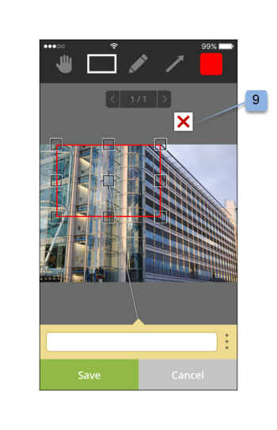
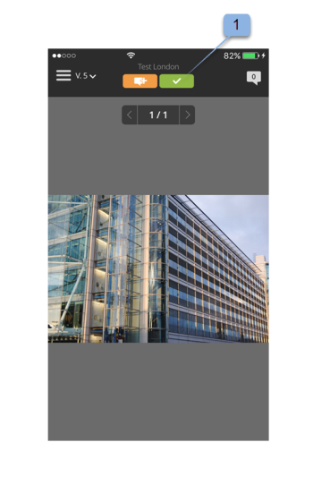

# App mobile Workfront Proof

>[!IMPORTANT]
>
>Questo articolo fa riferimento alle funzionalità del prodotto autonomo [!DNL Workfront Proof]. Per informazioni sulle prove all&#39;interno [!DNL Adobe Workfront], vedi [Bozza](../../../review-and-approve-work/proofing/proofing.md).

Scarica il file [!DNL Workfront Proof] dall’App Store di Apple o dal Google Store per essere produttivi ovunque ti trovi. Il [!DNL Workfront Proof] L’app dispone delle seguenti funzioni su iPhone e iPod Touch:

* Visualizzare, rivedere e approvare bozze statiche e audiovisive
* Visualizzare, aggiungere e rispondere ai commenti
* Gestione delle bozze tramite dashboard e visualizzazioni

Non è necessario essere un utente di [!DNL Workfront Proof] (ad esempio, possiedi le tue credenziali di accesso) per rivedere e approvare una bozza tramite l’app iOS. Se scarichi l’app sul tuo dispositivo iOS e accedi al tuo URL personale tramite l’app e-mail di iOS, puoi rivedere e approvare in movimento.

## Requisiti del dispositivo

Richiede iOS 7.0 o versione successiva. Android 4.0 e versioni successive. Compatibile con iPhone, iPad e iPod touch.

## Scaricare e installare l’app

>[!IMPORTANT]
>
>L’app mobile Workfront Proof non è più supportata ed è disponibile così com’è.  Eventuali problemi nell’app non verranno risolti.

Scarica il nostro [!DNL Workfront Proof] App mobile direttamente da [Apple App Store](https://itunes.apple.com/us/app/workfront-proof/id1030372728?mt=8) o [Google Play Store](https://play.google.com/store/apps/details?id=com.proofhq.tabletapp).

Per i dispositivi iOS, assicurati di disinstallare il precedente [!DNL Workfront Proof] per dispositivi iOS prima di installare la nuova app.

Il [!DNL Workfront Proof] L&#39;app rileva automaticamente il tipo di dispositivo in uso. Se desideri utilizzare l’app sul tablet, consulta [[!DNL Workfront Proof] app mobile per tablet](../../../workfront-proof/wp-mobile/wp-mobile-apps/wp-mobile-app-tablet.md).

>[!NOTE]
>
>Non è possibile rivedere i file SWF o i file audio, ad esempio MP3 su dispositivi iOS, a causa delle limitazioni software dei dispositivi mobili. Se desideri rivedere una bozza creata da un file SWF o da un file audio su un dispositivo mobile, convertendola in un formato supportato prima di caricarla in [!DNL Workfront Proof].

## Guida introduttiva all’app

Non è necessario essere un [!DNL Workfront Proof] per iniziare a utilizzare l’app. È sufficiente installare l’app sul dispositivo e fare clic su un **[!UICONTROL Vai alla bozza]** nella notifica e-mail. L’app avvia e carica automaticamente la bozza.

Se sei un [!DNL Workfront Proof] utente puoi accedere all’app prima di aprire qualsiasi bozza. L’app ti consente di sfogliare tutte le bozze condivise con te e di passare facilmente da una bozza all’altra.

1. Apri l’app.
1. Inserisci l’e-mail e la password e tocca **[!UICONTROL Login]**.

   Oppure

   Utilizza Single Sign-On, se configurato sul tuo [!DNL Workfront Proof] account.

   È possibile utilizzare **[!UICONTROL Password dimenticata]** se non si ricorda la password.

## Dashboard

Dopo aver effettuato l’accesso a [!DNL Workfront Proof] viene visualizzata la dashboard. Qui puoi accedere facilmente alle tue bozze. Puoi aprire una delle viste disponibili, Le mie bozze e Tutte le bozze. In alternativa, tocca il nome di una delle bozze recenti per passare direttamente al visualizzatore di bozze.

Per impostazione predefinita, nel dashboard viene aperta la vista Totale bozze. Questa visualizzazione mostra tutte le bozze di cui sei proprietario o che sono state condivise con te. Per modificare la visualizzazione, tocca la barra nella parte superiore della pagina e apri un menu a discesa contenente [!UICONTROL Ora di attivazione], [!UICONTROL A rischio], [!UICONTROL In Ritardo] e [!UICONTROL Recente] opzioni. Per aprire una bozza da qualsiasi visualizzazione, scorri l’elenco verso il basso per trovare la bozza desiderata, quindi tocca il nome per passare al visualizzatore di bozze.

| **Visualizzazione Ora di attivazione** | Mostra tutte le bozze attive nel tuo account che disponi dell’autorizzazione per visualizzare e che non hanno una scadenza o mancano più di 24 ore alla scadenza. |
|---|---|
| **Visualizzazione a rischio** | Visualizza tutte le bozze per le quali la scadenza è inferiore a 24 ore. |
| **Vista in ritardo** | Elenca tutte le bozze in cui non tutte le azioni sono completate per le quali la scadenza è già stata superata. |
| **Vista recente** | Include le bozze a cui hai effettuato l’accesso di recente e di cui sei proprietario, che possiedi le autorizzazioni di visualizzazione in base alle tue autorizzazioni di profilo e che sono state condivise con te. Questa visualizzazione mostra solo le bozze che sei riuscito ad aprire (tramite [!DNL Workfront Proof] o tramite la pagina dei dettagli della bozza). |
| **Collegamento e-mail** | Per aprire una bozza dall’e-mail, è sufficiente aprire l’e-mail nell’app e-mail e fare clic sul pulsante [!UICONTROL Vai alla bozza] pulsante nell&#39;e-mail (1) e verrai reindirizzato alla bozza nel [!DNL Workfront Proof] app. |

{style="table-layout:auto"}

## Rivedere una bozza statica nell’app

Quando apri una bozza nell’app mobile, puoi effettuare le seguenti operazioni:

* Leggi e rispondi ai commenti lasciati da altri revisori (1 - la cifra visibile nell’icona indica i numeri di commenti rimasti sulla bozza, se non sono rimasti commenti sulla bozza, questo pulsante mostra 0 e diventa grigio).
* Aggiungere commenti e annotazioni (2).
* La visibilità del pulsante Commento e decisione dipende dal ruolo della bozza.
* Prendi una decisione (3).
* Passa al menu (4).
* Scalare la bozza pizzicando lo schermo.
  

## Aggiungere commenti e risposte

1. Dopo aver aperto una bozza, tocca il pulsante **[!UICONTROL Aggiungi commento]** (1).

   

1. Digita il commento (2).

   

1. Fai clic su **[!UICONTROL Salva]**.

## Leggi e rispondi ai commenti

1. Apri la bozza, quindi tocca l’icona del callout nell’angolo superiore destro per visualizzare l’elenco dei commenti (1) e scegli il commento da rivedere.
1. Tocca il pin per aprire il commento associato (2).

   

1. Effettua una delle seguenti operazioni:

   * Per rispondere a un commento, tocca il **[!UICONTROL Rispondi]** (3).
   * Per tornare all’immagine della bozza, tocca il [!UICONTROL callout] icona.
   * Per visualizzare il commento completo e le relative risposte, toccare il commento stesso.

     

   * Per applicare un&#39;azione a un commento:

      1. Apri un commento.
      1. Tocca **[!UICONTROL Rispondi]**.
      1. Apri [!UICONTROL azioni] sul lato destro del campo di testo (1).
      1. Tocca **[!UICONTROL Aggiungi azione]** (2).

         

         Per ulteriori informazioni sulle azioni, consulta [Utilizzare le azioni sui commenti della bozza](../../../review-and-approve-work/proofing/reviewing-proofs-within-workfront/comment-on-a-proof/use-actions-on-comments-in-viewer.md).

## Aggiungi markup

È possibile aggiungere un markup (ad esempio una casella che evidenzia un&#39;area della bozza) e digitare un commento da allegare al markup. È inoltre possibile aggiungere un commento senza aggiungere un ricarico. Inoltre, è possibile aggiungere più ricariche a un singolo commento.

1. In una bozza aperta, tocca **Aggiungi commento** (1)

   

1. Scegli tra [!UICONTROL modalità panoramica] 2) [!UICONTROL strumento rettangolo] 3) [!UICONTROL disegno a mano libera] (4) o [!UICONTROL freccia] strumento (5).

   È inoltre possibile modificare il colore della linea del markup (6).

1. Per tracciare un markup sulla bozza, toccare lo schermo e spostare il dito sulla bozza.

   Non è necessario aggiungere testo per salvare il markup (7).

1. Tocca **[!UICONTROL Annulla]** (8) se si desidera eliminare il markup.

   

   Contrassegnando un’area nella bozza si apre automaticamente il campo commento. È possibile rimuovere il markup creato toccando la croce accanto alla forma markup (9).

   

## Decidi su una bozza

1. Apri la bozza nel Visualizzatore bozze e tocca il [!UICONTROL Decisione] (1).

   

1. Tocca la decisione che desideri inviare (2).
1. Tocca **[!UICONTROL Salva]** per inviare la decisione.

   

   >[!NOTE]
   >
   >* Se viene impostato un messaggio a comparsa su decisione sull’account in cui è stata creata la bozza, questo verrà visualizzato anche nell’app iOS quando viene presa una decisione sulla bozza.
   >* Se imposti motivi di decisione, questi verranno visualizzati sul [!UICONTROL Invia la tua decisione] per scegliere.

   Se hai già inviato una decisione e desideri modificarla o rimuoverla, puoi farlo facilmente. Dopo aver presentato una decisione, una nuova opzione, **[!UICONTROL Rimuovi la mia decisione]** (6), viene visualizzato sul [!UICONTROL Invia la tua decisione] schermo.

   

## Rivedi una bozza audio o video nell’app

Rivedere una bozza audio-video nell’app iOS è semplice come rivedere un file statico:

1. Tocca il [!UICONTROL riproduzione/pausa] per riprodurre o sospendere il video (1).
1. Per navigare nel video, tocca il [!UICONTROL navigazione] barra (2).
1. Per lasciare un commento, tocca il **[!UICONTROL Commento]** (3), quindi seguire le istruzioni sopra descritte.

   Eventuali commenti o marcature lasciati sulla bozza saranno contrassegnati da puntini lungo la barra di navigazione (4).

1. Per esaminare i commenti lasciati sulla bozza, tocca il **[!UICONTROL Commenti]** (5), quindi seguire le istruzioni sopra descritte.
1. Per prendere una decisione, tocca il **[!UICONTROL Decisione]** (6), quindi seguire le istruzioni riportate sopra.

   
