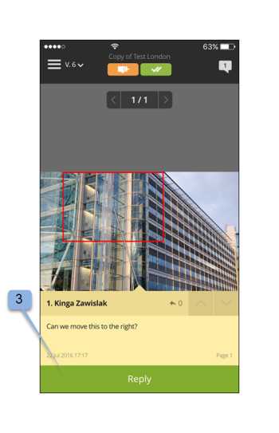

# App mobile Workfront Proof

>[!IMPORTANT]
>
>Questo articolo fa riferimento alla funzionalità del prodotto standalone [!DNL Workfront Proof]. Per informazioni sulle prove all&#39;interno [!DNL Adobe Workfront], vedi [Copertura](../../../review-and-approve-work/proofing/proofing.md).

Scarica la [!DNL Workfront Proof] app da Apple App Store o Google Store per essere produttiva ovunque ti trovi. La [!DNL Workfront Proof] l&#39;app dispone delle seguenti funzioni su iPhone e iPod Touch:

* Visualizzare, esaminare e approvare bozze statiche e audiovisive
* Visualizzare, aggiungere e rispondere ai commenti
* Gestione delle bozze tramite il dashboard e le visualizzazioni

Non devi essere un utente di [!DNL Workfront Proof] (ad esempio, disponi delle tue credenziali di accesso) per rivedere e approvare una bozza tramite l’app iOS. Se scarichi l’app sul tuo dispositivo iOS e accedi al tuo URL personale tramite la tua app e-mail iOS, puoi rivederla e approvarla in movimento.

## Requisiti del dispositivo

Richiede iOS 7.0 o versione successiva. Android 4.0 e versioni successive. Compatibile con iPhone, iPad e iPod touch.

## Scaricare e installare l’app

>[!IMPORTANT]
>
>L’app mobile Workfront Proof non è più supportata ed è disponibile così com’è.  Eventuali problemi nell’app non verranno risolti.

Scarica la nostra [!DNL Workfront Proof] App mobile direttamente dal [Apple App Store](https://itunes.apple.com/us/app/workfront-proof/id1030372728?mt=8) o [Google Play Store](https://play.google.com/store/apps/details?id=com.proofhq.tabletapp).

Per i dispositivi iOS, assicurati di disinstallare i [!DNL Workfront Proof] app per dispositivi iOS prima di installare la nuova app.

La [!DNL Workfront Proof] l&#39;app rileva automaticamente quale tipo di dispositivo utilizzi. Se desideri utilizzare l’app sul tuo tablet, consulta [[!DNL Workfront Proof] app mobile per tablet](../../../workfront-proof/wp-mobile/wp-mobile-apps/wp-mobile-app-tablet.md).

>[!NOTE]
>
>Non è possibile rivedere i file SWF o Audio, come MP3 su dispositivi iOS, a causa delle limitazioni software dei dispositivi mobili. Se desideri rivedere una bozza creata da un file SWF o da un file Audio su un dispositivo mobile, convertirla in un formato supportato prima di caricarla in [!DNL Workfront Proof].

## Guida introduttiva all’app

Non devi essere un [!DNL Workfront Proof] per iniziare a utilizzare l’app. Basta installare l’app sul dispositivo e fare clic su un **[!UICONTROL Vai a prova]** nella notifica e-mail. L’app avvia e carica automaticamente la bozza.

Se sei un [!DNL Workfront Proof] puoi accedere all’app prima di aprire qualsiasi bozza. L’app ti consente di sfogliare tutte le bozze condivise con te e di passare facilmente da una all’altra.

1. Apri l’app.
1. Immetti l&#39;e-mail e la password e tocca **[!UICONTROL Login]**.

   Oppure

   Utilizza Single Sign-On, se configurato sul tuo [!DNL Workfront Proof] conto.

   È possibile utilizzare **[!UICONTROL Password dimenticata]** se la password non viene ricordata.

## Dashboard

Dopo aver effettuato l&#39;accesso al [!DNL Workfront Proof] account, viene visualizzato il dashboard. Qui puoi accedere facilmente alle tue bozze. Puoi aprire una delle viste disponibili, Le mie bozze e Tutte le bozze. In alternativa, puoi toccare il nome di una delle bozze recenti per passare direttamente al visualizzatore di correzione.

Per impostazione predefinita, nella dashboard viene aperta la vista Bozze totali. Questa visualizzazione mostra tutte le bozze di cui sei il proprietario o che sono state condivise con te. Per modificare la visualizzazione, tocca la barra nella parte superiore della pagina per aprire un menu a discesa contenente la [!UICONTROL Ora di attivazione], [!UICONTROL A rischio], [!UICONTROL In ritardo] e [!UICONTROL Recente] opzioni. Per aprire una bozza da qualsiasi visualizzazione, scorri verso il basso l’elenco per trovare la bozza desiderata, quindi tocca il suo nome per passare al visualizzatore di correzione.

| **Visualizzazione in tempo** | Mostra tutte le bozze attive nel tuo account che hai l&#39;autorizzazione per vedere e che non hanno una scadenza o che sono presenti più di 24 ore fino alla scadenza. |
|---|---|
| **Vista a rischio** | Visualizza tutte le bozze per le quali la scadenza è inferiore a 24 ore. |
| **Vista in ritardo** | Elenca tutte le bozze in cui non tutte le azioni sono completate per le quali la scadenza è già stata superata. |
| **Vista recente** | Include le bozze a cui hai effettuato l’accesso di recente e che possiedi, che dispongono delle autorizzazioni da visualizzare in base alle autorizzazioni del tuo profilo e che sono state condivise con te. Questa visualizzazione mostra solo le bozze aperte dall’utente (tramite [!DNL Workfront Proof] Visualizzatore o tramite la pagina dei dettagli della bozza). |
| **Collegamento e-mail** | Per aprire una bozza dal tuo messaggio e-mail, ti basta aprire l’e-mail nella tua app e-mail, fai clic sul pulsante [!UICONTROL Vai alla bozza] collegamento pulsante nell&#39;e-mail (1) e sarai portato alla bozza nella [!DNL Workfront Proof] app. |

{style=&quot;table-layout:auto&quot;}

## Esamina una bozza statica nell’app

Quando apri una bozza nell’app mobile, puoi effettuare le seguenti operazioni:

* Leggi e rispondi ai commenti lasciati da altri revisori (1 - la cifra visibile nell&#39;icona indica il numero di commenti lasciati sulla bozza, se non sono stati lasciati commenti sulla bozza, questo pulsante mostrerà 0 e sarà disabilitato).
* Aggiungere commenti e marcature (2).
* La visibilità del pulsante Commento e Decisione dipende dal ruolo di prova.
* Prendere una decisione (3).
* Vai al menu (4).
* Adatta la bozza pinzando lo schermo.
   

## Aggiungi commenti e risposte

1. Quando hai aperto una bozza, tocca **[!UICONTROL Aggiungi commento]** pulsante (1).

   

1. Digita il tuo commento (2).

   

1. Fai clic su **[!UICONTROL Salva]**.

## Leggi e rispondi ai commenti

1. Apri la bozza, quindi tocca l’icona del callout nell’angolo superiore destro per visualizzare l’elenco dei commenti (1) e scegli il commento da esaminare.
1. Toccare il pin per aprire il commento associato (2).

   

1. Effettua una delle seguenti operazioni:

   * Per rispondere a un commento, tocca il pulsante **[!UICONTROL Rispondi]** pulsante (3).
   * Per tornare all’immagine di bozza, tocca [!UICONTROL callout] icona.
   * Per visualizzare il commento completo e le relative risposte, toccare il commento stesso.

      

   * Per applicare un’azione a un commento:

      1. Apri un commento.
      1. Tocca **[!UICONTROL Rispondi]**.
      1. Apri [!UICONTROL azioni] sul lato destro del campo di testo (1).
      1. Tocca **[!UICONTROL Aggiungi azione]** (2)

         

         Per ulteriori informazioni sulle azioni, consulta [Utilizzare azioni sui commenti della bozza](../../../review-and-approve-work/proofing/reviewing-proofs-within-workfront/comment-on-a-proof/use-actions-on-comments-in-viewer.md).

## Aggiungi marcature

È possibile aggiungere un markup (ad esempio una casella che evidenzia un’area sulla bozza) e digitare un commento allegato al markup. È inoltre possibile creare un commento senza aggiungere un contrassegno. È inoltre possibile aggiungere più contrassegni a un singolo commento.

1. Su una prova aperta, tocca **Aggiungi commento** (1)

   

1. Scegli tra [!UICONTROL modalità pan] (2) [!UICONTROL strumento rettangolo] (3) [!UICONTROL disegno a mano libera] (4) o [!UICONTROL freccia] strumento (5).

   È inoltre possibile modificare il colore della linea del markup (6).

1. Per disegnare un markup sulla bozza, tocca lo schermo e quindi sposta il dito sulla bozza.

   Non è necessario aggiungere testo per salvare il markup (7).

1. Tocca **[!UICONTROL Annulla]** (8) se desideri eliminare il markup .

   

   Quando si contrassegna un’area sulla bozza, viene automaticamente aperto il campo del commento. Per rimuovere il markup creato, toccate la croce accanto alla forma di markup (9).

   

## Prendere decisioni a prova

1. Apri la bozza nel visualizzatore delle prove e tocca [!UICONTROL Decisione] pulsante (1).

   

1. Toccare la decisione da presentare (2).
1. Tocca **[!UICONTROL Salva]** per sottoporre la sua decisione.

   

   >[!NOTE]
   >
   >* Se nell’account in cui è stata creata la bozza è stato impostato un messaggio pop-up su decisione, la bozza verrà visualizzata anche nell’app iOS quando viene presa una decisione su una bozza.
   >* Se imposti motivi decisionali, questi verranno visualizzati nella sezione [!UICONTROL Invia la tua decisione] schermata da scegliere.

   Se hai già inviato una decisione e desideri modificarla o rimuoverla, puoi farlo facilmente. Dopo aver adottato una decisione, una nuova opzione, **[!UICONTROL Rimuovi la mia decisione]** (6), appare sul [!UICONTROL Invia la tua decisione] schermo.

   

## Esamina una bozza audio o video nell’app

La revisione di una bozza audio-video nell’app iOS è semplice quanto la revisione di un file statico:

1. Tocca [!UICONTROL riproduzione/pausa] per riprodurre o mettere in pausa il video (1).
1. Per navigare nel video, tocca [!UICONTROL navigazione] bar (2).
1. Per lasciare un commento, tocca **[!UICONTROL Commento]** (3), quindi seguire le istruzioni sopra descritte.

   I commenti o le marcature eventualmente presenti sulla prova saranno contrassegnati da spilli lungo la barra di navigazione (4).

1. Per esaminare i commenti lasciati sulla bozza, tocca **[!UICONTROL Commenti]** (5), quindi seguire le istruzioni sopra descritte.
1. Per prendere una decisione, tocca **[!UICONTROL Decisione]** (6), quindi seguire le istruzioni di cui sopra.

   
