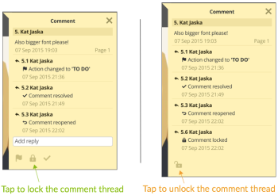

# [!DNL Workfront Proof] app mobile per tablet

>[!IMPORTANT]
>
>Questo articolo fa riferimento alla funzionalità del prodotto standalone [!DNL Workfront Proof]. Per informazioni sulle prove all&#39;interno [!DNL Adobe Workfront], vedi [Copertura](../../../review-and-approve-work/proofing/proofing.md).

La [!DNL Workfront Proof] l&#39;app per tablet ti consente di rivedere e approvare comodamente le bozze quando sei in viaggio. L&#39;app è disponibile per il download per tutti, non devi essere un [!DNL Workfront Proof] per poter rivedere le prove sul tablet o sul telefono.

Gli ospiti possono semplicemente fare clic sul [!UICONTROL Vai alla bozza] nella notifica e-mail che ricevono per aprire la bozza nell’app.

[!DNL Workfront Proof] gli utenti possono accedere all’app e utilizzare il dashboard per gestire in modo comodo il proprio lavoro.

## Requisiti del dispositivo

* Dispositivi iOS: iPad 3, iPad air, iPad mini
* Dispositivi Android: Android OS versione 4.4+, 5+; Samsung Galaxy Tab 3+ (10.1&quot;)

Questa è un&#39;app creata appositamente per i tablet. Se desideri utilizzare [!DNL Workfront Proof] sul tuo iPhone, scarica l&#39;app iOS dall&#39;iTunes Store.

## Scaricare l’app

>[!IMPORTANT]
>
>L’app mobile Workfront Proof non è più supportata ed è disponibile così com’è.  Eventuali problemi nell’app non verranno risolti.

La [!DNL Workfront Proof] l&#39;app per tablet è disponibile in Apple App Store e Google Play Store.

1. Fai clic sul collegamento seguente per scaricare l’app e installarla sul tuo dispositivo.

   

   

## Accedi

La [!DNL Workfront Proof] l’app per tablet consente di accedere al dashboard con le bozze che richiedono la tua attenzione. Per accedere al dashboard:

1. Esegui una delle operazioni seguenti:

   * Accedi con il tuo [!DNL Workfront Proof] credenziali.

      Se ricevi un’e-mail di invito a prova e la apri sul tuo dispositivo mobile, il collegamento ti porterà alla bozza nell’app. Non è necessario essere un utente per poter rivedere le bozze; tuttavia, è necessario che l’app sia installata sul dispositivo per poterla visualizzare.

   * Se l’opzione Single Sign-On è abilitata nel tuo account, tocca tale opzione nella schermata di accesso.

      Verrai portato alla pagina di accesso che ti chiederà il tuo indirizzo e-mail. Dopo aver digitato il tuo indirizzo e-mail, verrai reindirizzato alla pagina del provider di identità, dove potrai accedere utilizzando la tua password.

      

## Dashboard

Se desideri rimanere connesso al tuo [!DNL Workfront Proof] account:

1. Abilita **[!UICONTROL Registrami]** nel menu della barra laterale in **[!UICONTROL Impostazioni]**:

La *[!UICONTROL Dashboard]* Questo collegamento ti riporta al dashboard da qualsiasi visualizzazione nell’app. Puoi anche utilizzarlo per ricaricare il dashboard.

Altri elementi del dashboard sono la barra di ricerca che consente di cercare l’account in base al nome della bozza e a diverse viste che consentono di gestire in modo efficace il carico di lavoro.

## Gestire il carico di lavoro utilizzando le viste del dashboard

Analogamente ai grafici del dashboard nella nostra applicazione web, nell’app mobile viene visualizzato un elenco di bozze condivise con te. Il messaggio di benvenuto nella parte superiore della pagina ti darà il numero totale delle bozze e sotto di esse che le suddividiamo in *Ora di attivazione*, *A rischio* e *Prove tardive*.

* **Prove puntuali** sono le prove che non dispongono di un termine stabilito o che il termine è scaduto per più di 24 ore.
* **A prova di rischio** sono quelli in cui la scadenza è entro le prossime 24 ore - la barra di avanzamento è arancione per queste prove.
* **Prove tardive** sono le bozze che sono già oltre la scadenza - la barra di avanzamento è rossa per queste bozze. Raggiunto il termine [!DNL Workfront Proof] invia ai responsabili decisionali in ritardo e al proprietario della bozza un&#39;e-mail di promemoria automatica.

Queste bozze sono raggruppate in viste separate, che consentono di assegnare una priorità adeguata al lavoro, a partire dalle bozze che superano già la scadenza.

Un’altra visualizzazione utile è la visualizzazione Recente, che mostra le bozze a cui hai effettuato l’accesso di recente nell’app, quindi se desideri visualizzare di nuovo la stessa bozza, puoi facilmente trovarla in quell’elenco.

## Revisione delle bozze nell’app

1. Fai clic sul nome della bozza da aprire nel [!DNL Workfront Proof] Visualizzatore.

   Oppure

   Per aprire una bozza da una notifica e-mail, i revisori possono fare clic sul **[!UICONTROL Vai alla bozza]** nella notifica.
Se hai [!DNL Workfront Proof] account, puoi accedere e accedere alla bozza dal dashboard.

   >[!NOTE]
   >
   >Per poter controllare le bozze, devi aver installato l’app sul tuo dispositivo [!DNL Workfront Proof], anche se non hai [!DNL Workfront Proof] conto.

   Quando apri una bozza per la prima volta, ti verrà presentato un tour che ti aiuterà a iniziare a rivedere le bozze nell’app.

   

1. Naviga nella bozza:

   * Per passare a una pagina specifica della bozza, scorri lateralmente o utilizza la [!UICONTROL miniature] elenco.

      È inoltre possibile utilizzare le frecce nella parte inferiore della pagina o inserire un numero di pagina specifico.

   * Per passare a una versione diversa della bozza, utilizza il menu a discesa della versione nella parte superiore della pagina.
   * Per ingrandire, sfiorare lo schermo.
   * Per scorrere, tenere premuto e spostare l&#39;immagine fino a trovare la posizione giusta.

      La revisione delle bozze nell’app mobile è semplice quanto la revisione delle bozze tramite l’interfaccia utente [!DNL Workfront Proof] Visualizzatore. Di seguito vedremo più da vicino l&#39;aggiunta di commenti e marcature, la gestione del feedback e il processo decisionale. Discuteremo anche delle diverse opzioni disponibili nella barra laterale dell’app.

## Commento nell’app

Il video seguente illustra le nozioni di base per la creazione di commenti nell’app mobile. Viene illustrato come creare un commento, come pubblicare una risposta a un commento, come utilizzare diverse marcature ed eliminarle, nonché come modificare ed eliminare i commenti.

È possibile modificare ed eliminare solo i commenti se non è stata pubblicata alcuna risposta. Se non vedi il [!UICONTROL spazzatura] è possibile che questa opzione sia stata disabilitata dal tuo [!DNL Workfront Proof] amministratore.

Nell’app sono disponibili tre opzioni di visualizzazione dei commenti. Per passare da un commento all’altro, fai clic sul pulsante del commento.

* **[!UICONTROL Vista a elenco]** visualizza un elenco di tutti i commenti. Per sfogliarli, toccate ogni commento o toccate le frecce su e giù.
* **[!UICONTROL Visualizzazione di un singolo commento]** visualizza un commento alla volta. Per passare al commento successivo, tocca la freccia nella parte superiore della pagina.
* **[!UICONTROL Nascondi visualizzazione commenti]** nasconde tutti i commenti.

Ogni markup lasciato sulla bozza rilascia un pin sull&#39;immagine. Per visualizzare il commento e il markup associati al pin, è sufficiente toccare il pin. È possibile farlo solo se la casella di modifica dei commenti è chiusa. Per chiudere la casella del commento, tocca [!UICONTROL x] nel commento in alto a sinistra della casella.

## Strumento per l’annotazione testo

Il testo di correzione in movimento è davvero nel [!DNL Workfront Proof] app tablet. Lo strumento di annotazione testo è disponibile nella barra degli strumenti delle marcature dopo aver fatto clic sull’arancione **[!UICONTROL Aggiungi commento]** pulsante .

1. Seleziona lo strumento e tocca la parola che desideri evidenziare.
1. Tenere il dito sulla parola fino a quando l&#39;evidenziazione diventa disponibile e utilizzare i cursori per evidenziare l&#39;intera parola o frase che si desidera contrassegnare.

   Lo strumento testo offre quattro opzioni tra cui scegliere:

   | **[!UICONTROL Evidenziazione]** | Evidenzia il testo e lo copia nella casella del commento. |
   |---|---|
   | **[!UICONTROL Sostituisci]** | Aggiunge [[!UICONTROL SOSTITUIRE]] e [[!UICONTROL CON]] nella casella dei commenti insieme al testo, semplificando l’utilizzo di testo sostitutivo. |
   | **[!UICONTROL Elimina]** | Scorre il testo e aggiunge [DELETE] nella casella del commento. |
   | **[!UICONTROL Inserisci dopo]** | Aggiunte [INSERISCI DOPO] nella casella del commento. |

   {style=&quot;table-layout:auto&quot;}

1. (Facoltativo) Per incollare testo da un altro documento salvato sul tablet, toccare e tenere premuto il dito sulla casella del commento fino a quando non viene visualizzata un&#39;opzione per incollare il testo copiato dal documento.

## Gestire i commenti nell’app mobile

Dopo che tutti hanno lasciato i loro commenti e le marcature sulla bozza, molto spesso il responsabile della bozza deve esaminare il feedback e decidere quali modifiche applicare alla prossima versione della bozza. In [!DNL Workfront Proof] è possibile utilizzare Azioni sui commenti per contrassegnare ogni singolo commento e contrassegnare quelli che devono essere attivati.

Le azioni sui commenti devono essere configurate nel tuo account dal [!DNL Workfront Proof] e può essere utilizzato solo su una bozza da parte di persone con diritti di modifica.

Durante la preparazione della versione successiva della bozza, è possibile disattivare i commenti durante la preparazione. Il commento viene contrassegnato come risolto con un segno di spunta verde. Se è necessario riaprire il commento, è possibile fare clic sulla freccia nella parte inferiore della casella del commento.

Se desideri impedire ad altri revisori di rispondere a un thread di commento, puoi bloccarlo. Per poterlo fare, devi disporre dei diritti di modifica sulla bozza. Bloccare il thread di commento è molto semplice, tutto quello che devi fare è toccare l&#39;icona a forma di lucchetto nella parte inferiore della casella del commento.

## Verifica delle bozze video

La recensione del video in movimento è facile con il [!DNL Workfront Proof] app tablet. Il video seguente mostra come prendere commenti, marcature e decisioni nell’app.

## Modalità di confronto

La modalità di confronto nell’app per tablet ti consente di confrontare facilmente due diverse versioni di una bozza o due prove dalla stessa cartella.

>[!NOTE]
>
>A causa delle limitazioni di iOS, il confronto di due video non è disponibile sugli iPad. È disponibile su tablet con sistemi operativi Android.

La modalità di confronto è disponibile nell’angolo in alto a destra dello schermo.

Lo strumento di confronto visualizza le due versioni più recenti della bozza.

1. Per modificare le versioni da confrontare, utilizza i menu a discesa delle versioni nella parte superiore della pagina.
1. Per selezionare una bozza diversa dalla stessa cartella, utilizza il browser delle cartelle (l’icona della cartella disponibile nella parte superiore della pagina).

   
   
Lo strumento di confronto consente di confrontare le versioni affiancate per verificare se sono state apportate le modifiche richieste. Se sblocchi la navigazione, potrai confrontare pagine diverse di entrambe le versioni.

   

   Ora puoi confrontare diverse pagine delle bozze che stai guardando. Puoi anche confrontare pagine diverse della stessa bozza, utile se controlli la coerenza dei messaggi e del marchio.

   

## Prendere decisioni nell’app

1. Tocca il pulsante di decisione verde nella parte superiore della pagina.

   

   Se non vedi il verde **[!UICONTROL Termina revisione]** e pensi di prendere una decisione sulla prova, il tuo [!DNL Workfront Proof] l’amministratore può aggiornare il ruolo di bozza, come spiegato in [Gestisci ruoli di bozza in [!DNL Workfront Proof]](../../../workfront-proof/wp-work-proofsfiles/share-proofs-and-files/manage-proof-roles.md).

## Barra laterale del visualizzatore di correzione

La barra laterale contiene molte funzioni e funzionalità utili. A seconda delle autorizzazioni sulla bozza, potrebbero non essere visualizzate tutte. Di seguito tutti sono discussi più dettagliatamente.

| Dashboard | Consente di tornare al dashboard delle app mobili. |
|---|---|
| **[!UICONTROL Flusso di lavoro]** | Mostra i dettagli delle fasi di revisione, insieme a un elenco di revisori, le relative scadenze, le barre di avanzamento, le decisioni e il numero di commenti e risposte. |
| **[!UICONTROL Dettagli]** | Mostra informazioni sulla bozza, sulle opzioni di condivisione aggiuntive e sull’attività di audit trail. |
| **[!UICONTROL Condividi]** | Visualizza l’URL di prova e il codice di incorporamento. |
| **[!UICONTROL Notifiche]** | Consente di aggiornare gli avvisi e-mail relativi alla bozza che si sta esaminando. Questo non altera le impostazioni predefinite. |
| **[!UICONTROL Blocca]** | Consente di bloccare la bozza. Per visualizzare questa opzione è necessario disporre dei diritti di modifica sulla bozza. |
| **[!UICONTROL Elimina]** | Sposta la bozza nella cartella Cestino. Per poter eliminare la bozza, è necessario disporre dei diritti di modifica sulla bozza. |
| **[!UICONTROL Impostazioni]** | Puoi decidere di mostrare pin e/o marcature sulla bozza, ma puoi anche abilitare [!UICONTROL Registrami] per evitare di disconnettersi dall’app. |
| **[!UICONTROL Aiuto]** | Ti consente di visualizzare nuovamente la presentazione dell’app. |
| **[!UICONTROL Disconnetti]** | Ti disconnette dall’app e dal tuo account. |
