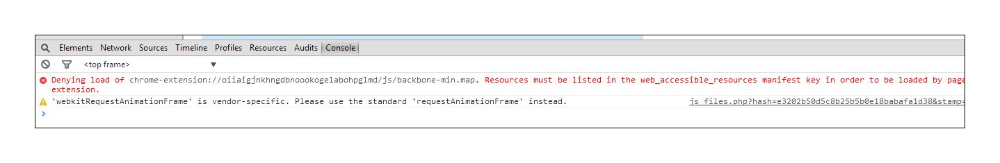

# Risoluzione dei problemi - Visualizzatore di bozze [!DNL Workfront Proof]

<!-- Audited: 01/2024 -->

>[!IMPORTANT]
>
>Questo articolo fa riferimento alle funzionalità nel prodotto autonomo [!DNL Workfront Proof]. Per informazioni sulla verifica all&#39;interno di [!DNL Adobe Workfront], vedere [Verifica](../../../review-and-approve-work/proofing/proofing.md).

Se il contenuto della bozza non viene caricato e puoi visualizzare solo un visualizzatore di bozze vuoto, è probabile che a livello locale sia presente un elemento che blocca l’azione. Prova le soluzioni possibili di seguito.

## Verificare che la versione del browser <!--and [!DNL Flash Player]--> sia aggiornata

Tutti gli sviluppatori lavorano costantemente sulle loro applicazioni e rilasciano regolarmente nuove funzioni e correzioni per i loro prodotti. In questo modo è possibile migliorare l’esperienza utente e mantenere il livello di sicurezza. È quindi consigliabile utilizzare solo le versioni più recenti. Questo consente anche di evitare conflitti tra le applicazioni.

<!--
### [!DNL Flash Player] Plugin Version

To check your current [!DNL Flash Player] version visit the [[!DNL Adobe] website](http://www.adobe.com/software/flash/about/).

If your version number differs from the one listed for your platform go to the [[!DNL Flash Player] download page](http://get.adobe.com/flashplayer/otherversions/) and get the latest version.

Please note: we do recommend using the original [!DNL Adobe] plugin, so if your browser uses a built-in solution deactivate it and install the [!DNL Adobe] solution.
-->

### Versione browser

Di solito la maggior parte dei browser si aggiorna automaticamente, ma se si verificano problemi vale la pena controllare quale versione si sta utilizzando ed eseguire un aggiornamento, se necessario.

Nel browser, vai a [!UICONTROL Menu] e individua l&#39;opzione [!UICONTROL Informazioni su] (in alcuni casi può essere visibile in un menu [!UICONTROL Guida]). Nel pop-up [!UICONTROL Informazioni su], troverai informazioni sulla versione corrente del browser e un&#39;opzione per aggiornare/verificare la disponibilità di aggiornamenti.

Ad esempio, in Chrome:

Dopo aver installato la versione più recente del browser, prova a riaprire la bozza e a vedere se il problema è stato risolto.

<!--

## Ensure Your Local [!DNL Flash] Storage is Available

Our [!DNL Workfront Proof] Viewer is based on Flash, and we store some data about the proofs (i.e., comments, proof tiles, [!DNL Workfront Proof] Viewer settings) on your computer using [!DNL Flash Player]. If the [!DNL Workfront Proof] Viewer opens, but there is no content inside you will want to make sure that the Flash Storage is available on your machine and that [!DNL Workfront Proof] is allowed to use it.

If there is some storage allocated, but you're working with the bigger proofs with multiple pages and comments try to increase the [!DNL Flash] Storage and re-load your proof.

-->

## Identificare la posizione del problema

* Le bozze si aprono in un browser diverso?
* Se utilizzi un browser su base giornaliera e riscontri problemi durante la visualizzazione delle bozze, prova ad aprire la stessa bozza in un browser diverso sul computer. Per eseguire l’operazione, copia il collegamento della bozza dalla barra URL del browser principale e incollalo in un altro browser. Se la bozza si apre qui, controlla la configurazione del browser principale, i plug-in e le estensioni, in quanto potrebbero interferire.
* Non abbiamo un browser preferito, ma se si hanno problemi di prestazioni nel browser corrente, si consiglia di passare a uno diverso.
* Le bozze si aprono su un computer diverso nella tua posizione?
Se la bozza non si apre in alcun browser del computer, prova ad aprirla in un altro computer nella tua posizione e/o all’esterno della tua. Questo consente di determinare se un problema si verifica nel computer in uso o se il problema si trova nella rete locale.
Se il livello di protezione è più elevato, le connessioni a [!DNL Workfront Proof] potrebbero essere bloccate da:

   * Il software AV locale
   * Soluzione di sicurezza di rete
   * Configurazione DNS, firewall o proxy
   * Queste sono le impostazioni che sfuggono al nostro controllo. Sono disponibili diverse soluzioni di sicurezza e non è possibile sapere quali sono implementate nella rete e quali potrebbero bloccare le connessioni a [!DNL Workfront Proof]. Non spetta inoltre a [!DNL Workfront Proof] decidere la configurazione della sicurezza interna. In caso di problemi durante l&#39;apertura delle bozze su più computer della propria posizione/rete, è consigliabile contattare il team IT in modo che possa verificare le impostazioni di rete e autorizzare o aggiungere [!DNL Workfront Proof] al inserisco nell&#39;elenco Consentiti di, se necessario.

* Le connessioni a [!DNL Workfront Proof] sono consentite nella rete?
All’interno del Visualizzatore bozze vengono caricate le tessere, ovvero i frammenti delle pagine. Se il contenuto non viene caricato correttamente alla fine, è possibile che alcune connessioni a [!DNL Workfront Proof] siano bloccate nella rete. Assicurati che tutte le connessioni e tutti i contenuti di *.proofhq.com siano stati aggiunti al inserisco nell&#39;elenco Consentiti di. Il tuo team IT dovrebbe essere in grado di aiutarti a verificarlo.

## Controlla i plug-in

Se il browser è aggiornato e la rete non blocca le connessioni a [!DNL Workfront Proof], potrebbe esserci qualcosa nel browser che influisce sulla visualizzazione delle bozze. Nel browser sono spesso disponibili più plug-in ed estensioni e alcuni di essi potrebbero interferire o entrare in conflitto con gli altri.

La procedura consigliata consiste nel rimuovere tutti i componenti aggiuntivi sconosciuti e mantenere solo quelli utilizzati e considerati attendibili. Ogni browser deve fornire le opzioni per controllare/modificare/eliminare i plug-in e le estensioni. JavaScript viene utilizzato per caricare il visualizzatore [!DNL Workfront Proof] e si desidera esaminare in particolare i plug-in che potrebbero influire su tale operazione.

Se esiste un componente aggiuntivo particolare che interferisce con il caricamento delle bozze, puoi provare a controllare i dettagli nella console del browser.

Nella maggior parte dei browser più recenti sono disponibili alcuni strumenti per sviluppatori aggiuntivi che possono essere utilizzati per una risoluzione più avanzata dei problemi.

In caso di problemi durante la visualizzazione delle bozze:

* Apri la console del browser e ricarica la bozza.
* Controlla se nella console sono presenti avvisi o messaggi. Questi dettagli possono aiutare a identificare la causa principale dei problemi.
* Chiedi al tuo team IT di analizzare i risultati. Dovrebbero essere in grado di consigliare e aiutare a risolvere il problema locale.
* Condividi i risultati con il nostro team di supporto. Noi saremo felici di aiutare.

## Verifica impostazioni contenuto misto

Tutte le connessioni a [!DNL Workfront Proof] sono tramite HTTPS. Tuttavia, nel visualizzatore [!DNL Workfront Proof] le tessere vengono caricate su HTTP e i dati sono protetti con i token. Questo crea contenuti misti che alcuni browser o soluzioni di sicurezza potrebbero bloccare (per impostazione predefinita o tramite configurazione manuale).

Se questo è il motivo per cui le bozze non si aprono sul computer (dovresti essere in grado di visualizzare gli avvisi pertinenti nella console del browser), autorizzare tali connessioni per [!DNL Workfront Proof] o modificare le impostazioni per consentire contenuti misti passivi sul computer. I contenuti misti potrebbero essere bloccati dal browser, dal software AV o dalla configurazione di rete per determinare la causa esatta. Contattare il team IT o gli amministratori di rete. Dovrebbero anche essere in grado di aiutare ad abilitare i contenuti misti sul computer.

