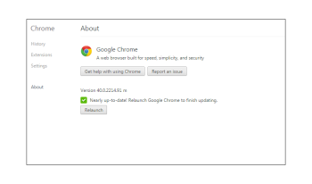

# Risoluzione dei problemi - [!DNL Workfront Proof] visualizzatore di bozze

>[!IMPORTANT]
>
>Questo articolo fa riferimento alle funzionalità del prodotto autonomo [!DNL Workfront Proof]. Per informazioni sulle prove all&#39;interno [!DNL Adobe Workfront], vedi [Bozza](../../../review-and-approve-work/proofing/proofing.md).

Se il contenuto della bozza non viene caricato e puoi visualizzare solo un visualizzatore di bozze vuoto, è probabile che a livello locale sia presente un elemento che blocca l’azione. Prova le soluzioni possibili di seguito.

## Assicurati che il browser e [!DNL Flash Player] Le versioni sono aggiornate

Tutti gli sviluppatori lavorano costantemente sulle loro applicazioni e rilasciano regolarmente nuove funzioni e correzioni per i loro prodotti. In questo modo è possibile migliorare l’esperienza utente e mantenere il livello di sicurezza. È quindi consigliabile utilizzare solo le versioni più recenti. Questo consente anche di evitare conflitti tra le applicazioni.

<!--
### [!DNL Flash Player] Plugin Version

To check your current [!DNL Flash Player] version visit the [[!DNL Adobe] website](http://www.adobe.com/software/flash/about/).

If your version number differs from the one listed for your platform go to the [[!DNL Flash Player] download page](http://get.adobe.com/flashplayer/otherversions/) and get the latest version.

Please note: we do recommend using the original [!DNL Adobe] plugin, so if your browser uses a built-in solution deactivate it and install the [!DNL Adobe] solution.
-->

### Versione browser

Oggi la maggior parte dei browser si aggiorna automaticamente, ma in caso di problemi vale la pena controllare quale versione si sta utilizzando ed eseguire l&#39;aggiornamento, se necessario.

Nel browser vai a [!UICONTROL Menu] e individuare [!UICONTROL Informazioni su] (in alcuni casi può essere visibile in [!UICONTROL Aiuto] menu). In [!UICONTROL Informazioni su] pop-up troverai informazioni sulla versione corrente del browser e anche un&#39;opzione per aggiornare/verificare la disponibilità di aggiornamenti.

Consulta in Chrome:

Una volta che avrai l’ultima [!DNL Flash Player] prova ad aprire nuovamente la bozza e a controllare se il problema è stato risolto.

## Assicurati che le [!DNL Flash] Archiviazione disponibile

Nostro [!DNL Workfront Proof] Il visualizzatore si basa sul Flash e vengono memorizzati alcuni dati sulle bozze (ad esempio commenti, riquadri di bozze, [!DNL Workfront Proof] impostazioni del visualizzatore) sul computer utilizzando [!DNL Flash Player]. Se il [!DNL Workfront Proof] Il visualizzatore si apre, ma non è presente alcun contenuto all&#39;interno del quale verificare che l&#39;archivio di Flash sia disponibile nel computer e che [!DNL Workfront Proof] è autorizzato a utilizzarlo.

Se è allocata una parte dell’archiviazione, ma stai utilizzando bozze più grandi con più pagine e commenti, prova ad aumentare il valore di [!DNL Flash] Archivia e ricarica la bozza.

Consulta la sezione [Problemi Nella Visualizzazione Delle Bozze - [!DNL Flash] Spiegazione degli oggetti condivisi](../../../workfront-proof/wp-tech-corner/troubleshooting/view-proof-flash-shared-object.md) per istruzioni dettagliate.

## Identificare la posizione del problema

* Le bozze si aprono in un browser diverso?
* Se utilizzi un browser su base giornaliera e riscontri problemi durante la visualizzazione delle bozze, prova ad aprire la stessa bozza in un browser diverso sul computer. Per eseguire l’operazione, copia il collegamento della bozza dalla barra URL del browser principale e incollalo in un altro browser. Se la bozza si apre qui, controlla la configurazione del browser principale, i plug-in e le estensioni, in quanto potrebbero interferire.
* Non abbiamo un browser preferibile, ma se hai problemi di prestazioni nel browser corrente ti consigliamo di passare a uno diverso.
* Le bozze si aprono su un computer diverso nella tua posizione?
Se la bozza non si apre in alcun browser sul computer, prova ad aprirla in un altro computer nella tua posizione e/o all’esterno della tua. Questo consente di determinare se un problema dipende dal computer in uso o se si tratta di un problema della rete locale.
Se il livello di protezione è più elevato, le connessioni a [!DNL Workfront Proof] può essere bloccato da:

   * Il software AV locale
   * Soluzione di sicurezza di rete
   * Configurazione di DNS, firewall o proxy
   * Queste sono le impostazioni che sfuggono al nostro controllo. Sono disponibili varie soluzioni di sicurezza e non siamo in grado di individuare quali sono implementate nella rete e quali potrebbero bloccare le connessioni a [!DNL Workfront Proof]. Inoltre, non è possibile [!DNL Workfront Proof] per decidere la configurazione della sicurezza interna. In caso di problemi con l&#39;apertura delle bozze su più computer nella propria posizione/rete, si consiglia di contattare il team IT in modo che possa verificare le impostazioni di rete e autorizzare o aggiungere [!DNL Workfront Proof] inserire nell&#39;elenco Consentiti all’, se necessario.

* Le connessioni a [!DNL Workfront Proof] nella rete?
All’interno del Visualizzatore bozze vengono caricate le tessere, ovvero i frammenti delle pagine. Se questo contenuto non viene caricato correttamente alla tua estremità, è possibile che alcune connessioni a [!DNL Workfront Proof] sono bloccati nella rete. Assicurati che tutte le connessioni e tutti i contenuti di *.proofhq.com siano stati aggiunti al inserisco nell&#39;elenco Consentiti di. Il tuo team IT dovrebbe essere in grado di aiutarti a verificarlo.

## Plug-in revisione

Se il browser e [!DNL Flash Player] il plug-in è aggiornato e la rete non blocca le connessioni a [!DNL Workfront Proof] nel browser potrebbe essere presente un elemento che influisce sulla visualizzazione delle bozze. Al giorno d’oggi sono disponibili più plug-in ed estensioni nel browser e alcuni di essi interferiscono o sono in conflitto con gli altri.

La procedura consigliata consiste nel rimuovere tutti i componenti aggiuntivi sconosciuti e mantenere solo quelli utilizzati e considerati attendibili. Ogni browser deve fornire le opzioni per controllare/modificare/eliminare i plug-in e le estensioni. Nostro [!DNL Workfront Proof] Il visualizzatore si basa su [!DNL Flash] e utilizziamo JavaScript per caricare il visualizzatore in modo da poter rivedere in particolare i plug-in che potrebbero interessarli.

Se esiste un componente aggiuntivo particolare che interferisce con il caricamento delle bozze, puoi provare a controllare i dettagli nella console del browser.

Nella maggior parte dei browser più recenti sono disponibili alcuni strumenti per sviluppatori aggiuntivi che possono essere utilizzati per una risoluzione più avanzata dei problemi.

In caso di problemi durante la visualizzazione delle bozze:

* Apri la console del browser e ricarica la bozza.
* Controlla se nella console sono presenti avvisi o messaggi. Questi dettagli possono aiutare a identificare la causa principale dei problemi.
* Chiedi al tuo team IT di analizzare i risultati. Dovrebbero essere in grado di consigliare e aiutare a risolvere il problema locale.
* Condividi i risultati con il nostro team di supporto. Noi saremo felici di aiutare.

## Verifica impostazioni contenuto misto

Tutte le connessioni a [!DNL Workfront Proof] si trovano su HTTPS. Tuttavia, nella [!DNL Workfront Proof] Il visualizzatore carica le tessere su HTTP e i dati sono protetti con i token. Questo crea contenuti misti che alcuni browser o soluzioni di sicurezza potrebbero bloccare (per impostazione predefinita o in base alla configurazione manuale).

Se questo è il motivo per cui le bozze non si aprono sul computer (dovresti essere in grado di visualizzare gli avvisi pertinenti nella console del browser), autorizza tali connessioni per [!DNL Workfront Proof] o modificare le impostazioni per consentire contenuti misti passivi sul computer. I contenuti misti potrebbero essere bloccati dal browser, dal software AV, dalla configurazione di rete e così via. Per determinare la causa esatta, contattare il team IT o gli amministratori di rete. Dovrebbero anche essere in grado di aiutare ad abilitare i contenuti misti sul computer.

