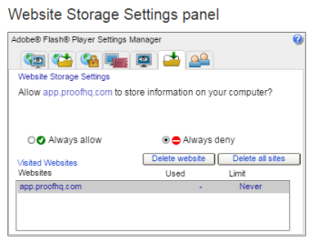

# Problemi Di Visualizzazione Delle Prove - [!DNL Flash] Spiegazione di oggetti condivisi

>[!IMPORTANT]
>
>Questo articolo fa riferimento alla funzionalità del prodotto standalone [!DNL Workfront Proof]. Per informazioni sulle prove all&#39;interno [!DNL Adobe Workfront], vedi [Copertura](../../../review-and-approve-work/proofing/proofing.md).

>[!NOTE]
>
>Le informazioni contenute in questo articolo si riferiscono a funzionalità attualmente obsolete e che verranno rimosse da [!DNL Workfront] nel 2018. È consigliabile utilizzare il nuovo visualizzatore per correzione web (come descritto in [Verifica delle bozze nel visualizzatore per correzione web](https://support.workfront.com/hc/en-us/sections/115000275214-Reviewing-Proofs-in-the-Web-Proofing-Viewer)) o il visualizzatore per correzione desktop (come descritto in [Revisione delle bozze nel visualizzatore di correzione desktop](https://support.workfront.com/hc/en-us/sections/360000686434-Reviewing-Proofs-in-the-Desktop-Proofing-Viewer)).

## [!DNL Flash] Oggetti condivisi

Un oggetto condiviso locale, talvolta denominato &quot;[!DNL Flash] cookie&quot; è un file di dati che può essere creato sul tuo computer dai siti visitati. Gli oggetti condivisi vengono utilizzati più spesso per migliorare l’esperienza di navigazione web. A [!DNL Flash] cookie è un messaggio utilizzato in [!DNL Adobe Flash] che viene inviato da un server Web a un browser Web e viene quindi memorizzato come file di dati nel browser.

Dal momento che [!DNL Workfront Proof] Il visualizzatore si basa su [!DNL Flash], vale la pena controllare per quale tipo di storage è consentito [!DNL Flash] sul computer.

## [!DNL Flash] Oggetti condivisi: problemi noti

Se la [!DNL Flash] l&#39;archiviazione è impostata su 0 KB o ha un&#39;altra impostazione che blocca [!DNL Flash] le applicazioni dal salvataggio dei dati localmente, potrebbero causare alcuni problemi noti nella [!DNL Workfront Proof] Visualizzatore:

* Il pop-up del tour &#39;Guida introduttiva&#39; continua ad apparire anche se l&#39;opzione per non mostrarlo ancora è stata scelta
* [!DNL Workfront Proof] Le prestazioni del visualizzatore rallentano a causa del numero crescente di commenti aggiunti alle bozze
* Le bozze non vengono caricate e si ottiene la &#39;schermata grigia&#39; invece di un&#39;immagine effettiva

## Consentire [!DNL Flash] Oggetti condivisi

Assicurati che la memorizzazione [!DNL Flash] Oggetti condivisi è consentito nel computer e il limite di archiviazione non è 0.

Per verificare se gli oggetti condivisi sono consentiti:

1. Fai clic con il pulsante destro del mouse [!DNL Workfront Proof] Visualizzatore.
1. Seleziona **[!UICONTROL Impostazioni globali]** dal menu di scelta rapida.
1. Vai a **[!UICONTROL Storage]** scheda .
1. Assicurati che **[!UICONTROL Consenti ai siti di salvare le informazioni sul computer]** è selezionato (1).
1. 

## In aumento [!DNL Flash] archiviazione

Per impostazione predefinita [!DNL Flash] le applicazioni possono memorizzare fino a 100 KB di dati sull&#39;unità dell&#39;utente, ma questo può essere facilmente modificato dagli utenti. La soluzione per i molti [!DNL Flash] questioni correlate è aumentare [!DNL Flash] archiviazione. Questo può essere fatto direttamente dal [!DNL Workfront Proof] Visualizzatore:

1. Apri una bozza.
1. Apri il menu di scelta rapida della bozza.
1. Fai clic su **[!UICONTROL Impostazioni]** per aprire [!DNL Flash] a comparsa delle impostazioni.
1. Vai a **[!UICONTROL Locale]** scheda di archiviazione.
1. Aumenta lo spazio di archiviazione fino a 100 KB (1).
1. Chiudi la finestra a comparsa delle impostazioni e riapri la bozza .

