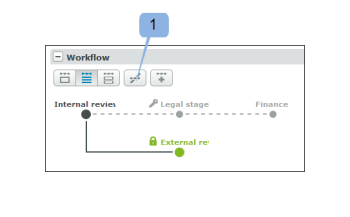
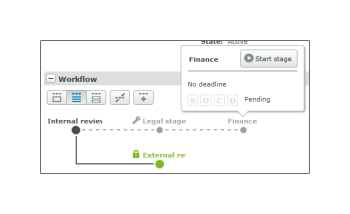

# Gestire una bozza configurata con un flusso di lavoro automatico in [!DNL Workfront Proof]

>[!IMPORTANT]
>
>Questo articolo fa riferimento alle funzionalità nel prodotto autonomo [!DNL Workfront Proof]. Per informazioni sulla verifica all&#39;interno di [!DNL Adobe Workfront], vedere [Verifica](../../../review-and-approve-work/proofing/proofing.md).

Puoi tenere traccia dell&#39;avanzamento delle bozze del flusso di lavoro automatico nella sezione Flusso di lavoro della pagina [!UICONTROL Dettagli bozza]. Puoi visualizzare il lavoro svolto su ogni fase e modificare, aggiungere, avviare e bloccare le fasi sulla bozza.

## Visualizzare un flusso di lavoro automatico

Puoi visualizzare il flusso di lavoro automatizzato in tre modi principali:

* [Visualizzare una fase in dettaglio](#view-a-stage-in-detail)
* [Visualizza tutte le fasi](#view-all-stages)
* [Visualizza in dettaglio tutte le fasi](#view-all-stages-in-detail)

### Visualizzare una fase in dettaglio {#view-a-stage-in-detail}

1. Fai clic sul pulsante nella parte superiore della sezione (1).

   È possibile passare da una fase all&#39;altra utilizzando il diagramma. La fase visualizzata è evidenziata in grigio (2).

1. Per visualizzare un altro stadio, selezionarlo nel diagramma.

### Visualizza tutte le fasi {#view-all-stages}

Per visualizzare tutte le fasi di un flusso di lavoro automatico:

1. Fai clic sul pulsante nella parte superiore della pagina (3).

   Tutte le fasi del flusso di lavoro automatico sono elencate nella sezione, ma i dettagli sono nascosti.

1. Per visualizzare i dettagli di una fase, fare clic sull&#39;icona più accanto al nome di ciascuna fase (4).

### Visualizza in dettaglio tutte le fasi {#view-all-stages-in-detail}

Per visualizzare in dettaglio tutte le fasi del flusso di lavoro automatizzato:

1. Fai clic sul pulsante nella parte superiore della pagina (5).

   Verranno visualizzate tutte le fasi del flusso di lavoro automatizzato con i dettagli di ciascuna fase espansi.

   È possibile nascondere i dettagli di ogni fase facendo clic sull&#39;icona meno (6).

## Utilizzare il diagramma di Flusso di lavoro automatico

Il diagramma del [!UICONTROL flusso di lavoro] automatizzato viene visualizzato nella parte superiore della sezione Flusso di lavoro.

Per nascondere il diagramma

1. Fare clic sul pulsante **[!UICONTROL Nascondi]** (1).

Le fasi del diagramma sono contrassegnate come segue:

- una fase attiva

- fase inattiva\
  - una fase privata

  - una fase bloccata

Le linee tra le fasi rappresentano le dipendenze tra le fasi. Le linee che conducono agli stadi inattivi vengono tratteggiate fino all&#39;attivazione dello stadio.

Passando il puntatore del mouse su una fase del diagramma verrà visualizzato lo stato di avanzamento della fase. Se la fase non è attiva e si dispone dei diritti di modifica sulla fase, sarà possibile avviare la fase dalla finestra popup utilizzando il pulsante [!UICONTROL Avvia fase]. Analogamente, viene visualizzata l&#39;opzione Blocca una fase attiva.

Per ulteriori informazioni sulla barra di avanzamento, vedere  [Visualizza stato e avanzamento di una bozza in [!DNL Workfront] Proof](../../../workfront-proof/wp-work-proofsfiles/manage-your-work/view-progress-and-status-of-proof.md).

## Aggiungi una nuova fase

Puoi aggiungere una nuova fase al flusso di lavoro automatico dalla pagina [!UICONTROL Dettagli bozza].

1. Fare clic sul pulsante **[!UICONTROL Nuova fase]** (1).

Nella casella **Nuova fase** visualizzata è possibile popolare i dettagli e le impostazioni della fase.

## Gestisci impostazioni area di visualizzazione

Nei dettagli della pagina è possibile modificare le impostazioni per ogni fase (se si dispone dei diritti di modifica):

* Modificare, aggiungere o rimuovere la scadenza per la fase (1)
* Blocca la fase (2): questa opzione viene visualizzata se la fase è attiva; per le fasi inattive viene visualizzata l’opzione Avvia la fase
* Modificare le impostazioni mediante modifica in linea (3)
* Abilita o disabilita una sola decisione richiesta sullo stage (4)
* Modifica la privacy della fase (5)

È inoltre possibile spostare i revisori tra le fasi semplicemente trascinandoli e rilasciandoli da una fase all&#39;altra. Le fasi disponibili vengono evidenziate in blu con le aree di rilascio per ciascuna fase chiaramente contrassegnate.

## Opzioni stage

Il menu [!UICONTROL Azioni] (1) per ogni fase presenta le seguenti opzioni:

* Invia messaggio a tutti (2) - puoi inviare un messaggio e-mail di promemoria a tutti i revisori sul palco
* Condividi (3): puoi aggiungere nuovi revisori all’area di visualizzazione
* Elimina fase (4): se il proprietario della bozza si trova in quella fase, ti verrà chiesto di scegliere una nuova fase per loro
