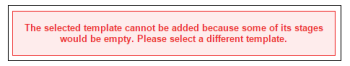

# Configurare una bozza con un flusso di lavoro automatico in [!DNL Workfront Proof]

>[!IMPORTANT]
>
>Questo articolo fa riferimento alle funzionalità nel prodotto autonomo [!DNL Workfront Proof]. Per informazioni sulla verifica all&#39;interno di [!DNL Adobe Workfront], vedere [Verifica](../../../review-and-approve-work/proofing/proofing.md).

Il flusso di lavoro automatizzato semplifica la gestione della revisione e dell&#39;approvazione dei contenuti quando si utilizzano processi di revisione complessi o quando si inviano regolarmente contenuti per la revisione agli stessi gruppi di persone.

La bozza viene creata e quindi spostata da un punto all’altro dell’applicazione fino all’approvazione finale. Gli utenti interessati ricevono una notifica ogni volta che sono tenuti a effettuare un’approvazione.

È possibile aggiungere un flusso di lavoro automatico a una bozza durante il caricamento del documento o dopo il caricamento del documento.

## Creare una bozza con il flusso di lavoro automatico

1. Inizia a creare la bozza.
1. Nella sezione **[!UICONTROL Condividi]**, fai clic su **[!UICONTROL Usa flusso di lavoro automatico]**.

   Puoi deselezionare questa opzione per tornare a un flusso di lavoro standard.

1. (Facoltativo) Se desideri utilizzare un modello di flusso di lavoro automatico configurato e condiviso con te dall&#39;amministratore [!DNL Workfront], selezionalo nel menu a discesa **[!UICONTROL Seleziona un modello di flusso di lavoro]**.

   >[!NOTE]
   >
   >La possibilità di modificare il modello dipende dalle impostazioni configurate dall&#39;amministratore [!DNL Workfront]. Se la possibilità di modificare il modello è disabilitata, solo il proprietario del modello può modificarlo.

1. Specifica le seguenti informazioni per configurare la prima fase del flusso di lavoro automatico:

   * **[!UICONTROL Nome]:** Il nome della fase viene visualizzato nel diagramma del flusso di lavoro ed è incluso nelle notifiche e-mail inviate ai revisori.
   * **[!UICONTROL Scadenza]:** Le funzionalità di questo campo variano a seconda dell&#39;opzione selezionata nell&#39;elenco a discesa **[!UICONTROL Scadenza calcolata da]**.

   * **[!UICONTROL Dalla creazione della bozza]:** Seleziona la data di scadenza per la bozza.
   * **[!UICONTROL Dall&#39;attivazione della fase]:** Seleziona il numero di giorni lavorativi che verranno aggiunti alla data di attivazione della fase per impostare automaticamente una scadenza sulla bozza.
   * **[!UICONTROL Attiva fase]:** Per ogni fase del flusso di lavoro, puoi decidere quando attivarla. Per la prima fase sono disponibili le seguenti opzioni.

      * Alla creazione della bozza
      * A un’ora e una data specifiche
      * Manualmente\

        Sono disponibili opzioni aggiuntive per le fasi successive. Queste opzioni richiedono una fase padre. Sono:
      * Dopo il raggiungimento della scadenza precedente
      * Tutte le decisioni vengono approvate o approvate con modifiche
      * Tutte le decisioni sono approvate
      * Tutte le decisioni vengono prese
   * **[!UICONTROL Scadenza calcolata a partire da]:** L&#39;opzione selezionata in questo elenco a discesa influisce sulle opzioni disponibili nel campo **[!UICONTROL Scadenza]**.

   * **[!UICONTROL Creazione bozza]:** Nel campo **[!UICONTROL Scadenza]**, seleziona la data di scadenza per la bozza.

   * **[!UICONTROL Attivazione fase]:** Nel campo **[!UICONTROL Scadenza]**, selezionare il numero di giorni lavorativi che verranno aggiunti alla data di attivazione della fase per impostare automaticamente una scadenza sulla bozza.

   * **[!UICONTROL Blocca fase]:** Seleziona quando la fase può essere bloccata.
   * **[!UICONTROL Decisore primario]:** Selezionare il Decisore primario sullo stage. I responsabili delle decisioni sono disponibili nell’elenco a discesa solo dopo aver aggiunto i revisori alla fase.
   * **[!UICONTROL È necessaria una sola decisione]:** Seleziona questa opzione per completare la revisione dopo che un responsabile delle decisioni ha preso la sua decisione.\

     Questa opzione non è disponibile se è stato designato un utente nel menu a discesa **[!UICONTROL Principale responsabile delle decisioni]**.

   * **[!UICONTROL Fase privata]:** Quando questa opzione è selezionata, i commenti e le decisioni non sono visibili agli utenti che non sono aggiunti a questa fase o che non sono supervisori, amministratori o amministratori di fatturazione nell&#39;account

1. (Facoltativo) Aggiungi i revisori all&#39;area di visualizzazione.
1. Quando aggiungi i revisori, tieni presente quanto segue:

   * Un revisore può essere aggiunto a una bozza una sola volta. (Non è possibile aggiungere la stessa persona a più di una fase della bozza.)
   * I revisori che vengono aggiunti a una fase privata possono vedere solo la fase a cui vengono aggiunti sulla bozza e i commenti fatti in quella fase.
   * Per impostazione predefinita, l’aggiunta di un utente a una fase consente a tale utente di accedere alla visualizzazione della bozza dal momento in cui viene creata.\

     L’amministratore di sistema può configurare il sistema di verifica in modo da impedire agli utenti di accedere alla bozza fino a quando il flusso di lavoro non entra nella fase in cui l’utente è stato aggiunto. Per ulteriori informazioni, consulta

1. (Facoltativo) Fai clic su **[!UICONTROL Nuova fase]**, quindi ripeti i passaggi 4 e 5 per aggiungere più fasi al flusso di lavoro automatico.
1. Continua a creare la bozza specificando le informazioni necessarie nelle sezioni [!UICONTROL Organizza] e [!UICONTROL Altre impostazioni] nella pagina [!UICONTROL Nuova bozza], come descritto in

## Diagrammi di flusso di lavoro automatizzati

Durante la configurazione del flusso di lavoro per la bozza, viene creato un diagramma. Ogni fase aggiunta alla bozza verrà visualizzata nel diagramma, indicando chiaramente le dipendenze tra le fasi. Le fasi private sono contrassegnate da un’icona a forma di chiave.

Il diagramma viene spostato e rimarrà visibile anche scorrendo la pagina verso il basso.

Se non è necessario visualizzare il diagramma, è possibile nasconderlo (1).

## Aggiungi una fase

È possibile aggiungere una fase aggiuntiva a un flusso di lavoro che si sta creando o modificando.

1. Se stai aggiungendo una fase a una bozza esistente, vai alla pagina Dettagli bozza come descritto in [Gestione dettagli bozza in [!DNL Workfront Proof]](../../../workfront-proof/wp-work-proofsfiles/manage-your-work/manage-proof-details.md).
1. Nella sezione **[!UICONTROL Flusso di lavoro]** fare clic su **[!UICONTROL Nuova fase]**.

1. Specifica le informazioni per la fase come nel passaggio 4 nella sezione [!UICONTROL Creazione di una bozza con un flusso di lavoro automatizzato] in questo articolo.
1. Fai clic su **[!UICONTROL Aggiungi fase]**, quindi su **[!UICONTROL Fine]**.

## Eliminare una fase

1. Fai clic sull’icona del cestino disponibile nell’angolo in alto a destra dell’area di visualizzazione (1).\
   L’icona viene visualizzata quando passi il cursore del mouse sull’area di visualizzazione.\
   

## Impostazioni fase

* **[!UICONTROL Nome fase]**: viene visualizzato nel diagramma del flusso di lavoro ed è incluso nelle notifiche e-mail inviate ai revisori.
* **[!UICONTROL Attiva fase]**: per ogni fase del flusso di lavoro, puoi decidere quando attivarla. Per la prima fase, saranno disponibili le seguenti opzioni:

   * Alla creazione della bozza
   * A un’ora e una data specifiche
   * Manualmente
   * Per la prima fase sono disponibili solo queste tre opzioni. Le altre opzioni diventano disponibili quando si aggiunge una seconda fase; richiedono la selezione di una fase padre.
   * Dopo il raggiungimento della scadenza precedente (richiede la scelta di una fase padre)
   * Tutte le decisioni sono approvate o [!UICONTROL approvate con modifiche] (richiede la selezione di una fase padre)
   * Tutte le decisioni sono approvate (richiede la selezione di una fase padre)
   * Tutte le decisioni vengono prese (è necessario scegliere una fase padre)

* **[!UICONTROL Scadenza]:** Puoi decidere come calcolare la scadenza in ogni fase di un flusso di lavoro. Le opzioni sono:

   * Dalla creazione della bozza: nel campo [!UICONTROL deadline] (9) puoi selezionare la data di scadenza della bozza.
   * Attivazione dalla fase: nel menu a discesa [!UICONTROL scadenza] seleziona il numero di giorni lavorativi che verranno aggiunti alla data di attivazione della fase per impostare automaticamente una scadenza sulla bozza.

* **[!UICONTROL Blocca]:** Esistono diverse opzioni che determinano quando un&#39;area di visualizzazione può essere bloccata. Le opzioni includono:

   * Blocco manuale
   * Mai
   * Quando inizia la fase successiva
   * Quando tutte le decisioni sono prese

**[!UICONTROL Decisore principale]**: è stato impostato il Decisore principale sullo stage. I responsabili delle decisioni disponibili vengono visualizzati nell’elenco solo dopo aver aggiunto i revisori alla fase.

>[!NOTE]
>
>Se scegli un’entità con potere decisionale principale, in questa fase non sarà più disponibile una sola opzione con potere decisionale richiesto.

* **[!UICONTROL È richiesta una sola decisione]**: è possibile abilitare questa opzione in una fase. Ciò significa che la revisione sarà completata una volta che uno dei responsabili decisionali prende la propria decisione.
* **[!UICONTROL Privacy]:** Ogni fase può essere resa privata. Se una fase è privata, i commenti e le decisioni non saranno visibili agli utenti che non sono aggiunti a questa fase o che non sono supervisori, amministratori o amministratori di fatturazione nell’account. Per ulteriori informazioni, vedere [Panoramica del flusso di lavoro automatico](../../../review-and-approve-work/proofing/proofing-overview/automated-workflow.md) .

## Aggiungere revisori a una fase

1. Immetti un nome di contatto o un indirizzo e-mail nel campo nella parte inferiore di ciascuna fase.
1. Fai clic sull’icona verde più per aggiungerli.
1. Imposta il ruolo sulla bozza.
1. Imposta l’avviso e-mail.
1. Durante l’impostazione della prima fase, puoi anche scegliere di cambiare il Proprietario della bozza.

   >[!NOTE]
   >
   >* Un revisore può essere aggiunto a una bozza una sola volta. Impossibile aggiungere la stessa persona a più di una fase della bozza.
   >* I revisori che non vengono aggiunti a una fase privata non possono vedere la fase sulla bozza o sui commenti fatti in quella fase.

## Convertire una bozza in un flusso di lavoro automatico

Puoi convertire una bozza di base in flusso di lavoro automatico.

1. Fare clic su **[!UICONTROL Converti in flusso di lavoro automatico]** nella pagina [!UICONTROL Dettagli bozza].
Dopo la rielaborazione della bozza in Flusso di lavoro automatico, tutte le fasi sono attive, pubbliche e l&#39;opzione [!UICONTROL Blocca fase] è impostata su Manuale per impostazione predefinita. Tutte le fasi rimangono associate agli utenti e alle relative impostazioni.

   * L’opzione Attiva fase è impostata su Al momento della creazione della bozza in ogni fase.
   * La scadenza calcolata dall’opzione è impostata su Creazione bozza in ogni fase.
   * Se sulla bozza di base è stata selezionata una sola opzione di decisione, in tutte le fasi viene selezionata tale opzione.
   * Se sulla bozza di base è stato selezionato [!UICONTROL Principale decisore], gli stadi con quel destinatario vengono impostati su di loro e tutti gli altri su Nessuno.
   * Il nome della fase rimane invariato.

## Aggiungere un modello aggiuntivo a un flusso di lavoro automatico esistente

Dopo aver convertito una bozza di base in un flusso di lavoro automatizzato, puoi aggiungervi un modello aggiuntivo.

1. Nella sezione Flusso di lavoro della pagina Dettagli bozza fare clic su **[!UICONTROL Aggiungi modello].**

   * Le impostazioni del modello determinano cosa è possibile fare con una bozza a cui è stato aggiunto il modello. Ad esempio, se nel modello sono disattivate le opzioni [!UICONTROL Aggiungi un&#39;area di visualizzazione e Aggiungi persone alle aree di visualizzazione], i pulsanti [!UICONTROL Aggiungi area di visualizzazione] e [!UICONTROL Condividi bozza] non saranno visibili.
   * Se [!UICONTROL Aggiungi un&#39;opzione di fase] è disabilitata nel modello specificato, dopo l&#39;aggiunta il pulsante [!UICONTROL Aggiungi modello] non sarà visibile.
   * Quando una persona viene aggiunta a una fase di un modello di flusso di lavoro automatico, ma è già presente nella bozza, se questo modello viene applicato il sistema la rimuoverà automaticamente dalla fase. Se nessun altro utente è stato aggiunto a questa fase particolare, verrà visualizzato il seguente errore, in quanto il sistema non consente di aggiungere una fase vuota al flusso di lavoro.

     
