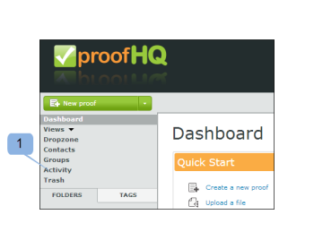

# Informazioni su [!DNL Workfront Proof] Activity Audit Trail

>[!IMPORTANT]
>
>Questo articolo fa riferimento alle funzionalità nel prodotto autonomo [!DNL Workfront Proof]. Per informazioni sulla verifica all&#39;interno di [!DNL Adobe Workfront], vedere [Verifica](../../../review-and-approve-work/proofing/proofing.md).

La pagina [!UICONTROL Activity Audit Trail] fornisce un elenco completo di tutte le attività che hanno avuto luogo nel tuo account.

Per accedere alla pagina [!UICONTROL Attività]:

1. Nella barra laterale a sinistra, fai clic su **[!UICONTROL Attività]**.\
   \
   Viene visualizzata la pagina [!UICONTROL Activity Audit Trail].\
   

1. Nel menu a discesa Visualizza selezionare la visualizzazione che si desidera visualizzare.\
   Potete scegliere tra le seguenti viste:

   * **[!UICONTROL Bozze e registri multimediali]**: visualizza tutte le attività su bozze e file nel tuo account.
   * **[!UICONTROL Registri cartelle]:** Visualizza tutte le attività nelle cartelle del tuo account.
   * **[!UICONTROL Registro profili]:** Visualizza tutte le modifiche apportate nel profilo personale.
   * **[!UICONTROL Registro account]:** Visualizza tutte le modifiche apportate alle impostazioni account. Questa visualizzazione è disponibile solo per gli utenti con diritti di amministratore.
   * **[!UICONTROL Registro autenticazione]:** Visualizza tutte le attività di accesso sull&#39;account, mostrando sia i tentativi riusciti che quelli non riusciti.
   * **[!UICONTROL Registro fatturazione]:** Visualizza la cronologia fatturazione sul tuo account. Questa vista è disponibile solo per gli utenti con diritti di amministratore fatturazione.
   * **[!UICONTROL Registro e-mail]:** Visualizza tutte le e-mail inviate dal tuo account.
