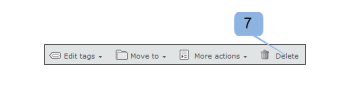
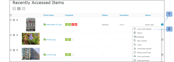

# Dashboard in [!DNL Workfront Proof]

>[!IMPORTANT]
>
>Questo articolo fa riferimento alle funzionalità nel prodotto autonomo [!DNL Workfront Proof]. Per informazioni sulla verifica all&#39;interno di [!DNL Adobe Workfront], vedere [Verifica](../../../review-and-approve-work/proofing/proofing.md).

La dashboard è la prima pagina visualizzata quando si accede all&#39;account [!DNL Workfront Proof]. Riepiloga l&#39;attività nel tuo account [!DNL Workfront Proof] e fornisce collegamenti rapidi ad altre sezioni e funzioni all&#39;interno di [!DNL Workfront Proof].

Il dashboard contiene quanto segue:

* Logo organizzazione (1)
* Navigazione superiore (2)
* Ricerca (3)

* Menu intestazione (4)
* Nuovo menu (5)
* Barra laterale (6)
* Sezione di benvenuto (7)
* Panoramica (8)
* Elementi a cui è stato effettuato l’accesso di recente (9)
* Attività recente (10)

>[!NOTE]
>
>I menu e i collegamenti che puoi visualizzare e utilizzare sul tuo dashboard dipenderanno dal tuo profilo utente e dalle tue autorizzazioni.

Puoi aggiungere un marchio al tuo account per mostrare il logo, i colori, i collegamenti personalizzati e altro ancora della tua organizzazione. Per ulteriori informazioni, consulta [Assegna il marchio al [!DNL Workfront Proof] sito](../../../workfront-proof/wp-acct-admin/branding/brand-wp-site.md).&quot;

Se non usi il tuo account come marchio, vengono visualizzati il logo [!DNL Workfront Proof] e i colori standard.

## Menu intestazione

### Nome utente

Il nome utente (2) scelto verrà visualizzato qui. Può essere modificato nelle impostazioni Personali.

### Impostazioni

Qui (3) puoi accedere a:

* Impostazioni personali
* Impostazioni account
* Fatturazione

>[!NOTE]
>
>La visibilità dei menu di cui sopra dipende dal profilo. Per ulteriori informazioni, consulta Profili utente e autorizzazioni.

### Aiuto

Qui (4) puoi accedere a:

* Articoli della Guida
* Film dimostrativi

>[!NOTE]
>
>Con i nostri piani Select e Premium puoi configurare le opzioni di Aiuto per indirizzare gli utenti al tuo contenuto. Per ulteriori dettagli, consulta le nostre opzioni di branding avanzate.

### Esci

Fai clic qui per uscire dal tuo account.

## Il nuovo menu

Per aprire il menu Nuovo:

1. Fai clic sulla freccia a discesa (7).

   Il menu **[!UICONTROL Nuovo]** include le opzioni seguenti:

   * Nuova bozza (8)
   * Carica file (9)
   * Nuova cartella (10)
   * Nuovo ospite (11)
   * Nuovo utente (12)
   * Nuovo gruppo (13)

## Menu del dashboard

Il menu Dashboard contiene i seguenti menu:

* Modifica tag
* Sposta in
* Altre azioni
* Elimina

## Modifica tag

Il menu [!UICONTROL Modifica tag] (1) consente di:

* Applicare un tag a uno o più elementi
* Creare nuovi tag
* Gestire i tag (2)

## Sposta in

Questa funzione consente di spostare bozze e file in una delle cartelle. Per eseguire questa operazione:

1. Selezionare la casella di spunta relativa alle voci pertinenti.
1. Fai clic su **[!UICONTROL Sposta in]** (3) e scegli la cartella pertinente (4).
1. Fai clic su **[!UICONTROL Salva]** (5).

   

### Altre azioni

Nel menu [!UICONTROL Altre azioni] (6) è possibile eseguire le azioni seguenti:

* Blocca (solo bozze)
* Attiva
* Archivia (solo bozze)
* Annulla archiviazione (solo bozze)
* Modifica proprietario

### Elimina

Per eliminare gli elementi:

1. Selezionare la casella di spunta a sinistra degli elementi e fare clic su **[!UICONTROL Elimina]** (7).

1. Nella schermata di conferma visualizzata, controllare i dettagli e confermare facendo clic su **[!UICONTROL Sì]** (8).

### Barra laterale

La barra laterale contiene collegamenti alle pagine seguenti:

* Dashboard (1)
* Visualizzazioni (2)
* Flussi di lavoro (3) (solo piani Premium)
* Dropzone (4) (Seleziona e piani Premium)
* Contatti (5)
* Gruppi (6)
* Attività (7)
* Cestino (8)
* Cartelle personali (9) (è inoltre possibile accedere a ogni singola cartella dalla barra laterale)
* Cartelle di altre organizzazioni (10) (in cui è possibile trovare elementi condivisi da altre organizzazioni)
* Tag (11)

La barra laterale viene descritta più dettagliatamente nella pagina della guida di Sidebar.

### [!UICONTROL Benvenuto] sezione

La sezione [!UICONTROL Benvenuto] include i collegamenti utili seguenti:

* Guarda i nostri film demo (1)
* Pagine della guida (2)
* Informazioni di contatto per il supporto (3)
* Collegamento &quot;Non visualizzare più la sezione Benvenuti&quot; (4)

### Panoramica

In questa sezione sono disponibili i collegamenti rapidi a:

* Creare una nuova bozza Caricare un file
* Creare una nuova cartella
* Aggiungi un nuovo utente
* Cambia la password

Nella sezione panoramica vengono inoltre visualizzate informazioni prefiltrate. Si tratta dei seguenti:

* Bozze da gestire: numero totale di bozze attive di tua proprietà e a te delegate
* Bozze in attesa di decisione: numero totale di bozze attive che richiedono decisioni

  

Qui puoi vedere immediatamente quante bozze richiedono un’azione immediata da parte tua o dei tuoi revisori:

* Totale
* Puntuale: bozze senza scadenza o mancano più di 24 ore alla scadenza
* A rischio - bozze con scadenza inferiore a 24 ore
* In ritardo: bozze con non tutte le azioni completate e scadenza passata

>[!NOTE]
>
>I valori dei grafici sono cliccabili - puoi facilmente andare all&#39;elenco dettagliato degli elementi.

### Elementi a cui è stato effettuato l&#39;accesso di recente

Nella sezione [!UICONTROL Elementi utilizzati di recente] sono visualizzati gli elementi a cui si è avuto accesso di recente. Ciò include gli elementi che possiedi, gli elementi per i quali disponi delle autorizzazioni di visualizzazione in base alle tue autorizzazioni di profilo e gli elementi condivisi con te. In questa sezione verranno inclusi solo gli elementi aperti dall&#39;utente (tramite il visualizzatore [!DNL Workfront Proof] o tramite la pagina Dettagli bozza).

Nella sezione [!UICONTROL Elementi utilizzati di recente] sono visualizzate le seguenti informazioni sui file e le bozze recenti:

* Nome
* Avanzamento
* Stato
* Decisione
* Proprietario

Riepilogo (queste informazioni verranno compresse per impostazione predefinita; per aprire il riepilogo della bozza, fai clic sul pulsante Espandi/Comprimi a sinistra della bozza pertinente)

Menu Azioni

Consulta Layout di pagina per le diverse opzioni di layout disponibili per questa sezione.

>[!NOTE]
>
>Facendo clic sul nome della bozza nella sezione [!UICONTROL Elementi aperti di recente] si aprirà la bozza nel Visualizzatore bozze.

Per accedere alla pagina dei dettagli della bozza:

1. Fai clic sul menu **[!UICONTROL Azioni]** (1) disponibile a destra del nome della bozza.
1. Seleziona **[!UICONTROL Visualizza dettagli bozza]** (2) dal menu.

### Attività recente

Questa sezione mostra i seguenti dettagli sulle attività recenti nel tuo account:

* Data e ora Proof/Nome file
* Azione
* Dettagli

È inoltre possibile accedere alla pagina Dettagli di un elemento facendo clic sull&#39;apertura del menu Azioni dell&#39;elemento e scegliendo Visualizza dettagli. Per ulteriori informazioni sull’attività nel tuo account, consulta Audit trail dell’attività.

>[!NOTE]
>
>Facendo clic sul nome della bozza nella sezione [!UICONTROL Attività recente], la bozza verrà aperta nel Visualizzatore bozze.

Per passare alla pagina dei dettagli della bozza:

1. Fare clic sul menu **[!UICONTROL Azioni]** (1).
1. Seleziona **[!UICONTROL Visualizza dettagli bozza]** (2) dal menu a discesa.

   
