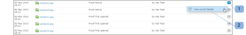

# Dashboard in [!DNL Workfront Proof]

>[!IMPORTANT]
>
>Questo articolo fa riferimento alla funzionalità del prodotto standalone [!DNL Workfront Proof]. Per informazioni sulle prove all&#39;interno [!DNL Adobe Workfront], vedi [Copertura](../../../review-and-approve-work/proofing/proofing.md).

Dashboard è la prima pagina visualizzata all&#39;accesso al [!DNL Workfront Proof] conto. Riassume l’attività nel [!DNL Workfront Proof] e fornisce collegamenti rapidi ad altre sezioni e funzioni in [!DNL Workfront Proof].

Il dashboard contiene i seguenti elementi:

* Logo dell&#39;organizzazione (1)
* Navigazione superiore (2)
* Ricerca (3)

* Menu Intestazione (4)
* Nuovo menu (5)
* Barra laterale (6)
* Sezione di benvenuto (7)
* Panoramica (8)
* Articoli a cui è stato effettuato l’accesso di recente (9)
* Attività recente (10)

>[!NOTE]
>
>I menu e i collegamenti che puoi visualizzare e utilizzare sul dashboard dipenderanno dal tuo profilo utente e dalle tue autorizzazioni.

Puoi assegnare un marchio al tuo account per mostrare il logo, i colori, i collegamenti personalizzati e altro ancora della tua organizzazione. Per ulteriori informazioni, consulta [Marchio [!DNL Workfront Proof] sito](../../../workfront-proof/wp-acct-admin/branding/brand-wp-site.md).&quot;

Se il tuo account non viene marchiato, la [!DNL Workfront Proof] vengono visualizzati il logo e i colori standard.

## Menu Intestazione

### Nome utente

Il nome utente (2) scelto verrà visualizzato qui. Può essere modificato nelle impostazioni Personali.

### Impostazioni

Qui (3) puoi accedere al tuo:

* Impostazioni personali
* Impostazioni account
* Fatturazione

>[!NOTE]
>
>La visibilità dei menu di cui sopra dipende dal profilo. Per ulteriori informazioni, consulta Profili utente e autorizzazioni .

### Aiuto

Qui (4) puoi accedere a:

* Articoli della Guida
* Filmati demo

>[!NOTE]
>
>Con i nostri piani Select e Premium è possibile configurare le opzioni di Aiuto per indirizzare gli utenti al proprio contenuto. Per ulteriori informazioni, consulta le nostre opzioni avanzate di branding .

### Esci

Fai clic qui per disconnettersi dall&#39;account.

## Il nuovo menu

Per aprire il menu Nuovo,

1. Fai clic sulla freccia a discesa (7).

   La **[!UICONTROL Nuovo]** il menu presenta le seguenti opzioni:

   * Nuova bozza (8)
   * Carica file (9)
   * Nuova cartella (10)
   * Nuovo ospite (11)
   * Nuovo utente (12)
   * Nuovo gruppo (13)

## Menu del dashboard

Il menu Dashboard contiene i seguenti menu:

* Modifica tag
* Sposta in
* Altre azioni
* Elimina

## Modifica tag

La [!UICONTROL Modificare i tag] menu (1) consente di:

* Applicare un tag a uno o più elementi
* Creare nuovi tag
* Gestione dei tag (2)

## Sposta in

Questa funzione consente di spostare bozze e file in una delle cartelle. Per eseguire questa operazione:

1. Selezionare la casella di spunta per gli elementi rilevanti.
1. Fai clic su **[!UICONTROL Sposta a]** (3) e scegliere la relativa cartella (4).
1. Fai clic su **[!UICONTROL Salva]** (5)

   

### Altre azioni

In [!UICONTROL Altre azioni] (6) è possibile eseguire le azioni seguenti:

* Blocca (solo bozze)
* Attiva
* Archivio (solo per le bozze)
* Annulla archiviazione (solo bozze)
* Cambia proprietario

### Elimina

Per eliminare gli elementi:

1. Selezionare la casella di spunta a sinistra degli elementi e fare clic su **[!UICONTROL Elimina]** (7)

1. Nella schermata di conferma visualizzata, controlla i dettagli e conferma facendo clic su **[!UICONTROL Sì]** (8)

### Barra laterale

La barra laterale include collegamenti alle pagine seguenti:

* Dashboard (1)
* Viste (2)
* Flussi di lavoro (3) (solo piani Premium)
* Zona di rilascio (4) (piani Select e Premium)
* Contatti (5)
* Gruppi (6)
* Attività (7)
* Cestino (8)
* Cartelle personali (9) (è anche possibile accedere a ogni singola cartella dalla barra laterale)
* Cartelle di altre organizzazioni (10) (in cui puoi trovare gli elementi condivisi da altre organizzazioni con te)
* Tag (11)

La barra laterale viene descritta più dettagliatamente nella pagina della guida di Sidebar.

### [!UICONTROL Benvenuto] sezione

La [!UICONTROL Benvenuto] include i seguenti collegamenti utili:

* Guarda i nostri film dimostrativi (1)
* Pagine della Guida (2)
* Informazioni di contatto (3)
* Collegamento &quot;Non mostrare più la sezione Benvenuto&quot; (4)

### Panoramica

In questa sezione trovi i collegamenti rapidi a:

* Crea una nuova bozza Carica un file
* Crea una nuova cartella
* Aggiungi un nuovo utente
* Modificare la password

Nella sezione panoramica sono inoltre visualizzate informazioni pre-filtrate. Si tratta di:

* Prove da gestire - numero totale di bozze attive di proprietà e delegate a te
* Prove in attesa di decisione - numero totale di bozze attive che richiedono le tue decisioni

   

Qui puoi vedere immediatamente quante bozze richiedono un’azione immediata da parte tua o dei tuoi revisori:

* Totale
* In tempo - prove che non hanno una scadenza o che sono presenti più di 24 ore fino alla scadenza
* A rischio - prove con scadenza inferiore a 24 ore
* Prove in ritardo - non tutte le azioni completate e trasmesse

>[!NOTE]
>
>I valori dei grafici sono cliccabili - è possibile facilmente passare all&#39;elenco dettagliato degli elementi.

### Articoli utilizzati di recente

La [!UICONTROL Articoli utilizzati di recente] questa sezione mostra gli elementi a cui hai effettuato l’accesso di recente. Ciò include gli elementi che possiedi, gli elementi che hai le autorizzazioni per visualizzare in base alle autorizzazioni del tuo profilo e gli elementi che sono stati condivisi con te. Questa sezione includerà solo gli elementi che hai aperto (tramite [!DNL Workfront Proof] Visualizzatore o tramite la pagina dei dettagli della bozza).

La [!UICONTROL Articoli utilizzati di recente] in questa sezione vengono visualizzate le seguenti informazioni sulle bozze e sui file recenti:

* Nome
* Avanzamento
* Stato
* Decisione
* Proprietario

Riepilogo (queste informazioni verranno compresse per impostazione predefinita; fai clic sul pulsante espandi/comprimi a sinistra della bozza pertinente per aprire il riepilogo della bozza)

Menu Azioni

Consulta Layout di pagina per le diverse opzioni di layout disponibili per questa sezione.

>[!NOTE]
>
>Fai clic sul nome della bozza in [!UICONTROL Articoli utilizzati di recente] La sezione ti porterà direttamente alla prova nel Visualizzatore prove.

Per accedere alla pagina dei dettagli della bozza:

1. Fai clic sul pulsante **[!UICONTROL Azioni]** menu (1) disponibile a destra del nome della bozza.
1. Seleziona **[!UICONTROL Visualizza dettagli della bozza]** (2) dal menu.

### Attività recente

Questa sezione mostra i seguenti dettagli sulle attività recenti nel tuo account:

* Data e ora Proof/Nome file
* Azione
* Dettagli

Per passare alla pagina Dettagli di un elemento, fai clic su Apri il menu Azioni e scegli Visualizza dettagli. Per ulteriori informazioni sull’attività nel tuo account, consulta Audit trail dell’attività .

>[!NOTE]
>
>Fai clic sul nome della bozza nel [!UICONTROL Attività recente] Viene aperta la bozza nel visualizzatore di prove.

Per passare alla pagina dei dettagli della bozza della bozza:

1. Fai clic sul pulsante **[!UICONTROL Azioni]** menu (1).
1. Seleziona **[!UICONTROL Visualizza dettagli della bozza]** (2) dal menu a discesa.

   
