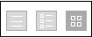

# Layout di pagina nella scheda Viste in [!DNL Workfront Proof]

>[!IMPORTANT]
>
>Questo articolo fa riferimento alle funzionalità del prodotto autonomo [!DNL Workfront Proof]. Per informazioni sulle prove all&#39;interno [!DNL Adobe Workfront], vedi [Bozza](../../../review-and-approve-work/proofing/proofing.md).

È possibile regolare il layout della pagina in [!UICONTROL Visualizzazioni] scheda. Sono disponibili le seguenti opzioni di layout:

## Elenco

* Mostra la bozza o il nome del file più le colonne della vista standard
* Il [!UICONTROL azioni bozza] il menu si trova sul lato destro della linea (1)

  

## Lista Thumbnail

* Mostra l’icona dell’immagine o del file della bozza, la bozza o il nome del file più le colonne della vista standard
* Il [!UICONTROL azioni bozza] il menu si trova sul lato destro della linea (1)
* Si tratta della visualizzazione standard predefinita.

  

## Miniature

* Mostra solo l&#39;icona immagine/file della bozza e il nome bozza/file
* Il [!UICONTROL azioni bozza] Il menu si trova nell’angolo in alto a destra per ogni bozza (1)

  

## Modifica del layout di pagina

Per modificare il layout di pagina nel dashboard o nella pagina cestino, scegliere la visualizzazione desiderata facendo clic su uno dei pulsanti di visualizzazione nella parte superiore della pagina:

Per modificare il layout di pagina in tutte le altre pagine di visualizzazione dell’account, espandi il menu a discesa nella parte superiore della pagina e fai clic sul layout di pagina preferito:

