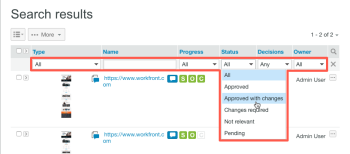

# Ricerca [!DNL Workfront] Bozza

>[!IMPORTANT]
>
>Questo articolo fa riferimento alle funzionalità del prodotto autonomo [!DNL Workfront Proof]. Per informazioni sulle prove all&#39;interno [!DNL Adobe Workfront], vedi [Bozza](../../../review-and-approve-work/proofing/proofing.md).

Puoi cercare i seguenti tipi di contenuto in [!DNL Workfront Proof] sito:

* Bozze (comprese le bozze archiviate)
* File
* Cartelle
* Tag
* Oggetto bozza
* Messaggio bozza
* Campi personalizzati
* Nome creatore
* Elementi condivisi con te

Per eseguire ricerche in [!DNL Workfront Proof] sito:

1. Digitare il testo che si desidera cercare, quindi premere **[!UICONTROL Invio]**.\
   Per quanto riguarda i risultati della ricerca, tieni presente quanto segue:

   * Lo strumento di ricerca individua gli elementi che contengono tutte le parole chiave digitate. Per ridurre al minimo i risultati della ricerca e massimizzare la precisione della ricerca, assicurati di scrivere correttamente le parole chiave e di aggiungere spazi tra di esse.
   * I risultati della ricerca sono ordinati in base alla rilevanza.
   * È possibile ridurre i risultati della ricerca aggiungendo più parole chiave nel campo di ricerca (separate da uno spazio), quindi eseguendo nuovamente la ricerca. La nuova ricerca viene eseguita solo sugli elementi già visualizzati nei risultati della ricerca.
   * Se immetti il nome di una versione di bozza precedente nel campo di ricerca, nei risultati della ricerca viene visualizzata la versione più recente della bozza.
   * Le cartelle principali e le sottocartelle sono elencate separatamente.

1. (Facoltativo) Nei risultati della ricerca visualizzati, ordina per colonna facendo clic sull’intestazione nella parte superiore di una colonna. (Facoltativo) Aggiungi il filtro ai risultati facendo clic sul pulsante [!UICONTROL ricerca] alla fine della riga di intestazione. 

In questo modo vengono aggiunti dei menu a discesa in cui è possibile selezionare i filtri per restringere la ricerca.
1. 

1. (Facoltativo) Restringi la ricerca aprendo il [!UICONTROL Tag] e facendo clic su un tag nella barra laterale di navigazione a sinistra. Gli elementi associati a tale tag vengono visualizzati nei risultati della ricerca.\
   \
   Il nome del tag viene visualizzato nel campo di ricerca nell’angolo superiore destro di Workfront Proof. Puoi perfezionare la ricerca selezionando tag aggiuntivi o digitando ulteriori parole chiave nel campo di ricerca. Per rimuovere un tag dal campo di ricerca, fai clic sull’icona x accanto al nome del tag.

Per informazioni sulla ricerca di testo all’interno del contenuto della bozza, vedi [Cercare contenuto in una bozza](../../../review-and-approve-work/proofing/reviewing-proofs-within-workfront/review-a-proof/search-in-a-proof.md).
