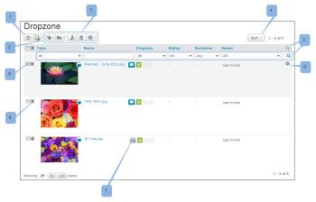

# Zona di rilascio

>[!IMPORTANT]
>
>Questo articolo fa riferimento alle funzionalità nel prodotto autonomo [!DNL Workfront Proof]. Per informazioni sulla verifica all&#39;interno di [!DNL Adobe Workfront], vedere [Verifica](../../../review-and-approve-work/proofing/proofing.md).

Se si dispone del piano Enterprise, è possibile utilizzare Dropzone per inviare nuove bozze e nuove versioni delle bozze al proprio account senza dover effettuare l&#39;accesso al proprio account.

Quando invii una bozza tramite Dropzone, questa viene visualizzata nella pagina Dropzone del tuo account [!DNL Workfront Proof]. Da lì, puoi indirizzarlo al flusso di lavoro.

## Invio di una nuova bozza tramite l’URL di Dropzone

1. Nel browser, vai all&#39;URL Dropzone univoco, come descritto in [Configurare dropzone in [!DNL Workfront Proof]](../../../workfront-proof/wp-acct-admin/account-settings/configure-dropzone-in-wp.md)
1. Inserisci il tuo indirizzo e-mail.
1. Fai clic su **[!UICONTROL Seleziona un file]** o **[!UICONTROL Acquisisci una pagina Web]** e scegli il file o la pagina Web da caricare.

1. Immetti il codice di sicurezza, quindi fai clic su **[!UICONTROL Avanti]**.\
   Una barra di avanzamento mostra l’avanzamento del caricamento.\
   Nella schermata successiva, potrai aggiungere i dettagli della bozza.\
   Questa sezione viene visualizzata solo se è stata abilitata nelle impostazioni di Dropzone.

1. Dopo aver inserito i dettagli, fai clic su **[!UICONTROL Avanti]**.
1. I revisori aggiunti alla bozza riceveranno l’e-mail di notifica solo al momento dell’attivazione della bozza (vedi di seguito).
1. La bozza passa attraverso i seguenti stati dopo averla inviata alla Dropzone:

   * La prima volta che carichi un file nell’area di rilascio, la bozza viene visualizzata come bozza.
   * Una volta completato l’invio, la bozza viene visualizzata in Dropzone come Inviata.
   * Una volta che la bozza è stata attivata e sbloccata, viene visualizzata nell’area di rilascio come Attiva.
   * Se la bozza è bloccata, viene visualizzata nell’area di rilascio come Bloccata.

## Invio di una nuova versione di una bozza esistente tramite l’URL di Dropzone

1. Nel browser, vai all&#39;URL Dropzone univoco, come descritto in [Configurare dropzone in [!DNL Workfront Proof]](../../../workfront-proof/wp-acct-admin/account-settings/configure-dropzone-in-wp.md)
1. Inserisci il tuo indirizzo e-mail.
1. Seleziona la casella di controllo per indicare che stai caricando una nuova versione di una bozza esistente.\
   Per informazioni sulla creazione di una nuova versione di una bozza, consulta .
1. Fai clic su **[!UICONTROL Seleziona un file]** o **[!UICONTROL Acquisisci una pagina Web]** e scegli il file o la pagina Web da caricare.

1. Immetti il codice di sicurezza, quindi fai clic su **[!UICONTROL Avanti]**.\
   Una barra di avanzamento mostra l’avanzamento del caricamento.\
   Workfront Proof ti invia un messaggio e-mail di convalida.

1. Fai clic sul collegamento nell’e-mail.\
   L’e-mail apre la finestra Dropzone nel browser. Il collegamento nella notifica e-mail è valido per 24 ore.
1. Seleziona la versione precedente della bozza (verranno visualizzate solo le bozze create/inviate).\
   Nella schermata successiva potrai aggiungere i dettagli della bozza.\
   Questa sezione viene visualizzata solo se è stata abilitata nelle impostazioni di Dropzone.

1. Digitare i dettagli e fare clic su **[!UICONTROL Avanti]**.

   >[!NOTE]
   >
   >I revisori aggiunti alla bozza riceveranno l’e-mail di notifica solo al momento dell’attivazione della bozza (vedi di seguito).

   La bozza passa attraverso i seguenti stati dopo averla inviata alla Dropzone:

   * La prima volta che carichi un file nell’area di rilascio, la bozza viene visualizzata come bozza.
   * Una volta completato l’invio, la bozza viene visualizzata in Dropzone come Inviata.
   * Una volta che la bozza è stata attivata e sbloccata, viene visualizzata nell’area di rilascio come Attiva.
   * Se la bozza è bloccata, viene visualizzata nell’area di rilascio come Bloccata.

## Invio di una bozza a Dropzone via e-mail

>[!NOTE]
>
>L’invio di una bozza alla zona di rilascio tramite e-mail non è più supportato.

## Completamento dell’invio

Workfront invia all&#39;utente (mittente) un messaggio e-mail Completa l&#39;invio in cui viene richiesto di confermare se si tratta di una nuova bozza o di una nuova versione. Il collegamento nella notifica e-mail è valido per 24 ore.

1. Fai clic sul collegamento e segui i passaggi indicati sopra, a seconda che si tratti di una nuova bozza o di una nuova versione di una bozza esistente.

## Attivazione della bozza

Il proprietario di Dropzone riceve un’e-mail di notifica per avvisare che è stata inviata una nuova bozza a Dropzone:

* La bozza viene visualizzata nella pagina Dropzone del tuo account (per accedere alla pagina Dropzone, fai clic sul collegamento nella barra laterale di navigazione a sinistra).
* La bozza è accessibile dal proprietario di Dropzone (o da un utente che ha almeno un profilo di Supervisore). Il proprietario può essere modificato nelle impostazioni di Dropzone (questa operazione può essere eseguita solo da un amministratore di fatturazione o da un amministratore).
* Prima che la bozza possa essere elaborata, deve essere attivata/sbloccata dal proprietario dell’area di rilascio (può farlo anche un utente con almeno un profilo Supervisore). Lo stato della bozza viene visualizzato come Inviata fino a quando non viene attivata/sbloccata.

Per attivare la bozza:

1. Vai al menu a discesa a destra della bozza e fai clic su **[!UICONTROL Attiva]**.
1. Dopo l’attivazione/sblocco della bozza:

   * Lo stato della bozza diventa Attivo.
   * Tutte le persone che sono state aggiunte alla bozza riceveranno un’e-mail di notifica per informarsi di disporre di una nuova bozza da rivedere. (Nessun messaggio e-mail viene inviato finché la bozza non viene attivata/sbloccata).
   * È possibile lavorare alla bozza come al solito
   * Se anche l’autore dell’invio si aggiunge esplicitamente alla bozza, non riceverà un’e-mail Nuova bozza. Per ulteriori informazioni, vedere [Nuovo messaggio e-mail bozza](../../../workfront-proof/wp-emailsntfctns/proof-notifications-and-reminders/new-proof-email.md).

## Gestione dell’area di rilascio

La pagina Dropzone semplifica la gestione delle richieste inviate a Dropzone. La pagina Dropzone include le opzioni e le funzionalità seguenti:

* Layout di pagina (1)
* Scegli se includere/escludere le bozze archiviate nella visualizzazione (2)
* Pulsanti di azione (3)
* Ordina (4)
* Filtro (5)
* Menu Azioni bozza (6)
* Annulla archiviazione della bozza (7)
* Espandi/comprimi riepilogo bozza (8)
* Seleziona una bozza (9)

Le opzioni di layout e ordinamento e filtro delle pagine sono le stesse degli elenchi [!DNL Views]. Per ulteriori informazioni, vedi [Gestione elementi nella pagina Visualizzazioni in [!DNL Workfront Proof]](../../../workfront-proof/wp-work-proofsfiles/manage-your-work/manage-items-on-views-page.md).

