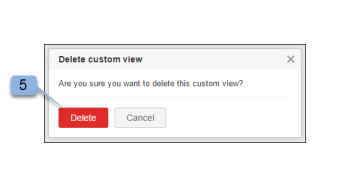

# Crea e gestisci visualizzazioni personalizzate in [!DNL Workfront Proof]

>[!IMPORTANT]
>
>Questo articolo fa riferimento alle funzionalità nel prodotto autonomo [!DNL Workfront Proof]. Per informazioni sulla verifica all&#39;interno di [!DNL Adobe Workfront], vedere [Verifica](../../../review-and-approve-work/proofing/proofing.md).

È possibile creare visualizzazioni personalizzate dei file e delle bozze per elencare gli elementi desiderati nel modo desiderato. È inoltre possibile esportare le informazioni nella visualizzazione personalizzata come rapporto (in CSV, valori separati da virgola, formato file).

>[!NOTE]
>
>Le viste personalizzate sono disponibili solo nei piani Select e Premium. Contatta il nostro team di vendita per ricevere un preventivo.

## Creazione di una vista personalizzata

Quando crei una visualizzazione personalizzata, puoi scegliere:

* Se includere bozze, file o entrambi
* Quali colonne vengono visualizzate
* Colonna in base alla quale eseguire l&#39;ordinamento
* Ordinamento della colonna (crescente o decrescente)
* Tipi di filtri da utilizzare per determinare quali informazioni includere nella visualizzazione

Una volta creata, la vista personalizzata è disponibile per l’uso immediato. Il nome della nuova visualizzazione è incluso anche nel menu a discesa sotto l’intestazione Visualizzazioni personalizzate (sotto le visualizzazioni Standard).

Per creare una visualizzazione personalizzata:

1. Vai alla pagina **[!UICONTROL Visualizzazioni]**.
1. Per ulteriori informazioni sulle visualizzazioni, vedere [Gestione elementi nella pagina Visualizzazioni in [!DNL Workfront Proof]](../../../workfront-proof/wp-work-proofsfiles/manage-your-work/manage-items-on-views-page.md).
1. Effettuate una delle seguenti operazioni, a seconda che desiderate creare una nuova vista personalizzata da zero o una nuova vista personalizzata basata su una vista standard esistente:

   * Per creare una nuova visualizzazione personalizzata basata su una visualizzazione standard esistente: dal menu a discesa, selezionare la visualizzazione standard esistente da utilizzare come base per la nuova visualizzazione personalizzata. Fai clic sull&#39;icona **[!UICONTROL Visualizza impostazioni]**, quindi fai clic su **[!UICONTROL Copia]** nella nuova visualizzazione personalizzata.

   * 

   * Per creare una nuova visualizzazione personalizzata da zero: fai clic sull&#39;icona **[!UICONTROL Nuova visualizzazione]**.
   * 

1. Nella sezione **[!UICONTROL Dettagli]**, specifica le seguenti informazioni:

   * **[!UICONTROL Nome]** (obbligatorio): nome della nuova visualizzazione. Utilizza un nome univoco per consentire agli utenti di trovare facilmente la visualizzazione personalizzata nel menu a discesa delle Visualizzazioni.
   * **[!UICONTROL Elementi]**: selezionare se si desidera includere nella visualizzazione sia bozze che file, solo bozze o solo file. Per impostazione predefinita, sono inclusi sia le bozze che i file.

1. Nella sezione **[!UICONTROL Colonne]**, determina le colonne da includere nella visualizzazione personalizzata.

   1. Fare clic sull&#39;icona freccia destra.
   1. 

   1. Fare doppio clic sul nome della colonna selezionata.
   1. È necessario selezionare almeno una colonna, che può essere aggiunta una sola volta.
   1. Selezionare una colonna dall&#39;area **[!UICONTROL Colonne disponibili]** che si desidera includere nella nuova visualizzazione.
   1. Le colonne vengono spostate dall&#39;elenco **[!UICONTROL Colonne disponibili]** all&#39;elenco **[!UICONTROL Colonne selezionate]**.

   1. È possibile effettuare una selezione dalle colonne standard oppure scegliere Campi personalizzati e Motivi decisione come colonne nella visualizzazione personalizzata. Se sono configurate nell&#39;account, vengono visualizzate nell&#39;elenco standard delle colonne disponibili.
   1. Colonne standard che è possibile includere

      <table style="table-layout:auto">
      <thead>

      </thead>
      <tbody>  
      <tr>   
      <td><strong>Nome fase attiva</strong></td>   
      <td>Nome della fase attiva nel flusso di lavoro automatizzato.</td>  
      </tr>  
      <tr>   
      <td><strong>Commenti</strong></td>   
      <td>Numero di osservazioni ricevute.</td>
      </tr>  
      <tr>   
      <td><strong>Contatore</strong></td>
      <td>Mostra una parte della bozza caricata sul tuo account (devi avere un contatore di bozze abilitato in Impostazioni account).</td>
      </tr>
      <tr>
      <td><strong>Creazione completata</strong></td>
      <td>Data e ora di creazione dell'elemento.</td>
      </tr>
      <tr>
      <td><strong>Creatore</strong></td>
      <td>Utente che ha creato l'elemento.</td>
      </tr>
      <tr>
      <td><strong>[!UICONTROL Data aggiunta alla bozza]</strong></td>
      <td>Data in cui sei stato aggiunto alla bozza. </td>
      </tr>
      <tr>
      <td><strong>Scadenza</strong></td>
      <td>Scadenza per l'intera bozza.</td>
      </tr>
      <tr>
      <td><strong>Decisioni</strong></td>
      <td>Il numero di decisioni date rispetto al numero previsto (ad esempio 0 di 1, 1 di 1, ecc.)</td>
      </tr>
      <tr>
      <td><strong>[!UICONTROL Download]</strong></td>
      <td>Il numero di volte in cui il file originale è stato scaricato.</td>
      </tr>
      <tr>
      <td><strong>Nome del file</strong></td>
      <td>Nome del file o della bozza.</td>
      </tr>
      <tr>
      <td><strong>Cartella</strong></td>
      <td>Cartella contenente l'elemento.</td>
      </tr>
      <tr>
      <td><strong>Ultima attività</strong></td>
      <td>La data e l'ora dell'ultima attività sull'elemento.</td>
      </tr>
      <tr>
      <td><strong>Ultima decisione il</strong></td>
      <td>La data e l’ora dell’ultima decisione presa.</td>
      </tr>
      <tr>
      <td><strong>La mia scadenza</strong></td>
      <td>La tua scadenza sulle bozze in cui sei aggiunto esplicitamente come Revisore/Approvatore (se applicato).</td>
      </tr>
      <tr>
      <td><strong>Proprietario</strong></td>
      <td>Proprietario dell'elemento.</td>
      </tr>
      <tr>
      <td><strong>Paese proprietario</strong></td>
      <td>Paese registrato nel sistema per il proprietario della prova. </td>
      </tr>
      <tr>
      <td><strong>Bozza principale</strong></td>
      <td>Nome della bozza padre.</td>
      </tr>
      <tr>
      <td><strong>Avanzamento</strong></td>
      <td>
Barra di avanzamento. Visualizza le bozze non ancora avviate, aperte, commentate o decise.

Queste informazioni non sono ordinate su.
</td>
      </tr>
      <tr>
      <td><strong>Nome bozza</strong></td>
      <td>Nome della bozza.</td>
      </tr>
      <tr>
      <td><strong>Tipo di bozza</strong></td>
      <td>
Tipo di bozza: file statico, pagina web statica, web interattivo (caricamento con estensione zip), pagina web interattiva (https), video, audio e altro. 

Le bozze combinate sono identificate come "Tipo di bozza combinato". Tipo di file della bozza.
</td>
      </tr>
      <tr>
      <td><strong>Dimensione file (MB)</strong></td>
      <td>
Dimensione del file della bozza in relazione alla quota di utilizzo del disco.

Queste informazioni si riferiscono alla versione corrente della bozza. Se non esiste una versione corrente, si tratta della versione più recente.
</td>
      </tr>
      <tr>
      <td>
 

<strong>Scadenza fase attiva</strong>
</td>
      <td>Scadenza delle fasi del flusso di lavoro automatizzato.</td>
      </tr>
      <tr>
      <td><strong>Nome fase</strong></td>
      <td>Nome di ogni fase del flusso di lavoro automatizzato. Ciò include le fasi passate, le fasi attive e le fasi future.</td>
      </tr>
      <tr>
      <td><strong>Stato</strong></td>
      <td>Attivo, Bloccato, Bozza o Inviato.</td>
      </tr>
      <tr>
      <td><strong>Stato</strong></td>
      <td>In sospeso, Modifiche richieste, Approvato con modifiche, Approvato o Non pertinente.</td>
      </tr>
      <tr>
      <td><strong>Tag</strong></td>
      <td>Qualsiasi tag associato all'elemento.</td>
      </tr>
      <tr>
      <td><strong>Nomi delle fasi successive</strong></td>
      <td> Nome di ogni fase non ancora avviata nel flusso di lavoro automatico. </td>
      </tr>
      <tr>
      <td><strong>Contatore versione</strong></td>
      <td> Numero di versioni dell'elemento. </td>
      </tr>
      <tr>
      <td><strong>Numero versione bozza</strong></td>
      <td><i>Numero di versione della bozza.</i></td>
      </tr> 
      </tbody>
      </table>

   1. (Facoltativo) Per spostare la colonna nell&#39;area **[!UICONTROL Colonne selezionate]** in modo che venga inclusa nella nuova visualizzazione, eseguire una delle operazioni seguenti:

      * Riordinare le colonne nell&#39;elenco **[!UICONTROL Colonne selezionate]**.
      * L&#39;ordine di visualizzazione delle colonne nell&#39;elenco **[!UICONTROL Colonne selezionate]** determina l&#39;ordine di visualizzazione delle colonne nella visualizzazione personalizzata.
      * Le colonne sono visibili nell&#39;elenco **[!UICONTROL Colonne selezionate]** nell&#39;ordine in cui sono state aggiunte dall&#39;elenco **[!UICONTROL Colonne disponibili]**.

      * Per riordinare una colonna nell&#39;elenco **[!UICONTROL Colonne selezionate]**, selezionare il nome della colonna e trascinarlo verso l&#39;alto o verso il basso nell&#39;elenco.

      * Rimuovere una colonna dall&#39;elenco **[!UICONTROL Colonne selezionate]** facendo clic sul nome della colonna selezionata e quindi sulla freccia **[!UICONTROL Sinistra]**. In alternativa, è possibile fare doppio clic sul nome della colonna selezionata (la colonna viene riportata nell&#39;elenco **[!UICONTROL Colonne disponibili]**).

      * È possibile aggiungere una colonna una sola volta. Se ad esempio si sposta la colonna Commenti dall&#39;elenco [!UICONTROL Disponibili] all&#39;elenco [!UICONTROL Colonne selezionate], il nome di questa colonna non verrà più visualizzato nell&#39;elenco [!UICONTROL Colonne disponibili].

1. Nella sezione **[!UICONTROL Ordinamento]**, specificare le informazioni seguenti:

   * **Ordina per:** Utilizza la scheda [!UICONTROL Ordinamento] per impostare un ordine particolare in cui gli elementi sono elencati nella visualizzazione personalizzata. Se non si seleziona una colonna per l&#39;ordinamento, l&#39;impostazione predefinita è Nessuna colonna, ovvero nessuna colonna o ordinamento speciale.
   * Solo le colonne selezionate nella scheda [!UICONTROL Colonne] sono incluse nell&#39;elenco a discesa [!UICONTROL Ordina per colonna].
   * **Crescente o Decrescente:** Specificare se si desidera ordinare la colonna in ordine crescente o decrescente per impostazione predefinita.

1. Utilizza la sezione **[!UICONTROL Filtri]** per definire uno o più criteri per la selezione degli elementi da includere nella visualizzazione personalizzata. I filtri sono particolarmente utili se desideri utilizzare la visualizzazione personalizzata come rapporto.
1. Per includere tutti gli elementi nella visualizzazione personalizzata, ignora la sezione **[!UICONTROL Filtri]**.
1. Filtri disponibili:

   * **Campo:** Selezionare il campo per questo filtro (Commenti è il campo predefinito). L&#39;elenco Campo contiene tutti i campi Standard (come nella scheda [!UICONTROL Colonne]). L’elenco non è limitato alle colonne selezionate per la visualizzazione.
   * **Operatore:** Gli operatori disponibili per il filtro dipendono dal tipo di campo selezionato. Selezionare un operatore che visualizzi la relazione tra il campo Field e il campo value. Queste informazioni verranno fornite in seguito.
   * **Valore:** Seleziona o immetti il valore scelto in questo campo, in base al campo e all&#39;operatore selezionato. A seconda dell&#39;operatore scelto, è possibile che sia presente un solo campo Valore o due o nessuno. Vedi gli esempi di seguito.
   * **I filtri vengono applicati utilizzando la logica seguente:** I criteri di filtro tra campi diversi utilizzeranno l&#39;operatore AND. Più criteri di filtro che utilizzano lo stesso campo utilizzeranno l’operatore OR per lo stesso campo.

     Se desideri visualizzare solo le bozze senza commenti, seleziona i seguenti valori:

      * Campo: Commenti
      * Operatore: Equals
      * Campo valore: 0

     Per visualizzare solo le bozze con due o più commenti, seleziona i seguenti valori:

      * Campo: Commenti
      * Operatore: maggiore o uguale a
      * Campo valore: 2

     Per visualizzare solo le bozze con un numero di commenti compreso tra 1 e 4, seleziona i seguenti valori:

      * Campo: Commenti
      * Operatore: Between
      * Campo valore (primo campo): 1
      * Campo valore (secondo campo): 4

        È possibile modificare un filtro aggiunto alla visualizzazione personalizzata senza problemi oppure rimuoverlo facendo clic sull&#39;icona incrociata accanto al filtro [!UICONTROL setup], se necessario.

        Poiché l&#39;elenco dei campi non è limitato alle colonne selezionate nella scheda [!UICONTROL Colonne], è consigliabile creare un filtro che includa una colonna non selezionata per la visualizzazione personalizzata. Ad esempio, il seguente filtro per la visualizzazione selezionerà tutte le bozze con un valore del contatore Versione pari o superiore a 2:

         * Campo = contatore versione
         * Operatore = Maggiore o uguale a
         * Campo valore = 2

           >[!NOTE]
           >
           >È possibile modificare un filtro aggiunto alla visualizzazione personalizzata senza problemi oppure rimuoverlo facendo clic sull&#39;icona incrociata accanto al filtro [!UICONTROL setup], se necessario.

1. Nella sezione **[!UICONTROL Condivisione]**, seleziona gli utenti del tuo account che potranno visualizzare la tua visualizzazione personalizzata.
1. Le viste personalizzate sono specifiche dell’utente che le crea. Per impostazione predefinita, la nuova visualizzazione personalizzata è visibile solo per il creatore; tuttavia, è possibile scegliere di condividere la visualizzazione personalizzata scegliendo una delle opzioni seguenti:

   * **Solo la visualizzazione personalizzata è disponibile** (impostazione predefinita): selezionare questa opzione se si desidera che la visualizzazione personalizzata sia disponibile solo per l&#39;utente corrente.
   * **Tutti gli utenti possono visualizzare questa visualizzazione personalizzata**: selezionare questa opzione per rendere la visualizzazione personalizzata disponibile a tutti gli utenti del proprio account.
   * **Selezionare gli utenti che possono visualizzare questa visualizzazione personalizzata**: selezionare questa opzione per rendere la visualizzazione personalizzata disponibile solo a utenti specifici.
   * Inizia a digitare il nome o l’indirizzo e-mail dell’utente che desideri avere accesso alla visualizzazione personalizzata, quindi fai clic sul nome quando viene visualizzato nell’elenco a discesa.
   * Se a questo punto scegli di non condividere la visualizzazione con altri utenti, puoi farlo in un secondo momento modificando la visualizzazione personalizzata.

1. Fai clic su **[!UICONTROL Crea]**.
1. La visualizzazione personalizzata viene visualizzata ed è disponibile nella pagina [!DNL Views]. Per ulteriori informazioni sulle visualizzazioni, vedere [Gestione elementi nella [!DNL Views] pagina in [!DNL Workfront Proof]](../../../workfront-proof/wp-work-proofsfiles/manage-your-work/manage-items-on-views-page.md).

## Modifica di visualizzazioni personalizzate

È possibile modificare facilmente una visualizzazione personalizzata. Per modificare una visualizzazione personalizzata:

1. Vai alla pagina **[!UICONTROL Visualizzazioni]**.\
   Per ulteriori informazioni sulle visualizzazioni, vedere [Gestione elementi nella pagina Visualizzazioni in [!DNL Workfront Proof]](../../../workfront-proof/wp-work-proofsfiles/manage-your-work/manage-items-on-views-page.md).

1. Fai clic sul pulsante [!UICONTROL Visualizzazioni] (1)
1. Seleziona la vista da modificare dal menu a discesa.\
   

1. Fai clic sul pulsante **[!UICONTROL Opzioni visualizzazione]**, quindi fai clic su **[!UICONTROL Modifica visualizzazione]**.\
   \
   Viene visualizzata la pagina Modifica visualizzazione personalizzata.

1. Fai clic sul menu [!UICONTROL Azioni]. 3)\
   Questo pulsante è disponibile solo se nella vista è inclusa la colonna Nome bozza.
1. Selezionare [!UICONTROL Modifica visualizzazione] dal menu. 4) \
   

1. Viene visualizzata la pagina Modifica vista personalizzata.

>[!NOTE]
>
>Se si modifica la visualizzazione personalizzata, le colonne dell&#39;elenco Colonne selezionate verranno disposte automaticamente in ordine alfabetico. Se necessario, dovrai ridisporli prima di aggiornare la visualizzazione.

## Copia delle viste personalizzate

La funzione Copia vista consente di creare facilmente una copia di una vista personalizzata esistente. Questa funzione è molto utile, ad esempio, se si desidera impostare viste separate per tutti i designer, con ogni vista uguale tranne che per il proprietario della bozza (designer).

Per copiare una visualizzazione personalizzata:

1. Vai alla pagina **[!UICONTROL Visualizzazioni]**.\
   Per ulteriori informazioni sulle visualizzazioni, vedere [Gestione elementi nella pagina Visualizzazioni in [!DNL Workfront Proof]](../../../workfront-proof/wp-work-proofsfiles/manage-your-work/manage-items-on-views-page.md).

1. Fai clic sul pulsante **[!UICONTROL Visualizzazioni]**. 1)
1. Selezionare la visualizzazione personalizzata dall&#39;elenco. 2)
1. Fare clic sul menu **[!UICONTROL Azioni]**. 3)\
   Questo pulsante è disponibile solo se nella vista è inclusa la colonna Nome bozza.

1. Seleziona [!UICONTROL Copia] dal menu. 4)\
   

1. Nella pagina Copia visualizzazione personalizzata vengono inserite tutte le impostazioni originali. Modifica la visualizzazione personalizzata in base alla tua scelta e fai clic sul pulsante **[!UICONTROL Copia visualizzazione]**. Verrà immediatamente visualizzata la nuova visualizzazione.\
   

## Condivisione di visualizzazioni personalizzate

La funzione di visualizzazione Condivisione consente di condividere una visualizzazione con altri utenti nel tuo account, se non li hai già selezionati nella sezione Condivisione della visualizzazione. Quando condividi una visualizzazione personalizzata con altri utenti, questa viene visualizzata nella sezione [!UICONTROL Visualizzazioni personalizzate] del menu a discesa Visualizzazioni.

Per condividere una visualizzazione personalizzata con altri utenti:

1. Vai alla pagina **[!UICONTROL Visualizzazioni]**.\
   Per ulteriori informazioni sulle visualizzazioni, vedere [Gestione elementi nella pagina Visualizzazioni in [!DNL Workfront Proof]](../../../workfront-proof/wp-work-proofsfiles/manage-your-work/manage-items-on-views-page.md).

1. Fai clic sul pulsante **[!UICONTROL Visualizzazioni]** (1)
1. Seleziona la Vista personalizzata dall’elenco (2)
1. Fare clic sul menu **[!UICONTROL Azioni]**. 3)\
   Questo pulsante è disponibile solo se nella vista è inclusa la colonna Nome bozza.

1. Seleziona [!UICONTROL Condividi visualizzazione] dal menu (4)
1. Viene visualizzata la pagina Modifica vista personalizzata.
1. Nella sezione [!UICONTROL Condivisione] selezionare gli utenti con cui si desidera condividere la visualizzazione e fare clic su **[!UICONTROL Aggiorna visualizzazione]**.

   

## Esportazione di visualizzazioni personalizzate in file CSV

Per esportare i dati da una visualizzazione personalizzata a un file CSV:

1. Vai alla pagina **[!UICONTROL Visualizzazioni]**.\
   Per ulteriori informazioni sulle visualizzazioni, vedere [Gestione elementi nella pagina Visualizzazioni in [!DNL Workfront Proof]](../../../workfront-proof/wp-work-proofsfiles/manage-your-work/manage-items-on-views-page.md).

1. Fai clic sul pulsante **[!UICONTROL Visualizzazioni]**. 1)
1. Selezionare la visualizzazione personalizzata dall&#39;elenco. 2)
1. Fare clic sul menu **[!UICONTROL Azioni]**. 3)\
   Questo pulsante è disponibile solo se nella vista è inclusa la colonna Nome bozza.

1. Seleziona [!UICONTROL Esporta in CSV] dal menu. 4)\
   \
   In una finestra del browser separata viene visualizzato &quot;Generating report: 100%&quot; (Generazione del rapporto: 100%) più il numero di record (il numero di elementi inclusi nel rapporto dalla vista personalizzata)

1. (Condizionale) Se viene visualizzato un messaggio di sicurezza che indica che il download del report è attualmente bloccato, fai clic su per consentire il download.
1. Fare clic su **[!UICONTROL Salva]** quando viene visualizzata la finestra Download file in cui viene richiesto se si desidera aprire o salvare il file.
1. Selezionare un percorso nel computer e salvare il file.

## Eliminazione di visualizzazioni personalizzate

È possibile eliminare facilmente una visualizzazione personalizzata. Per eseguire questa operazione:

1. Vai alla pagina **[!UICONTROL Visualizzazioni]**.\
   Per ulteriori informazioni sulle visualizzazioni, vedere [Gestione elementi nella pagina Visualizzazioni in [!DNL Workfront Proof]](../../../workfront-proof/wp-work-proofsfiles/manage-your-work/manage-items-on-views-page.md).

1. Fai clic sul pulsante **[!UICONTROL Visualizzazioni]**.
1. Selezionare la visualizzazione personalizzata dall&#39;elenco
1. Fare clic sul menu **[!UICONTROL Azioni]**. 3)\
   Questo pulsante è disponibile solo se nella vista è inclusa la colonna Nome bozza.

1. Selezionare [!UICONTROL Elimina] dal menu. 4)\
   

1. Fai clic su **[!UICONTROL Elimina]** (5) per confermare l&#39;eliminazione della visualizzazione personalizzata corrente\
   

1. Viene visualizzata la visualizzazione predefinita Tutti gli elementi e la visualizzazione personalizzata eliminata non viene più visualizzata nel menu a discesa **[!UICONTROL Visualizzazioni]**.
