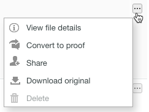

# Gestisci i file in [!DNL Workfront Proof]

>[!IMPORTANT]
>
>Questo articolo fa riferimento alla funzionalità del prodotto standalone [!DNL Workfront Proof]. Per informazioni sulle prove all&#39;interno [!DNL Adobe Workfront], vedi [Copertura](../../../review-and-approve-work/proofing/proofing.md).

Puoi gestire, condividere e visualizzare le informazioni sui file (non le bozze) caricati in Workfront Proof (vedi [Caricare file e contenuti web in [!DNL Workfront Proof]](../../../workfront-proof/wp-work-proofsfiles/create-proofs-and-files/upload-files-web-content.md)).

1. Fai clic sulla freccia rivolta verso il basso a destra di **[!UICONTROL Viste]** nel pannello di navigazione a sinistra, quindi fai clic su **[!UICONTROL File]** nel menu a discesa .

1. Fai clic sul pulsante **[!UICONTROL Altro]** pulsante per il file, quindi fare clic su **[!UICONTROL Visualizza dettagli file]** nel menu visualizzato.\
   \
   È possibile visualizzare e modificare i dettagli del file nella finestra visualizzata. Ad esempio, puoi modificare il nome del file nella parte superiore della finestra, [!DNL Workfront Proof] **Cartella** che memorizza il file e il **Proprietario** del file.\
   

1. (Facoltativo) Se disponi di diritti di modifica per il file, utilizza i pulsanti di azione nell’angolo in alto a destra per gestire e condividere il file:

* **[!UICONTROL Tag]**. Gestisci i tag applicati al file.\
   \
   Sotto i pulsanti di azione è possibile visualizzare tutti i tag applicati al file. Per rimuovere un tag indesiderato, fai clic sulla x accanto a esso.\
   

* **[!UICONTROL Sposta in]**. Organizza i file in cartelle. È possibile spostare un file tra cartelle esistenti o inserirlo in una nuova cartella.\
   

* **[!UICONTROL Condividi]**. Condividi file con altre persone. [!DNL Workfront Proof] invia ai destinatari una notifica e-mail con un messaggio personalizzato e collegamenti per il download.\
   

* **[!UICONTROL Cestino]**. Puoi eliminare il file spostandolo nel Cestino. Tieni presente che il file verrà conteggiato per il limite di archiviazione fino a quando il cestino non viene svuotato (vedi [Ripristina e svuota il cestino in [!DNL Workfront Proof]](../../../workfront-proof/wp-work-proofsfiles/manage-your-work/restore-and-empty-trash.md)).\
   

* **[!UICONTROL Altro]**. In questo elenco a discesa, puoi fare clic su **[!UICONTROL Converti in bozza]** per creare una bozza di un file (vedi [Genera bozze in [!DNL Workfront Proof]](../../../workfront-proof/wp-work-proofsfiles/create-proofs-and-files/generate-proofs.md)). Il file deve soddisfare i requisiti dei nostri tipi di file per le bozze (vedi [Panoramica sui tipi di file di correzione supportati e sui limiti di dimensione](../../../review-and-approve-work/proofing/proofing-overview/supported-proofing-file-types.md)). Se il nome del file corrisponde al nome di una bozza esistente, [!DNL Workfront Proof] visualizza un messaggio con un collegamento che ti consente di convertire il file in un **[!UICONTROL Nuova versione]** di tale prova (vedi ).\
   

   >[!TIP]
   >
   >Per i file condivisi da un altro [!DNL Workfront Proof] account (e non caricato sul tuo account), la conversione è disponibile solo sui piani aziendali.

   Puoi fare clic anche su **[!UICONTROL Scarica]** per scaricare il file originale sul computer.

1. (Facoltativo) Apri il **[!UICONTROL Condiviso con]** per elencare gli utenti con cui è stato condiviso il file.

   È possibile **[!UICONTROL Messaggio]** o **[!UICONTROL Rimuovi]** un utente che utilizza **[!UICONTROL Altro]** a destra.

   

   Se scegli di inviare un messaggio a uno di questi utenti, la **[!DNL Message all]** viene visualizzata una pagina in cui è possibile inviare più messaggi contemporaneamente.

1. Apri **[!UICONTROL Attività]** per elencare tutte le attività sul file, inclusa l’ora, la data e la persona che ha eseguito l’azione. L&#39;attività include:

   * File caricato
   * Nuove persone aggiunte
   * Persone rimosse
   * File scaricato

1. Apri **[!UICONTROL Messaggi]** per tracciare i messaggi inviati dagli utenti in associazione con il file . Per visualizzare il contenuto di un messaggio, fai clic sull’icona &quot;i&quot; a destra.
