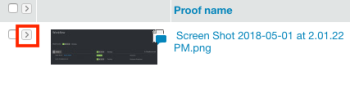
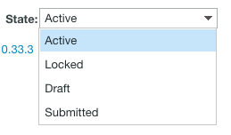

# Comprendere lo stato della bozza in Workfront Proof

>[!IMPORTANT]
>
>Questo articolo fa riferimento alle funzionalità nel prodotto autonomo [!DNL Workfront Proof]. Per informazioni sulla verifica all&#39;interno di [!DNL Adobe Workfront], vedere [Verifica](../../../review-and-approve-work/proofing/proofing.md).

In [!DNL Workfront Proof] le bozze esistono in stati diversi. Questi stati determinano le azioni che puoi intraprendere sulla bozza, ad esempio commentare o prendere decisioni.

## Informazioni sullo stato della bozza

I quattro stati sono i seguenti:

* [Attiva](#active)
* [Bloccato](#locked)
* [Bozza (solo Dropzone)](#draft-dropzone-only)
* [Inviato (solo Dropzone)](#submitted-dropzone-only)

### Attiva {#active}

Le bozze caricate in [!DNL Workfront Proof] tramite la pagina New Proof (Nuova bozza) o Dropzone vengono visualizzate come attive dopo l&#39;elaborazione. Quando una bozza è attiva, gli utenti possono esaminarla, aggiungervi commenti e prendere decisioni al riguardo.

>[!NOTE]
>
>Le bozze caricate tramite l’area di rilascio vengono visualizzate come attive solo se l’opzione Attiva bozza all’invio è abilitata. Se l’opzione non è abilitata, devi attivare manualmente la bozza.

Per ulteriori informazioni sulle impostazioni di Dropzone, vedere [Configurare la dropzone in [!DNL Workfront Proof]](../../../workfront-proof/wp-acct-admin/account-settings/configure-dropzone-in-wp.md).

### Bloccato {#locked}

È possibile bloccare una bozza al termine della revisione. Il blocco di una bozza non consente più di inserire commenti o decisioni sulla bozza, ma è comunque possibile aprirla.

Tutti gli utenti con i diritti di modifica sulla bozza possono sbloccarla.

Per ulteriori informazioni sui diritti, vedere [Profili autorizzazioni bozza in [!DNL Workfront Proof]](../../../workfront-proof/wp-acct-admin/account-settings/proof-perm-profiles-in-wp.md).

>[!NOTE]
>
>Le notifiche e-mail non vengono più inviate quando una bozza è bloccata. Ad esempio, se una bozza viene bloccata prima della scadenza, non viene inviata un’e-mail di notifica al raggiungimento della scadenza.

### Bozza (solo Dropzone) {#draft-dropzone-only}

Quando invii una bozza tramite Dropzone, questa viene attivata dall’amministratore in stato Bozza. Quando si trova nella zona bozza, non è possibile eseguire alcuna azione sulla bozza.

### Inviato (solo Dropzone) {#submitted-dropzone-only}

Dopo che una bozza è stata attivata dall’amministratore, la bozza viene visualizzata come Inviata nell’area di rilascio. Dopo l’invio, puoi intervenire sulla bozza.

## Visualizzazione e modifica dello stato della bozza

Per informazioni sulla visualizzazione di un elenco di tutte le bozze in uno stato specifico, ad esempio la visualizzazione di tutte le bozze attive o bloccate, vedere [Gestione elementi nella pagina Viste in [!DNL Workfront Proof]](../../../workfront-proof/wp-work-proofsfiles/manage-your-work/manage-items-on-views-page.md) nell&#39;articolo [Gestione elementi nella pagina Viste in [!DNL Workfront Proof]](../../../workfront-proof/wp-work-proofsfiles/manage-your-work/manage-items-on-views-page.md).

1. Accedi al tuo dashboard di [!DNL Workfront Proof].

   Per ulteriori informazioni, vedere [Accesso [!DNL Workfront Proof] da Adobe Workfront](../../../review-and-approve-work/proofing/managing-proofs-within-workfront/access-wf-proof-in-workfront.md).

1. Nel **[!UICONTROL Dashboard]**, fai clic sulla freccia **[!UICONTROL Espandi]** accanto alla bozza di cui desideri visualizzare o modificare lo stato.

   

   Viene visualizzata la sezione **[!UICONTROL Processo del flusso di lavoro]**.

   

1. Visualizza lo **[!UICONTROL Stato]** nel **[!UICONTROL processo flusso di lavoro]**.

1. (Facoltativo) Per modificare lo stato, passa il mouse sullo **[!UICONTROL Stato]** corrente e fai clic sul menu a discesa, quindi seleziona un nuovo stato.

   
