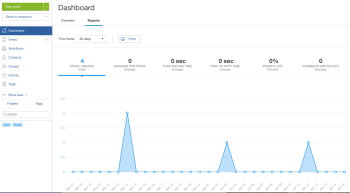

# Eseguire rapporti in [!DNL Workfront Proof]

>[!IMPORTANT]
>
>* La funzionalità di reporting non è più disponibile in [!DNL Workfront Proof]. La scheda per la generazione di rapporti viene comunque visualizzata, ma i dati non sono precisi.
> 
>* Questo articolo fa riferimento alle funzionalità del prodotto autonomo [!DNL Workfront Proof]. Per informazioni sulle prove all&#39;interno [!DNL Adobe Workfront], vedi [Bozza](../../../review-and-approve-work/proofing/proofing.md).

Workfront Proof consente di visualizzare i rapporti in modo da tenere traccia dell’avanzamento del lavoro e dell’efficienza dei team.

Puoi visualizzare facilmente il numero di bozze create nel [!DNL Workfront Proof] account, quante versioni sono associate a ogni bozza, il tempo di risposta e altro ancora.

## Prerequisiti

La disponibilità dei report dipende dal tipo di [!DNL Workfront Proof] livelli di autorizzazione per account e utenti.

* [Prerequisiti per l’account](#account-prerequisites)
* [Prerequisiti utente](#user-prerequisites)

### Prerequisiti per l’account {#account-prerequisites}

Le informazioni di reporting sono disponibili solo con i piani Premium.

### Prerequisiti utente {#user-prerequisites}

Le informazioni di reporting sono disponibili solo per gli utenti con accesso completo a tutte le bozze sul tuo account (ad esempio, utenti con almeno [Profili delle autorizzazioni di bozza in [!DNL Workfront Proof]](../../../workfront-proof/wp-acct-admin/account-settings/proof-perm-profiles-in-wp.md)).

In questo pannello puoi

* Controllare l’intervallo di tempo dei dati visualizzati
* Analizzare le modifiche delle metriche nel tempo
* Per controllare i dettagli di un punto nel tempo selezionato, passa il cursore sopra di esso
* Controlla il numero totale di bozze create nell’intervallo di tempo selezionato
* Verifica il numero medio di versioni incluse nei set di bozze completati

## Visualizzazione dei rapporti {#viewing-reports}

1. Vai a **[!UICONTROL Dashboard]** pagina.
1. Fai clic su **[!UICONTROL Rapporti]** scheda.\
   

1. In **[!UICONTROL Intervallo temporale]** dal menu a discesa, seleziona se desideri visualizzare le informazioni sulle bozze create nelle ultime 24 ore, 7 giorni, 30 giorni, 90 giorni o in un periodo di tempo personalizzato.\
   Se si seleziona un periodo di tempo personalizzato, selezionare le date di inizio e di fine, quindi fare clic su **[!UICONTROL Applica]**.\
   Per il periodo di tempo selezionato vengono visualizzate le seguenti informazioni:\
   **Bozza creata:** Numero di bozze create nel periodo di tempo selezionato.\
   **Versioni per bozza:** Numero medio di versioni per bozza per tutte le bozze completate (approvate o approvate con modifiche) entro il periodo di tempo selezionato.\
   **Tempo di rotazione:** Tempo medio dalla creazione della prima versione al momento in cui è stata presa la decisione sulla versione finale.\
   **Ora prima attività:** Tempo medio dalla creazione della bozza al momento della prima attività sulla bozza.\
   **Bozze in ritardo:** Percentuale media di bozze completate (approvate o approvate con modifiche) con almeno una versione in ritardo nel periodo di tempo selezionato.\
   **Commenti e risposte:** Numero medio di commenti e risposte inseriti in tutte le bozze nel periodo di tempo selezionato.

1. (Facoltativo) Seleziona o deseleziona il **[!UICONTROL Mostra intervallo min-max]** per determinare se i valori minimo e massimo vengono visualizzati nel grafico.\
   Quando questa opzione è selezionata, viene visualizzata un&#39;ombreggiatura blu tra i valori minimo e massimo registrati.

1. (Facoltativo) Puoi filtrare i dati visualizzati, come descritto in [Filtraggio dei rapporti](#filtering-reports).

## Filtraggio dei rapporti {#filtering-reports}

Per impostazione predefinita, i dati visualizzati nei rapporti includono tutte le informazioni provenienti [!DNL Workfront Proof] di rete. Puoi utilizzare i filtri per mostrare solo le informazioni rilevanti per le tue esigenze.

Per filtrare le informazioni di reporting:

1. Vai a **[!UICONTROL Dashboard]** pagina.
1. Fai clic su **[!UICONTROL Rapporti]** scheda.\
   

1. Eseguire un rapporto, come descritto in [Visualizzazione dei rapporti](#viewing-reports).
1. Clic **[!UICONTROL Filtro]**.

1. Sul lato sinistro della pagina, seleziona una delle seguenti opzioni di filtro:\
   **[!UICONTROL Tipo di bozza]:** Seleziona il tipo di bozze da includere nel rapporto.\
   **[!UICONTROL Decisioni]:** Seleziona le opzioni per determinare se sono state effettuate solo le bozze che contengono determinate decisioni.\
   **[!UICONTROL Destinatari]:** Seleziona i singoli utenti per visualizzare le informazioni relative alle bozze condivise con gli utenti selezionati.\
   **[!UICONTROL Proprietari bozza]:** Seleziona i singoli utenti per visualizzare le informazioni relative alle bozze di proprietà degli utenti selezionati.\
   **[!UICONTROL Creatori bozza]:** Seleziona i singoli utenti per visualizzare le informazioni relative alle bozze create dagli utenti selezionati.\
   **[!UICONTROL Account]:** Selezionare gli account da includere nel report.

1. Clic **[!UICONTROL Applica]**.
1. (Facoltativo) Seleziona o deseleziona il **[!UICONTROL Mostra intervallo min-max]** per determinare se i valori minimo e massimo vengono visualizzati nel grafico.\
   Quando questa opzione è selezionata, viene visualizzata un&#39;ombreggiatura blu tra i valori minimo e massimo registrati.

## Stampa dei report

1. Vai a **[!UICONTROL Dashboard]** pagina.
1. Fai clic su **[!UICONTROL Rapporti]** , quindi fai clic su **[!UICONTROL Stampa]**.\
   

1. Selezionare tra le varie opzioni di stampa disponibili.\
   Le opzioni di stampa variano a seconda del browser e della versione del browser utilizzati.
