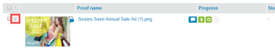

# Visualizza l&#39;avanzamento e lo stato di una bozza in [!DNL Workfront Proof]

>[!IMPORTANT]
>
>Questo articolo fa riferimento alla funzionalità del prodotto standalone [!DNL Workfront Proof]. Per informazioni sulle prove all&#39;interno [!DNL Adobe Workfront], vedi [Copertura](../../../review-and-approve-work/proofing/proofing.md).

## Informazioni sull’avanzamento della bozza

L’avanzamento della prova indica il lavoro svolto su una prova dal momento in cui la prova viene inviata ai revisori al momento in cui decidono in merito alla prova.

* [Icone di avanzamento](#progress-icons)
* [Livelli di progresso](#levels-of-proof-progress)

### Icone di avanzamento {#progress-icons}

Le icone di avanzamento S, O, C e D vengono visualizzate nella barra di avanzamento per indicare l’avanzamento della bozza.

Indicano le seguenti informazioni su una bozza:

<table style="table-layout:auto"> 
 <col> 
 <col> 
 <thead> 
  <tr> 
   <td> 
<strong>Icona Avanzamento</strong> 
 </td> 
   <td> 
<strong>Descrizione</strong> 
 </td> 
  </tr> 
 </thead> 
 <tbody> 
  <tr> 
   <td> 
  
 </td> 
   <td> 
<strong>Invio completato</strong>. La bozza è stata inviata ai revisori.
 </td> 
  </tr> 
  <tr> 
   <td> 
  
 
 
 </td> 
   <td> 
<strong>Aperto</strong>. Un revisore ha aperto la pagina dei dettagli della bozza o ha aperto la bozza stessa nel visualizzatore di correzione.
 </td> 
  </tr> 
  <tr> 
   <td> 
  
 </td> 
   <td> 
<strong>Commenti</strong>. I revisori (utenti che possono fare commenti) hanno fatto commenti sulla bozza.
 
Se non sono stati designati revisori per la bozza, questa icona non viene visualizzata.
 </td> 
  </tr> 
  <tr> 
   <td> 
  
 </td> 
   <td> 
<strong>Decisione</strong>. Un revisore ha preso una decisione sulla prova.
 
Se non sono stati designati approvatori (responsabili decisionali) per la bozza, questa icona non viene visualizzata. 
 </td> 
  </tr> 
 </tbody> 
</table>

Queste icone possono essere visualizzate nei seguenti colori per indicare l’avanzamento della bozza:

* **Verde**. Completato.
* **Bianco**. Non completato.
* **Arancio**. Non completato e il termine è inferiore a 24 ore.
* **Rosso**. Non completato e superato il termine.

### Livelli di progresso {#levels-of-proof-progress}

Workfront Proof utilizza le icone di avanzamento per monitorare l’avanzamento di una bozza a uno dei seguenti livelli:

* Per ogni revisore, in base all&#39;attività della persona sulla bozza.
* Per ogni fase, in base all&#39;avanzamento del revisore sul palco che è più indietro nel processo di correzione. Per ulteriori informazioni, consulta [Panoramica delle fasi del flusso di lavoro automatizzato](../../../review-and-approve-work/proofing/proofing-overview/stages.md).
* Per la prova, in base all&#39;avanzamento dello stadio (gruppo di revisori) che è il più indietro nel processo di correzione.

Per un esempio di come [!DNL Workfront Proof] determina lo stato di avanzamento utilizzando il revisore o lo stadio più in ritardo, supponiamo che tre revisori su una prova debbano prendere una decisione. Se due di loro hanno preso la loro decisione ma il terzo non l&#39;ha fatto, la barra di avanzamento della prova non mostra il D in verde a causa della decisione in sospeso.

Se la [!UICONTROL Decisore principale] l’impostazione è selezionata su una bozza e il decision maker principale invia una decisione, la D nella barra di avanzamento della bozza diventa verde per tutti i revisori perché non sono necessarie altre decisioni.

Analogamente, se [!UICONTROL È necessaria una sola decisione] l’impostazione è selezionata su una bozza e ogni revisore invia una decisione, la D nella barra di avanzamento della bozza diventa verde per tutti i revisori perché non sono necessarie altre decisioni.

## Informazioni sullo stato della bozza

Lo stato della bozza visualizza lo stato delle decisioni necessarie per la bozza.

\
Le opzioni di stato standard sono:

* In Attesa
* Approvato
* Approvato con modifiche
* Modifiche richieste
* Non pertinente

Se le decisioni personalizzate sono configurate nel tuo account, le opzioni di stato riflettono le impostazioni di decisione personalizzate.

Lo stato della prova è determinato dal partecipante al &quot;caso peggiore&quot;. Ad esempio, supponiamo che ci siano tre decisioni sulla bozza: due hanno lo status di **Accettato** e uno ha lo status di **Rifiutato**. La decisione del &quot;caso peggiore&quot; di Rifiutato sovrintende alle altre decisioni e lo stato generale della prova è indicato come **Rifiutato**.

## Visualizzazione dell&#39;avanzamento e dello stato {#viewing-progress-and-status}

È possibile visualizzare l’avanzamento e lo stato di bozze, fasi e revisori in ogni fase.

* [Riepilogo delle prove](#proof-summary)
* [Menu Azioni fase](#stage-actions-menu)
* [In [!UICONTROL Riepilogo] è inoltre possibile accedere ai menu delle azioni del revisore, a condizione di disporre dei diritti di modifica sulla bozza. Per ulteriori informazioni, consulta Profili delle autorizzazioni di prova in Workfront Proof e Gestisci ruoli di prova in Workfront Proof. La [!UICONTROL Azioni del revisore] il menu (1) viene visualizzato quando passi il cursore sui dettagli del revisore e consente di:](#in-the-summary-section-you-can-also-access-the-reviewer-actions-menus-provided-you-have-edit-rights-on-the-proof-for-more-information-see-proof-permissions-profiles-in-workfront-proof-and-manage-proof-roles-in-workfront-proof-the-reviewer-actions-menu-1-appears-when-you-hover-over-the-reviewer-s-details-and-allows-you-to)
* [Menu Azioni bozza](#proof-actions-menu)

### Riepilogo delle prove {#proof-summary}

Ogni bozza della cartella dispone di un riepilogo espandibile che consente di visualizzare e modificare rapidamente i dettagli della bozza.

Per espandere o comprimere il riepilogo:

1. Fate clic sulla freccia a sinistra della bozza nella vista Dashboard o in una delle viste a elenco.

Il riassunto include quanto segue:

* Flusso di lavoro (2)
* Versione (3)
* Cartella (4)
* Stato (5)\
   

Nel riepilogo puoi visualizzare e modificare i seguenti dettagli della bozza:

* Prove di avanzamento (1)
* Stato di avanzamento di ciascuna fase (2)
* Termine stabilito per la fase (3)
* Dettagli revisore:

   * Numero di osservazioni e risposte presentate da ciascun revisore (4)
   * Avanzamento di ciascun revisore (5)
   * Decisione (se una decisione include una firma elettronica, accanto alla decisione che la indica verrà visualizzata un’icona). (6)
   * Ruolo della prova (7)
   * Impostazioni avviso e-mail (8)

>[!NOTE]
>
>La possibilità di modificare i dettagli della bozza dipende dai tuoi diritti sulla bozza (vedi [Profili delle autorizzazioni di prova in [!DNL Workfront Proof]](../../../workfront-proof/wp-acct-admin/account-settings/proof-perm-profiles-in-wp.md) e [Gestisci ruoli di bozza in [!DNL Workfront Proof]](../../../workfront-proof/wp-work-proofsfiles/share-proofs-and-files/manage-proof-roles.md)).

### [!UICONTROL Azioni stage] Menu  {#stage-actions-menu}

Ogni fase del flusso di lavoro dispone di un menu separato, che consente di eseguire azioni in blocco relative ai revisori in tale fase.

La [!UICONTROL Azioni della fase] quando si passa il mouse sulla sezione Stage (1), viene visualizzato il menu che consente di:

* [!UICONTROL Messaggio tutti] (2)
* [!UICONTROL Condividi] (3)
* [!UICONTROL Elimina fase] (4)

>[!NOTE]
>
>La disponibilità di queste opzioni dipende dai tuoi diritti sulla prova (vedi [Profili delle autorizzazioni di prova in [!DNL Workfront Proof]](../../../workfront-proof/wp-acct-admin/account-settings/proof-perm-profiles-in-wp.md) e [Gestisci ruoli di bozza in [!DNL Workfront Proof]](../../../workfront-proof/wp-work-proofsfiles/share-proofs-and-files/manage-proof-roles.md)).

Nella sezione Riepilogo è inoltre possibile accedere ai menu delle azioni del revisore, a condizione di disporre dei diritti di modifica sulla bozza. Per ulteriori informazioni, consulta [Profili delle autorizzazioni di prova in [!DNL Workfront Proof]](../../../workfront-proof/wp-acct-admin/account-settings/proof-perm-profiles-in-wp.md) e [Gestisci ruoli di bozza in [!DNL Workfront Proof]](../../../workfront-proof/wp-work-proofsfiles/share-proofs-and-files/manage-proof-roles.md). Il menu Azioni revisore (1) viene visualizzato quando passi il cursore sui dettagli del revisore e consente di:

* Invia un messaggio al revisore (2)
* Modifica i dettagli del revisore (3): consente di modificare il nome visualizzato, il ruolo di bozza e l&#39;avviso e-mail per il revisore
* Farli il proprietario della prova (4)
* Farli diventare il principale soggetto decisionale (5)
* Rimuovi dalla prova (6)

>[!NOTE]
>
>La visibilità di queste opzioni dipende dai tuoi diritti sulla bozza (vedi [Profili delle autorizzazioni di prova in [!DNL Workfront Proof]](../../../workfront-proof/wp-acct-admin/account-settings/proof-perm-profiles-in-wp.md) e [Gestisci ruoli di bozza in [!DNL Workfront Proof]](../../../workfront-proof/wp-work-proofsfiles/share-proofs-and-files/manage-proof-roles.md)).

### Menu Azioni bozza {#proof-actions-menu}

Ogni bozza dispone anche di un menu (1) che consente di eseguire le azioni seguenti:

* Puoi accedere alla pagina dei dettagli della bozza (2)
* Condividi la prova con altre persone (3)
* Invia un messaggio ai revisori (4)
* Crea una nuova versione della bozza (5)
* Copia la prova (6)
* Scarica il file originale (7)
* Condividi collegamenti a prova di (8)
* Stampa commenti (9)
* Richiedi un riepilogo Excel della bozza (10)
* Bloccare la prova (11)
* Elimina la bozza (12)

>[!NOTE]
>
>La disponibilità di queste opzioni dipende dai tuoi diritti sulla prova (vedi [Profili delle autorizzazioni di prova in [!DNL Workfront Proof]](../../../workfront-proof/wp-acct-admin/account-settings/proof-perm-profiles-in-wp.md) e [Gestisci ruoli di bozza in [!DNL Workfront Proof]](../../../workfront-proof/wp-work-proofsfiles/share-proofs-and-files/manage-proof-roles.md)).

Per informazioni sulla visualizzazione dell&#39;avanzamento e dello stato della bozza in [!DNL Workfront], vedi [Visualizzazione dell&#39;avanzamento e dello stato](#viewing-progress-and-status).

Per informazioni sull’avanzamento e lo stato della visualizzazione nel visualizzatore per correzione desktop, consulta [Rivedere un flusso di lavoro nel visualizzatore di bozze](../../../workfront-proof/wp-work-proofsfiles/review-proofs-wpv/review-workflow.md).
