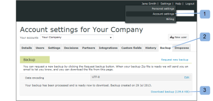

# Esegui backup [!DNL Workfront Proof] Dati

>[!IMPORTANT]
>
>Questo articolo fa riferimento alla funzionalità del prodotto standalone [!DNL Workfront Proof]. Per informazioni sulle prove all&#39;interno [!DNL Adobe Workfront], vedi [Copertura](../../../review-and-approve-work/proofing/proofing.md).

## Introduzione ai backup

Puoi richiedere un backup di tutti i tuoi dati in [!DNL Workfront Proof] utilizzando la funzione di backup.

Il backup viene consegnato come file .zip. Include un&#39;esportazione XML di tutti i tuoi dati (inclusi commenti e risposte per tutte le versioni di tutte le bozze); tuttavia, non include i file originali caricati come bozze.

Ogni file .zip di backup creato per il download ha un nome file univoco, ad esempio:

9789_05_05_2011_61703.zip

Il nome del file in questo esempio fornisce le seguenti informazioni:

* 9789 è il tuo [!DNL Workfront Proof] identificatore account
* 05_05_2011 è la data di creazione, 5 maggio 2011
* 61703 è un numero assegnato casualmente dal sistema

Questa convenzione di denominazione consente di memorizzare tutti i file .zip di backup in un&#39;unica posizione sul computer e di sapere esattamente quando ogni backup è stato creato per te.

La [!UICONTROL Backup] consente di decidere come utilizzare le risorse:

* Consente di liberare spazio di archiviazione senza perdere le bozze attive o archiviate. È possibile richiedere un backup, eliminare le bozze e quindi svuotare il [Ripristina e svuota il cestino in [!DNL Workfront Proof]](../../../workfront-proof/wp-work-proofsfiles/manage-your-work/restore-and-empty-trash.md).
* Consente di accedere ai file originariamente caricati in [!DNL Workfront] Prova. Puoi scaricarli utilizzando la [!UICONTROL scarica file originale] prima di eliminare le bozze.

>[!NOTE]
>
>Quando si utilizzano i backup, tenere presente quanto segue:
>
>* I backup sono disponibili su Enterprise e Unlimited plan. Contatta il nostro [sales team](mailto:sales@proofhq.com) per una citazione.
>* Il tipo di codifica dei dati è impostato su UTF-8 per impostazione predefinita e si consiglia di eseguire questa impostazione. Questo è il tipo di codifica più comunemente utilizzato dalle applicazioni Internet.
>* Puoi richiederne solo uno [!DNL backup] alla volta. Quando il file .zip di backup viene elaborato, il nuovo collegamento di backup della scheda Backup non viene visualizzato e il messaggio visualizzato rimane invariato. Per informazioni sulla richiesta di un backup, vedi [Richiedi un nuovo backup dei dati in [!DNL Workfront Proof]](../../../workfront-proof/wp-acct-admin/account-settings/request-new-data-backup-in-wp.md).
>

## Backup dei dati

1. Fai clic su **[!UICONTROL Impostazioni account]** nell&#39;angolo superiore destro del [!DNL Workfront Proof] interfaccia. (1)
1. Fai clic sul pulsante **[!UICONTROL Backup]** scheda . (2)
1. Fai clic sul pulsante **[!UICONTROL Richiedi nuovo backup]** link (3)

Quando il backup è pronto, si verifica quanto segue:

* Ricevi un’e-mail da [!DNL Workfront Proof] ti informi di questo (&quot;Il tuo [!DNL Workfront Proof] backup è pronto&quot;). L’e-mail contiene un collegamento per il download dei dati di backup.
* La [Impostazioni account](https://support.workfront.com/hc/en-us/sections/115000912147-Account-settings) Nella scheda Backup viene visualizzato un collegamento per il download dei dati di backup.
* Il nuovo collegamento di backup della richiesta (3) viene nuovamente visualizzato nella scheda Backup

I tuoi dati saranno pronti per il download come file zip. Puoi scaricare il file .zip di backup dall’e-mail di notifica o nel [!UICONTROL impostazioni account], come descritto nelle sezioni seguenti:

* [Download del file .zip di backup dalla notifica e-mail](#downloading-your-backup-zip-file-from-your-email-notification)
* [Download del file .zip di backup dalle impostazioni dell&#39;account](#downloading-your-backup-zip-file-from-the-account-settings)

## Download del file .zip di backup dalla notifica e-mail {#downloading-your-backup-zip-file-from-your-email-notification}

Quando il file .zip di backup è pronto per il download, ricevi un&#39;e-mail da [!DNL Workfront Proof] con l&#39;oggetto &#39;Il tuo [!DNL Workfront Proof] backup pronto.&quot;

Per scaricare il file .zip di backup dall&#39;e-mail:

1. Fai clic sul collegamento di download nell’e-mail.\
   \
   Se al momento non hai effettuato l&#39;accesso a [!DNL Workfront Proof]viene visualizzata una nuova finestra del browser con la pagina di accesso.

## Download del file .zip di backup dalle impostazioni dell&#39;account {#downloading-your-backup-zip-file-from-the-account-settings}

Quando il file .zip di backup è pronto per il download, la [!UICONTROL Backup] questa funzione è indicata dalla scheda che mostra un collegamento per il download. Inoltre, il [!UICONTROL Richiedi nuovo backup] viene visualizzato di nuovo il collegamento.

1. Fai clic su **[!UICONTROL Impostazioni account]** nell&#39;angolo superiore destro del [!DNL Workfront Proof] interfaccia. (1)
1. Fai clic sul pulsante **[!UICONTROL Backup]** scheda . (2)\
   Se nessun utente del tuo account ha richiesto backup, il [!UICONTROL Backup] la scheda indica che non sono disponibili backup. Se un utente ha richiesto un backup, nella scheda vengono visualizzati la data di creazione e il collegamento di download per l’ultimo backup.

1. Fai clic sul pulsante **[!UICONTROL Scarica backup]** link. (3)\
    Viene visualizzata una schermata Download file in cui si chiede se si desidera aprire o salvare il file di download.

1. Fai clic su **[!UICONTROL Salva]**, quindi selezionare il percorso nel computer in cui si desidera salvare il file .zip di backup.\
   Il messaggio che identifica la data del backup più recente rimane visualizzato nella parte inferiore del [!UICONTROL Backup] fino alla successiva richiesta di un backup. Il collegamento Scarica backup è valido per l&#39;ultimo backup. Ogni volta che [!UICONTROL Richiedi nuovo backup] viene visualizzato il collegamento, è possibile fare clic su di esso per richiedere un altro backup.

## Informazioni sui file nel file .zip di backup

Il file .zip di backup contiene sette file CSV (valori separati da virgole o delimitati da virgole) che includono informazioni dalle bozze attive e archiviate fino al backup dei dati:

* comments.csv - include commenti sulle bozze
* comment_reply.csv - include le risposte ai commenti sulle bozze di organizzazione.csv - include l&#39;identificatore numerico e il nome dell&#39;organizzazione (l&#39;account).
* contact.csv : include l&#39;identificatore numerico, il nome e l&#39;organizzazione per ogni contatto
* files.csv - include informazioni dalla pagina Dettagli bozza o Dettagli file su bozze o file caricati in [!DNL Workfront Proof]
* recipients.csv : include l&#39;identificatore numerico, il ruolo e le decisioni di ogni persona specificata come revisore, revisore e approvatore, ecc., quando le bozze vengono caricate per la revisione su [!DNL Workfront Proof]
* users.csv - include identificatori numerici e nomi di tutti gli utenti nell’account

È possibile estrarre questi file dal file .zip di backup con qualsiasi utilità zip si utilizza, quindi archiviarli nel percorso desiderato sul computer. Dopo aver salvato il file zip ed estratto i singoli file CSV, puoi manipolare le informazioni desiderate per la conservazione dei record interni.

Ogni file .zip di backup creato su richiesta ha un nome distintivo che include la data di creazione del backup, ma i file CSV inclusi in ogni file .zip di backup hanno sempre gli stessi nomi. È possibile utilizzare uno dei metodi seguenti per garantire che i file di backup siano distinti l&#39;uno dall&#39;altro:

* Crea una nuova cartella per ogni file .zip di backup e i file CSV estratti da esso.
* Rinomina ogni singolo file CSV per includere la data di backup quando lo estrai dal file zip.

>[!NOTE]
>
>Se [!DNL Microsoft Excel] installato nel computer, l&#39;utilità di estrazione potrebbe elencare il tipo di file per i singoli file CSV come [!DNL Microsoft Office Excel] File di valori separati da virgole. Puoi aprire un file CSV estratto utilizzando [!DNL Excel] e salva il file come [!DNL Excel] cartella di lavoro (&#42;.xlsx) o un altro tipo di file.
