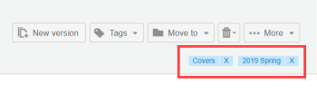

# Crea e gestisci tag in [!DNL Workfront Proof]

>[!IMPORTANT]
>
>Questo articolo fa riferimento alla funzionalità nel prodotto autonomo [!DNL Workfront] Proof. Per informazioni sulla verifica all&#39;interno di [!DNL Adobe Workfront], vedere [Verifica](../../../review-and-approve-work/proofing/proofing.md).

Puoi creare e modificare i tag e applicarli alle bozze e ai file. Si tratta di un&#39;ottima soluzione quando si dispone di molti [!DNL Workfront Proof] elementi diversi, ad esempio progetti, divisioni e client, e si desidera identificarli e trovarli facilmente.

È possibile applicare i tag a bozze nuove o esistenti, nuovi file, nuove versioni e copie in qualsiasi pagina della visualizzazione elenco.

>[!TIP]
>
>Può essere utile utilizzare più tag quando a un elemento si applicano più categorie. Puoi applicare un numero illimitato di tag a qualsiasi elemento.

Le impostazioni del profilo e delle autorizzazioni influiscono sulla funzionalità tag disponibile:

* Gli amministratori di fatturazione, gli amministratori e i supervisori possono utilizzare tutte le funzioni descritte in questa pagina.
* I responsabili possono creare e modificare i tag solo per i propri elementi.
* Gli osservatori non possono applicare o modificare i tag sugli elementi, ma possono visualizzare i tag applicati agli elementi da altri utenti e la scheda Tag nelle impostazioni Personali.

Per ulteriori informazioni su questi profili e autorizzazioni, vedere [Profili autorizzazioni bozza in [!DNL Workfront Proof]](../../../workfront-proof/wp-acct-admin/account-settings/proof-perm-profiles-in-wp.md).

## Creazione, modifica o eliminazione di un tag nell’account

1. Fare clic su **[!UICONTROL Impostazioni]** > **[!UICONTROL Impostazioni personali]**.

1. Apri la scheda **[!UICONTROL Tag]** nella parte superiore della pagina **[!UICONTROL Impostazioni personali]**.\
   Esegui una delle operazioni seguenti:

   * Per creare un tag, fai clic su **[!UICONTROL Nuovo tag]**, digita un nome per il tag, quindi premi **[!UICONTROL Invio]**.\

     I nomi di tag devono includere almeno un carattere alfanumerico e non più di 30 caratteri.\
      Per modificare un tag esistente, fai clic sul nome del tag, digita un nuovo testo, quindi premi **[!UICONTROL Invio]**.

   * Per eliminare un tag, fai clic sull’icona cestino alla fine della riga in cui è elencato il tag.

## Visualizzazione delle informazioni sui tag

1. Fare clic su **[!UICONTROL Impostazioni]** > **[!UICONTROL Impostazioni personali]**.

1. Apri la scheda **[!UICONTROL Tag]** nella parte superiore della pagina **[!UICONTROL Impostazioni personali]**.\
   La scheda **[!UICONTROL Tag]** fornisce le seguenti informazioni sui tag:

   * **Nome**
   * **Totale elementi** a cui è stato applicato il tag
   * **Elementi per i quali si dispone dell&#39;autorizzazione di visualizzazione** ai quali è stato applicato il tag

1. (Facoltativo) Se desideri visualizzare tutti gli elementi a cui è stato applicato un tag specifico, fai clic sul numero accanto a tale tag in **Elementi per i quali disponi dell&#39;autorizzazione di visualizzazione**.\
   Nella pagina dei risultati della ricerca vengono elencati tutti gli elementi che è possibile visualizzare a cui viene applicato il tag.

## Creazione di tag per uno o più elementi

1. In una vista a elenco o nel dashboard, selezionare l&#39;elemento o gli elementi per i quali si desidera creare o gestire i tag.
1. Fai clic su **[!UICONTROL Tag]** > **[!UICONTROL Nuovo tag]** immediatamente sopra l&#39;elenco, digita un nome per il tag, quindi fai clic su **[!UICONTROL Crea]**.

1. Seleziona il nuovo tag, quindi fai clic su **[!UICONTROL Aggiungi tag]**.

## Gestione dei tag per uno o più elementi

1. In una vista a elenco o nel dashboard, selezionare l&#39;elemento o gli elementi per i quali si desidera creare o gestire i tag.
1. Fai clic su **[!UICONTROL Tag]** > **[!UICONTROL Gestisci tag]** immediatamente sopra l&#39;elenco.

1. Nella scheda [!UICONTROL Tag] visualizzata, gestire i tag come descritto in precedenza in [Creazione, modifica o eliminazione di una scheda.](https://support.workfront.com/knowledge/articles/115004379508/en-us?brand_id=662728&return_to=%2Fhc%2Fen-us%2Farticles%2F115004379508#CreatingEditingDeletingTag)\
   Un tag viene applicato a tutti gli elementi selezionati quando la casella di controllo accanto al tag è grigia. Se è grigio chiaro, solo alcuni degli elementi di un batch selezionato vengono taggati con esso. Se vuoi rimuovere un tag da tutti gli elementi selezionati, accertati che la casella di spunta accanto al tag sia vuota.\
   

## Gestione dei tag dai dettagli della bozza o del file

I tag applicati a una bozza o a un file vengono visualizzati rispettivamente nelle pagine Dettagli bozza e Dettagli file. In questa pagina è possibile visualizzare, modificare e rimuovere i tag. Per ulteriori informazioni, vedere [Gestire i dettagli della bozza in [!DNL Workfront Proof]](../../../workfront-proof/wp-work-proofsfiles/manage-your-work/manage-proof-details.md) e [Gestire i file in [!DNL Workfront Proof]](../../../workfront-proof/wp-work-proofsfiles/manage-your-work/manage-files.md).

1. Aprire la pagina Dettagli bozza per una bozza, come descritto in [Gestione dettagli bozza in [!DNL Workfront Proof]](../../../workfront-proof/wp-work-proofsfiles/manage-your-work/manage-proof-details.md).\
   Oppure\
   Aprire la pagina Dettagli file per un file, come descritto in [Gestione file in [!DNL Workfront Proof]](../../../workfront-proof/wp-work-proofsfiles/manage-your-work/manage-files.md).\
   Tutti i tag applicati all&#39;elemento vengono visualizzati nell&#39;angolo superiore destro.\
   

1. (Facoltativo) Per rimuovere i tag dalla bozza o dal file, fai clic sulla x accanto ad esso.
1. Nell&#39;angolo superiore destro fare clic su **[!UICONTROL Tag]**.\
   

1. Nella casella visualizzata, seleziona i tag da applicare all&#39;elemento (o deseleziona i tag da rimuovere), quindi fai clic su **[!UICONTROL Aggiungi tag]**.

## Ricerca di un elemento utilizzando un nome di tag

È possibile cercare un elemento utilizzando il nome di un tag che si sa essere applicato all&#39;elemento.Se si condivide un elemento con qualcuno, questi sarà in grado di cercare l&#39;elemento nello stesso modo.Per visualizzare un elenco di tutti gli elementi a cui è stato applicato il tag:

1. In una visualizzazione elenco o nel dashboard, apri la scheda **[!UICONTROL Tag]** nella barra laterale a sinistra, quindi fai clic sul tag nell&#39;elenco dei tag visualizzati.\
   \
   Il nome del tag viene visualizzato nel campo di ricerca nell&#39;angolo superiore destro di [!DNL Workfront Proof]. Puoi perfezionare la ricerca selezionando tag aggiuntivi o digitando ulteriori parole chiave nel campo di ricerca. Per rimuovere un tag dal campo di ricerca, fai clic sull’icona x accanto al nome del tag.
