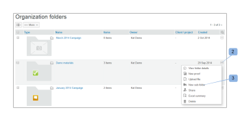

# Crea cartelle in [!DNL Workfront Proof]

>[!IMPORTANT]
>
>Questo articolo fa riferimento alla funzionalità del prodotto standalone [!DNL Workfront Proof]. Per informazioni sulle prove all&#39;interno [!DNL Adobe Workfront], vedi [Copertura](../../../review-and-approve-work/proofing/proofing.md).

## Creazione di una nuova cartella di livello superiore {#creating-a-new-top-level-folder}

1. Nella barra laterale, fai clic sulla freccia a discesa (1) accanto al verde **[!UICONTROL Nuova prova]** pulsante .
1. Seleziona **[!UICONTROL Nuova cartella]**. (2)\
   La [!UICONTROL Nuova cartella] viene visualizzata la pagina .

1. Continua con [Configurazione della nuova cartella](#configuring-the-new-folder).\
   

## Creazione di una nuova sottocartella {#creating-a-new-sub-folder}

Puoi creare sottocartelle in uno dei seguenti modi:

* [Creazione di una sottocartella dalla pagina dei dettagli della cartella](#creating-a-sub-folder-from-the-folder-details-page)
* [Creazione di una sottocartella dalla pagina Cartelle account](#creating-a-sub-folder-from-the-account-folders-page)

>[!NOTE]
>
>Quando si crea una nuova sottocartella, l’elenco di condivisione viene ereditato dalla cartella principale.

### Creazione di una sottocartella dal [!UICONTROL Dettagli della cartella] page {#creating-a-sub-folder-from-the-folder-details-page}

Per informazioni sulla [!UICONTROL Dettagli della cartella] pagina, vedi [Gestione cartelle e relativi contenuti in Workfront Proof](../../../workfront-proof/wp-work-proofsfiles/organize-your-work/manage-folders-and-contents.md).

Per creare una sottocartella dal [!UICONTROL Dettagli della cartella] pagina:

1. Nella barra laterale, fai clic sul nome della cartella nel [!UICONTROL Cartelle personali] elenco (1) per accedere alla pagina dei dettagli della cartella

1. Fai clic sul nuovo pulsante della sottocartella (2) nella parte superiore della pagina.\
   Nell’elenco degli elementi della cartella viene visualizzata una nuova cartella.
1. Digitare un nome per la nuova sottocartella. (3)
1. Press **[!UICONTROL Invio]**.\
   Oppure\
   Fare clic all&#39;esterno del campo del nome della cartella.

1. (Facoltativo) Modifica i dettagli della nuova sottocartella nella pagina Dettagli cartella .
1. Continua con [Configurazione della nuova cartella](#configuring-the-new-folder).

### Creazione di una sottocartella dalla pagina Cartelle account {#creating-a-sub-folder-from-the-account-folders-page}

1. Fai clic su [Nome account] cartelle nella barra laterale per accedere alla pagina Cartelle account (1)\
   

1. Individua la cartella in cui desideri aggiungere una sottocartella e apri la [!UICONTROL azioni] menu (2)
1. Seleziona [!UICONTROL Nuova sottocartella] dal menu (3)\
   La [!UICONTROL Nuova cartella] viene visualizzata la pagina .
1. Continua con [Configurazione della nuova cartella](#configuring-the-new-folder).

## Configurazione della nuova cartella {#configuring-the-new-folder}

Dopo aver iniziato a creare una nuova cartella (come descritto in [Creazione di una nuova cartella di livello superiore](#creating-a-new-top-level-folder) o [Creazione di una nuova sottocartella](#creating-a-new-sub-folder)), puoi impostare le opzioni di configurazione come descritto in questa sezione.

* [Navigazione breadcrumb](#breadcrumb-navigation) 1)
* [Dettagli della cartella](#folder-details) (2)
* [Dettagli client](#client-details) (3)
* [Condividi](#share) (4)

### Navigazione breadcrumb {#breadcrumb-navigation}

La navigazione nel breadcrumb mostra se stai creando una cartella di livello superiore o una sottocartella) (1)

### Dettagli della cartella {#folder-details}

In questa sezione puoi aggiungere (e controllare) le seguenti informazioni alla cartella che stai creando:

* Nome cartella - questo campo è obbligatorio (1)
* Fai clic sul pulsante [!UICONTROL Vedi l&#39;elenco] link (2) mostrerà un pop-up con un elenco di persone con cui questa cartella è condivisa - queste informazioni sono particolarmente utili quando si creano sottocartelle, in quanto le sottocartelle verranno automaticamente condivise con le stesse persone della cartella principale
* Descrizione (3) : qui puoi aggiungere una breve descrizione della cartella, che sarà visibile nella pagina Dettagli cartella
* Rendi la cartella privata (4) - se accetti la casella, questa cartella sarà privata (così visibile solo alle persone con cui condividi esplicitamente la cartella e agli utenti nel tuo account con i profili di [Profili delle autorizzazioni di prova in [!DNL Workfront Proof]](../../../workfront-proof/wp-acct-admin/account-settings/proof-perm-profiles-in-wp.md), [Profili delle autorizzazioni di prova in [!DNL Workfront Proof]](../../../workfront-proof/wp-acct-admin/account-settings/proof-perm-profiles-in-wp.md) o [Profili delle autorizzazioni di prova in [!DNL Workfront Proof]](../../../workfront-proof/wp-acct-admin/account-settings/proof-perm-profiles-in-wp.md) ). Vedi [Comprendere le autorizzazioni delle cartelle in [!DNL Workfront Proof]](../../../workfront-proof/wp-work-proofsfiles/organize-your-work/folder-permissions.md) per ulteriori informazioni sulle cartelle private e pubbliche in Workfront Proof.

### Dettagli client {#client-details}

In questa sezione è possibile compilare i dettagli del client, in modo da poter ordinare la pagina Cartelle personali in base al nome del client/progetto:

* Nome client (1)
* Nome del progetto (2)

### Condividi {#share}

In [!UICONTROL Condividi] è possibile:

* Assegna un nuovo proprietario della cartella (1): il creatore della cartella rimarrà elencato nella cartella e non potrà essere rimosso, tuttavia puoi fare in modo che un altro utente nel tuo account diventi il proprietario che gli darà i diritti di modifica sulla cartella.
* Condividere la cartella con altri [!DNL Workfront Proof] utenti digitando il proprio indirizzo e-mail (2) - nota che le cartelle possono essere condivise solo con persone che hanno il proprio [!DNL Workfront Proof] accessi.
* Imposta le autorizzazioni per le persone con cui condividi la cartella (3). Questa funzione è utile per condividere cartelle private con utenti del tuo account: puoi decidere se gli utenti con [Profili delle autorizzazioni di prova in [!DNL Workfront Proof]](../../../workfront-proof/wp-acct-admin/account-settings/proof-perm-profiles-in-wp.md) Il profilo deve poter creare, modificare ed eliminare elementi nella cartella.
* Rimuovi un utente dall&#39;elenco di condivisione cartelle facendo clic sull&#39;icona del cestino (4) a destra del nome dell&#39;utente.
* Rimuovi tutti dall&#39;elenco di condivisione cartelle facendo clic sull&#39;icona del cestino più in alto (5) - nota che non sarà possibile rimuovere il creatore o il proprietario della cartella.

Vedi anche [Condividi cartelle in [!DNL Workfront Proof]](../../../workfront-proof/wp-work-proofsfiles/organize-your-work/share-folders.md).

